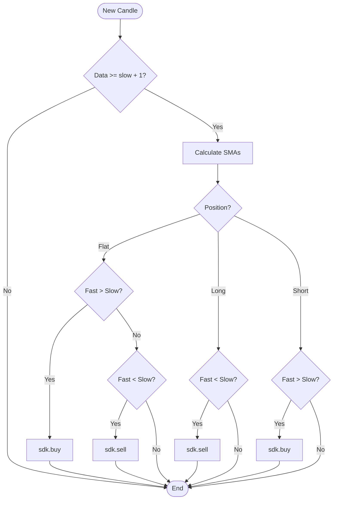
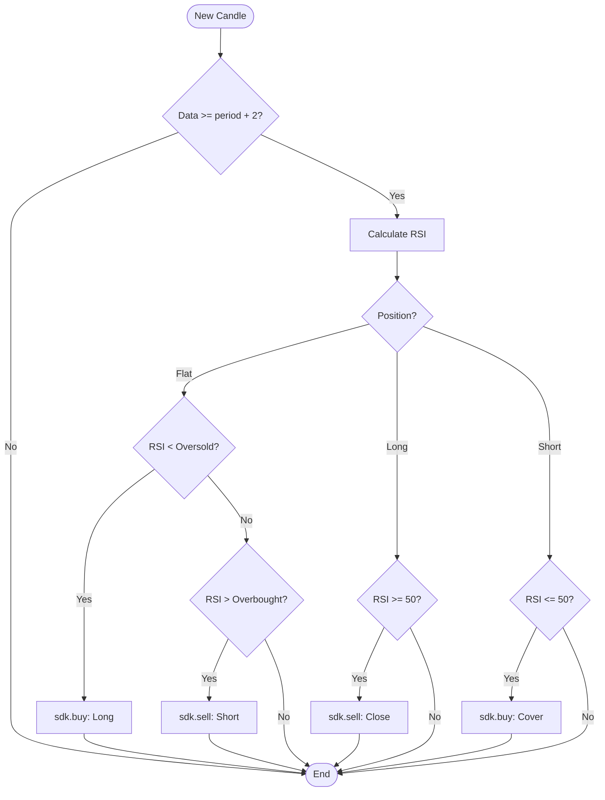
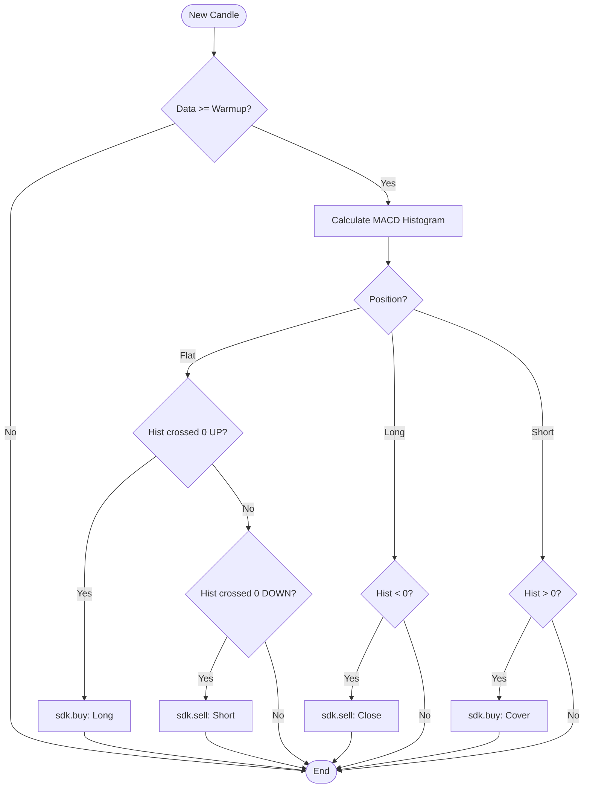
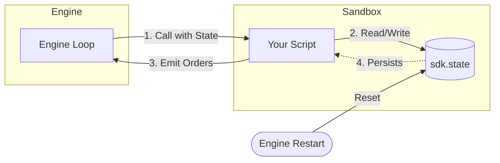
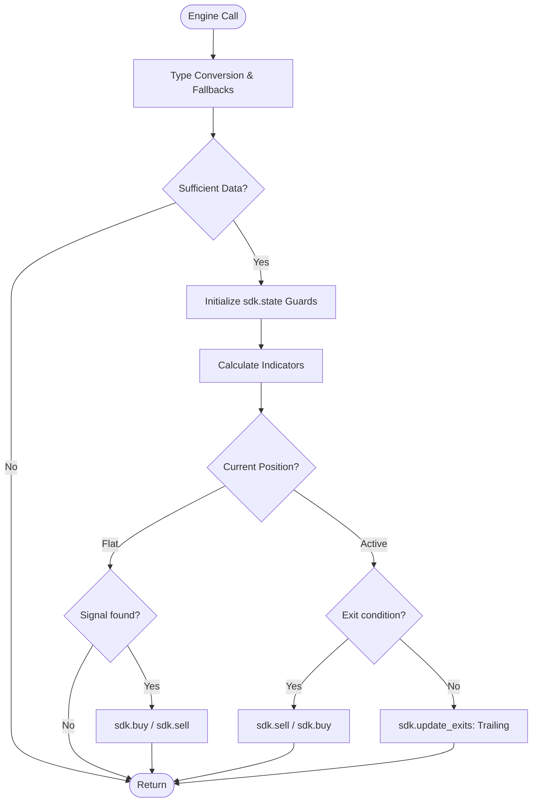
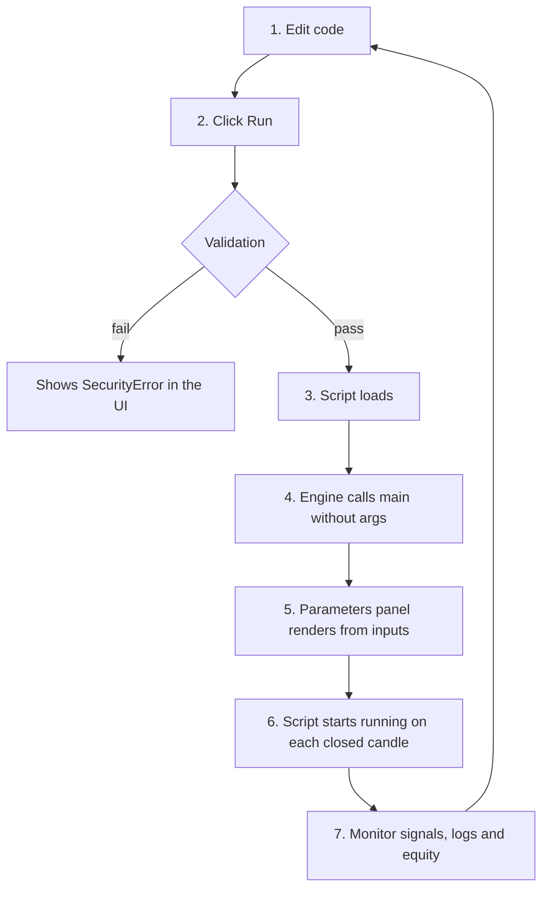

# TessTrade — Documentação completa (SDK de indicadores e estratégias)

> **Documento único** consolidando toda a documentação pública do TessTrade
> (learn.tesstrade.com), para uso como contexto em assistentes de IA.
> Gerado em 2026-06-23 a partir do gitbook. Fonte da verdade do contrato: o
> sandbox Python do TessTrade (`strategy_sdk.py`, `runner.py`, `restrictions.py`).
> A matemática dos indicadores é a dos kernels compartilhados `tesstrade_core`,
> os mesmos que o gráfico ao vivo usa (via `import tesstrade_indicators as ti`).
>
> As páginas estão concatenadas na ordem da navegação. Links internos do tipo
> `../secao/pagina.md` referem-se a outras seções **deste mesmo arquivo**.

## Índice

- Introdução — `index.md`

**Getting started**

- Backtest vs Chart Trading — `getting-started/overview.md`
- Example script — `getting-started/example-script.md`
- Sandbox limits — `getting-started/sandbox-limits.md`

**Contract**

- The main dispatcher — `contract/dispatcher-main.md`
- The DECLARATION shape — `contract/declaration.md`
- Script lifecycle — `contract/lifecycle.md`

**SDK Reference**

- Candles, params and state — `sdk-reference/candles.md`
- Position, cash and equity — `sdk-reference/positions.md`
- Canonical actions — `sdk-reference/actions.md`
- Order types — `sdk-reference/order-types.md`
- Stops, targets and trailing — `sdk-reference/stops-and-targets.md`

**Indicators**

- Anatomy of a custom indicator — `indicators/anatomy.md`
- Plots and series — `indicators/plots-and-series.md`
- Implementing SMA and EMA — `indicators/implementing-sma-ema.md`
- RSI, MACD and Bollinger Bands — `indicators/rsi-macd-bands.md`
- Panes: overlay vs new pane — `indicators/panes.md`
- tesstrade_indicators (native library) — `indicators/tesstrade-indicators.md`

**Ready-to-use strategies**

- SMA Crossover — `strategies/sma-crossover.md`
- RSI Mean Reversion — `strategies/rsi-mean-reversion.md`
- MACD Momentum — `strategies/macd-momentum.md`
- Persistent state and trailing stop — `strategies/persistent-state.md`
- Solid entry/exit patterns — `strategies/entry-exit-patterns.md`

**Declarative mode**

- When to use entry/exit conditions — `declarative-mode/when-to-use.md`
- Supported operators — `declarative-mode/operators.md`

**Backtest**

- Reading the results — `backtest/reading-results.md`
- Performance metrics — `backtest/metrics.md`
- Troubleshooting — `backtest/troubleshooting.md`

**Chart Trading**

- Live editor — `chart-trading/live-editor.md`
- Paper Trading Bots — `chart-trading/paper-trading-bots.md`
- Live vs backtest differences — `chart-trading/live-vs-backtest.md`

**Reference**

- Canonical actions table — `reference/canonical-actions.md`
- Operators table — `reference/operators.md`
- Error catalog — `reference/errors.md`
- Glossary — `reference/glossary.md`


---

<!-- ===== Introdução  (index.md) ===== -->

# TessTrade Python SDK

Write indicators and strategies in **Python**. The same script runs in two contexts - a historical backtest and live chart trading - under an identical contract. This documentation covers how the engine calls your code, what the SDK exposes, the set of accepted actions, and the most common pitfalls.


::: info
**New here?** Start with [Backtest vs Chart Trading](getting-started/overview.md) for the mental model, then jump to the [Example script](getting-started/example-script.md) to write your first strategy in five minutes.
:::

<div class="home-download">
  <a class="home-download__btn" href="/tesstrade-docs-completo.md" download="tesstrade-docs.md">
    <svg xmlns="http://www.w3.org/2000/svg" viewBox="0 0 24 24" width="18" height="18" fill="none" stroke="currentColor" stroke-width="2" stroke-linecap="round" stroke-linejoin="round" aria-hidden="true"><path d="M21 15v4a2 2 0 0 1-2 2H5a2 2 0 0 1-2-2v-4"/><polyline points="7 10 12 15 17 10"/><line x1="12" y1="15" x2="12" y2="3"/></svg>
    Download all docs as a single <code>.md</code>
  </a>
  <span class="home-download__hint">One file with the entire documentation — paste it into ChatGPT, Claude or any AI assistant as context.</span>
</div>


## What you write

A Python file with a `main(df, sdk, params)` function and, optionally, a `DECLARATION` dictionary describing the editable parameters and the chart plots.

```python
DECLARATION = {
    "type": "strategy",
    "inputs": [
        {"name": "fast_period", "type": "int", "default": 9,  "min": 1, "max": 100},
        {"name": "slow_period", "type": "int", "default": 21, "min": 2, "max": 200},
    ],
}

def main(df=None, sdk=None, params={}):
    params = params or {}
    if sdk is not None:
        # tick by tick / candle by candle execution
        return on_bar_strategy(sdk, params)
    if df is not None:
        # chart plots
        return _build_chart(df, params)
    return DECLARATION
```

The same function is called in three different contexts. See [The `main()` dispatcher](contract/dispatcher-main.md) for details on each one.

## Documentation map

### Getting started

| Page | Description |
|---|---|
| [Backtest vs Chart Trading](getting-started/overview.md) | The two execution contexts and why the same script runs in both |
| [Example script](getting-started/example-script.md) | A minimal runnable strategy to verify the editor and the pipeline |
| [Sandbox limits](getting-started/sandbox-limits.md) | Available modules, builtins, and resource caps |

### Contract

| Page | Description |
|---|---|
| [The `main()` dispatcher](contract/dispatcher-main.md) | The three contexts the engine calls your script in |
| [The `DECLARATION` shape](contract/declaration.md) | Root-level dictionary for inputs, plots, and conditions |
| [Script lifecycle](contract/lifecycle.md) | How the engine loads, validates, and executes your code |

### SDK reference

| Page | Description |
|---|---|
| [Candles, params and state](sdk-reference/candles.md) | Reading market data and persisting values across bars |
| [Position, cash and equity](sdk-reference/positions.md) | Portfolio properties exposed on the SDK |
| [Canonical actions](sdk-reference/actions.md) | Every action string the engine accepts |
| [Order types](sdk-reference/order-types.md) | Market, limit, stop, and attached stop/target |
| [Stops, targets and trailing](sdk-reference/stops-and-targets.md) | Protective stops, take-profit, and trailing stops |

### Indicators

| Page | Description |
|---|---|
| [Anatomy of a custom indicator](indicators/anatomy.md) | The canonical file structure — parameters and colors first, then math |
| [Plots and `series`](indicators/plots-and-series.md) | How chart plots are declared and rendered |
| [Implementing SMA and EMA](indicators/implementing-sma-ema.md) | Moving average recipes in pure Python |
| [RSI, MACD and Bollinger Bands](indicators/rsi-macd-bands.md) | Pure-Python implementations of the three most common oscillators |
| [Panes: overlay vs new pane](indicators/panes.md) | When to overlay on price versus use a separate pane |
| [`tesstrade_indicators` (native library)](indicators/tesstrade-indicators.md) | The shared kernels the chart renders with — same math, callable from your script |

### Ready-to-use strategies

| Page | Description |
|---|---|
| [SMA Crossover](strategies/sma-crossover.md) | Dual moving-average trend-following template |
| [RSI Mean Reversion](strategies/rsi-mean-reversion.md) | Overbought/oversold reversal template |
| [MACD Momentum](strategies/macd-momentum.md) | Signal-line crossover template |
| [Persistent state and trailing stop](strategies/persistent-state.md) | Patterns for `sdk.state` and trailing exits |
| [Solid entry/exit patterns](strategies/entry-exit-patterns.md) | Checklist of robust practices |

### Declarative mode

| Page | Description |
|---|---|
| [When to use entry/exit conditions](declarative-mode/when-to-use.md) | Declarative versus imperative mode and how to choose |
| [Supported operators](declarative-mode/operators.md) | Operator catalog with semantics |

### Backtest

| Page | Description |
|---|---|
| [Reading the results](backtest/reading-results.md) | Interpreting the output panel |
| [Performance metrics](backtest/metrics.md) | Sharpe, drawdown, profit factor, and which ones actually matter |
| [Troubleshooting](backtest/troubleshooting.md) | Common failure modes with root cause and fix |

### Chart Trading

| Page | Description |
|---|---|
| [Live editor](chart-trading/live-editor.md) | In-chart development environment |
| [Paper Trading Bots](chart-trading/paper-trading-bots.md) | Persistent simulated bots that run without an open tab |
| [Live vs backtest differences](chart-trading/live-vs-backtest.md) | Subtle execution gaps between the two contexts |

### Reference

| Page | Description |
|---|---|
| [Canonical actions table](reference/canonical-actions.md) | Quick lookup for every accepted action |
| [Operators table](reference/operators.md) | Quick lookup for declarative operators |
| [Error catalog](reference/errors.md) | Every exception the engine can raise and how to fix it |
| [Glossary](reference/glossary.md) | Term definitions |

## What the SDK provides

* **`sdk.candles`** - list of OHLCV candles.
* **`sdk.params`** - the parameters defined in `DECLARATION["inputs"]`, already typed.
* **`sdk.state`** - dictionary persistent across candles (useful for trailing stops, flags, cooldowns).
* **`sdk.position`** - current net position (positive = long, negative = short, zero = flat).
* **`sdk.cash`**, **`sdk.equity`**, **`sdk.buy_price`**, **`sdk.sell_price`** - portfolio snapshot.
* **`sdk.buy(...)`**, **`sdk.sell(...)`**, **`sdk.close(...)`**, **`sdk.update_exits(...)`** - issue signals.

Full API in [SDK reference](sdk-reference/candles.md).

## Sandbox

Scripts run in a hardened Python sandbox. Available resources:

* **Injected modules (no `import` required):** `np` (numpy), `pd` (pandas), `math`, `json`, `datetime`, plus safe optimized versions of `ta`, `pandas_ta`, and `talib`.
* **Opt-in native library:** `import tesstrade_indicators as ti` exposes the **same kernels the live chart renders with** (so your math matches the chart exactly) — see [`tesstrade_indicators`](indicators/tesstrade-indicators.md).
* **Allowed builtins:** `len`, `range`, `sum`, `abs`, `min`, `max`, `round`, `sorted`, `zip`, `enumerate`, `isinstance`, `int`, `float`, `str`, `list`, `dict`, `tuple`, `set`, `print`.
* **Exception classes:** `ValueError`, `TypeError`, `KeyError`, `IndexError`, `RuntimeError`, `ZeroDivisionError`, `OverflowError`.

Anything outside this surface raises `SecurityError`. Full detail in [Sandbox limits](getting-started/sandbox-limits.md).

## Execution limits

| Limit | Default | Raised if exceeded |
|---|---|---|
| Time per bar | 800ms | `TimeoutError` (single bars are tolerated; persistent failures abort the run) |
| Memory | per-strategy ceiling | `MemoryError` |
| Code size | ~100KB | rejected at load time |
| Nesting depth | 50 levels | rejected at load time |
| Code complexity | ~10000 syntax nodes | rejected at load time |


::: tip
**Quick start:** copy the [SMA Crossover](strategies/sma-crossover.md) template, adjust the parameters, and run it. From there, swap in the indicator of your choice from [Implementing SMA and EMA](indicators/implementing-sma-ema.md) or [RSI, MACD and Bollinger Bands](indicators/rsi-macd-bands.md).
:::

---

<!-- ===== Getting started ▸ Backtest vs Chart Trading  (getting-started/overview.md) ===== -->

# Backtest vs Chart Trading

TessTrade runs the **same Python script** in two contexts. You write once and decide where to test or operate. Understanding the difference prevents confusion about "why it worked in backtest but not live".

## Comparison

| | **Backtest** | **Chart Trading** |
|---|---|---|
| **Data** | Full history pre-loaded | Live stream candle by candle |
| **Execution time** | Minutes (processes thousands of candles) | Indefinite (keeps running while enabled) |
| **Orders** | Simulated against history | Simulated against a paper trading account |
| **Slippage/fees** | Configurable in the panel | Real from the connected exchange's order book when available |
| **Result** | Final snapshot with metrics | Evolving orders + equity |
| **Typical use** | Validate an idea before running live | Operate paper in real time |

Both use exactly the **same Python contract** (`main(df, sdk, params)`, `DECLARATION`, 7 canonical actions). The code remains identical.

## Canonical flow

```
  1. Write the script in the Code Editor
                |
                v
  2. Run in Backtest (historical replay)
                |
         [iterate until solid]
                |
                v
  3. Promote to Chart Trading (live paper)
                |
         [monitor for days/weeks]
                |
                v
  4. Consider real capital (out of scope for this doc)
```

## When to use each

### Use **Backtest** when:

* **Validating a new idea.** "Does SMA crossover 9/21 on ETHUSDT 1h produce a profit?" - backtest answers in 2 min.
* **Optimizing parameters.** Vary `fast_period` between 5 and 30 and evaluate which yields the best Sharpe.
* **You want quantitative metrics.** Sharpe, drawdown, profit factor, win rate - only the backtest delivers all of them together (see [metrics](../backtest/metrics.md)).
* **Testing on several years of data.** Live takes 1 year to produce 1 year of data. The backtest processes the same interval in seconds.
* **Comparing strategies.** Run 5 different versions over the same period and compare results.

### Use **Chart Trading** when:

* **You have already validated in backtest** and want to observe real behavior before operating with capital.
* **Testing robustness against live data.** Some bugs appear only with a real stream (latency, gaps, late trades).
* **Validating the strategy under the current regime.** A 2020 backtest may have great metrics that do not repeat today.
* **Strategy depends on intraday timing.** When the script reads `sdk.candles[-1]["time"]` for session decisions, rigorous backtesting is harder.

## Caveats when migrating from backtest to live

Even with an identical contract, three things change:

### 1. Delayed data

In **backtest**, `sdk.candles[-1]` is always the "now" candle of the replay. In **chart trading**, there is a delay (typically 100-500ms) between the real close and the candle arriving at the script. Time-sensitive decisions (orders in the first seconds of the candle) may behave differently.

### 2. Real slippage

In backtest, slippage is configured as an estimate. In live, the execution price depends on who is in the book at the moment. In more liquid crypto (BTC, ETH) the difference is minimal; in altcoins it can be relevant.

### 3. Engine restarts

Chart trading runs in a long-lived process. If the backend restarts (deploy, crash), `sdk.state` is **rebuilt** via hydration from the DB, but some edge cases may lose volatile state (for example, an in-memory counter populated manually). Backtest runs from scratch, without that complication.

Details in [live vs backtest](../chart-trading/live-vs-backtest.md).

## Context-specific content

| Section | Context |
|---|---|
| [Contract](../contract/dispatcher-main.md) | Both (identical) |
| [SDK Reference](../sdk-reference/candles.md) | Both (identical) |
| [Indicators](../indicators/plots-and-series.md) | Both |
| [Ready-to-use strategies](../strategies/sma-crossover.md) | Both - run in either |
| [Declarative mode](../declarative-mode/when-to-use.md) | Both |
| [Backtest](../backtest/reading-results.md) | **Specific - reading results, metrics, troubleshooting** |
| [Chart Trading](../chart-trading/live-editor.md) | **Specific - live editor, paper bots, execution differences** |

## Next steps

* [Example script](example-script.md) - minimal runnable version.
* [`main()` dispatcher](../contract/dispatcher-main.md) - the core of the contract.
* [Ready-to-use template](../strategies/sma-crossover.md) to copy and adapt.

---

<!-- ===== Getting started ▸ Example script  (getting-started/example-script.md) ===== -->

# Example script

A minimal, runnable first script. It buys when the price rises relative to
the previous bar **and** is above a moving average, then closes when either
condition fails. The moving average is drawn on the chart so you can *see*
the filter working. Uses:

* Confirm that the Code Editor is working.
* Observe a plotted indicator **and** trade signals on the chart.
* Understand the **params-and-colors-first** layout and the `main()`
  dispatcher in a real run.

This is not a profitable strategy — it is only a working skeleton. For the
canonical, field-by-field structure every indicator and strategy should
mirror, read [Anatomy of a custom indicator](../indicators/anatomy.md)
right after this page.

## 1. Open the Code Editor

In **Backtest** or **Chart Trading**, click **Editor**. A code window appears with a scaffold.

## 2. Erase the scaffold and paste the code below

Notice the order: **colors → param defaults → declaration → math →
dispatcher**. Everything the user can tune — the period **and** the line
color — is declared at the very top, before any math. The moving average is
computed with [`tesstrade_indicators`](../indicators/tesstrade-indicators.md),
so the line you plot is drawn from the *same kernels the chart renders
with* — no "looks right in backtest, wrong on the chart" drift.

```python
# ── Strategy: Rising-bar above SMA ────────────────────────────────────
# 1) COLORS FIRST — one place to retheme the indicator.
import tesstrade_indicators as ti   # the same math the chart renders with

COLOR_SMA = "#22D3EE"   # cyan

# 2) PARAM DEFAULTS — the math reads these; never a magic number mid-function.
DEFAULT_QTY = 1.0
DEFAULT_SMA = 20

# 3) DECLARATION — params and colors are the FIRST thing the engine sees.
DECLARATION = {
    "type": "strategy",
    "inputs": [
        {"name": "qty", "label": "Quantity", "type": "float",
         "default": DEFAULT_QTY, "min": 0.001, "max": 1000.0, "step": 0.001},
        {"name": "sma_period", "label": "SMA period", "type": "int",
         "default": DEFAULT_SMA, "min": 2, "max": 400, "step": 1},
        # The color input lives right next to the number it styles.
        {"name": "sma_color", "label": "SMA color", "type": "color",
         "default": COLOR_SMA},
    ],
    "plots": [
        {"name": "sma", "source": "sma", "type": "line",
         "color": COLOR_SMA, "width": 2},
    ],
    "pane": "overlay",   # SMA shares the price scale → draw on the price pane
    "scale": "none",
}


# 4) MATH — read every tunable value out of params, once, with safe defaults.
def _resolve(params):
    p = params or {}
    return {
        "qty": float(p.get("qty", DEFAULT_QTY)),
        "sma": int(p.get("sma_period", DEFAULT_SMA)),
        "sma_color": p.get("sma_color", COLOR_SMA),
    }


def _declaration(params):
    """DECLARATION with the user's chosen color wired into the plot.

    A type:"color" input does NOT auto-apply — we must read it from params
    and inject it into the plot's color here, or the line stays cyan no
    matter what the user picks.
    """
    cfg = _resolve(params)
    plots = [dict(plot) for plot in DECLARATION["plots"]]  # copy, don't mutate
    plots[0]["color"] = cfg["sma_color"]
    return {**DECLARATION, "plots": plots}


def on_bar_strategy(sdk, params):
    cfg = _resolve(params)

    # Needs enough candles to compare bars and warm up the SMA.
    if len(sdk.candles) < cfg["sma"] + 1:
        return

    closes = [c["close"] for c in sdk.candles]
    sma = ti.sma(closes, cfg["sma"])   # list, same length; None during warm-up

    last_close = closes[-1]
    prev_close = closes[-2]
    last_sma = sma[-1]
    if last_sma is None:               # still warming up — do nothing
        return

    went_up = last_close > prev_close
    above_sma = last_close > last_sma

    if sdk.position == 0 and went_up and above_sma:
        sdk.buy(action="buy_to_open", qty=cfg["qty"], order_type="market")
    elif sdk.position > 0 and not (went_up and above_sma):
        sdk.sell(action="sell_to_close", qty=abs(sdk.position), order_type="market")


# 5) DISPATCHER — one entry point, three contexts.
def main(df=None, sdk=None, params={}):
    params = params or {}
    if sdk is not None:                       # per-bar: trade
        return on_bar_strategy(sdk, params)
    if df is not None:                         # chart: full series for the plot
        closes = df["close"].tolist()
        cfg = _resolve(params)
        return {**_declaration(params),
                "series": {"sma": ti.sma(closes, cfg["sma"])}}
    return _declaration(params)               # no args: metadata only
```

## 3. Click **Run** (or **Backtest**)

* In **Backtest**: choose the symbol, period, and click start. In 1-2 min the results panel appears.
* In **Chart Trading**: start a **paper trading bot** (see [paper bots](../chart-trading/paper-trading-bots.md)).

## 4. What to expect

A cyan SMA line on the price pane, plus trades that fire only when the bar
rises **and** sits above that line. Fewer trades than a pure coin-flip, but
still no edge — this is a noise generator with a filter, not a strategy.

Checkpoints:

* The parameter panel appeared with editable **Quantity**, **SMA period**,
  and **SMA color** fields.
* Changing **SMA color** in the panel actually recolors the line (because
  the script reads `sma_color` and injects it — see the dispatcher).
* The SMA line is drawn on the chart, and orders were emitted (markers).
* Equity evolved candle by candle, and the script compiled without error.

## 5. Variations

Modifications in order of difficulty:

### Only buy when it rises 2 bars in a row
```python
closes = [c["close"] for c in sdk.candles]
went_up_twice = closes[-1] > closes[-2] > closes[-3]
```

### Swap the SMA for an EMA (same parity-true library)
`tesstrade_indicators` exposes 6 vectorised functions — `sma`, `ema`,
`wma`, `rsi`, `atr`, `macd` — that all call the chart's kernels. Switching
is a one-line change:

```python
sma = ti.ema(closes, cfg["sma"])   # was ti.sma(...)
```

For indicators outside that catalogue (Bollinger, Stochastic, ADX, …) write
the math yourself or use `pandas_ta` — see
[`tesstrade_indicators`](../indicators/tesstrade-indicators.md).

### Add another plot or input

See [Anatomy of a custom indicator](../indicators/anatomy.md) for the
canonical structure, and [SMA Crossover](../strategies/sma-crossover.md) for
a full strategy template commented line by line.

### Store state between bars
```python
if not isinstance(sdk.state, dict):
    sdk.state = {}
sdk.state["trades_taken"] = sdk.state.get("trades_taken", 0) + 1
```

Details in [persistent state](../strategies/persistent-state.md).

## 6. Error handling

### "Strict Mode" error
The `main()` function was not defined at the root level. Check that it is not indented.

### "requires explicit action" error
`sdk.buy()` was called without `action=`. All calls require that argument - the [canonical actions](../sdk-reference/actions.md) documentation lists the 7.

### "Import not allowed"
Import outside the whitelist. See [sandbox limits](sandbox-limits.md). The
only import in this script is `tesstrade_indicators`, which is allowed; the
full whitelist is `numpy`, `pandas`, `pandas_ta`, `talib`, `math`, `json`,
`datetime`, `tesstrade_indicators`. (`np`, `pd`, `ta`, `talib`, `math`,
`json`, `datetime` are pre-injected, so `tesstrade_indicators` is the one
you usually `import` by hand. Note `re` is **not** allowed.)

### The SMA color picker shows but the line never changes
The `type:"color"` input is declared but never wired. A color input only
stores its value in `params`; it does **not** auto-apply to a plot. Read it
with `params.get("sma_color")` and inject it into the plot's `color` before
returning the declaration — see `_declaration()` above and
[Anatomy: colors do not auto-apply](../indicators/anatomy.md#colors-do-not-auto-apply-wire-them).

### 0 trades
For an event-driven script like this one, no trades usually means the entry logic never triggered (e.g. `sdk.position` / price comparison conditions were never met) or there were fewer candles than `sma_period + 1`. Check that `sdk.buy()` is actually reached. Note: declarative `entry_conditions` in the DECLARATION do **not** block `on_bar_strategy` from emitting trades - at runtime they are ignored (with a warning) unless you set `params['runtime_declarative_fallback'] = True` (details in [when to use declarative mode](../declarative-mode/when-to-use.md)).

### Empty parameter panel
`DECLARATION["inputs"]` is empty or `main()` does not return `DECLARATION` in the no-argument branch. Review the contract in [main dispatcher](../contract/dispatcher-main.md).

## Next steps

* [Anatomy of a custom indicator](../indicators/anatomy.md) - the canonical
  colors→params→declaration→math→dispatcher structure to mirror everywhere.
* [main dispatcher](../contract/dispatcher-main.md) - why this script has 3 branches.
* [DECLARATION](../contract/declaration.md) - how to add more inputs and plots.
* [`tesstrade_indicators`](../indicators/tesstrade-indicators.md) - the
  parity-true math library and its streaming classes.
* [SMA Crossover](../strategies/sma-crossover.md) - first utility template.

---

<!-- ===== Getting started ▸ Sandbox limits  (getting-started/sandbox-limits.md) ===== -->

# Sandbox limits

The code runs in a **hardened** Python sandbox. The engine validates the source before executing, blocks unsafe modules and builtins, and enforces time and memory limits.

This document describes the applied limits and how to avoid them.

## Available modules

Injected automatically as globals (no `import` required):

| Name in the script | Type | Common use |
|---|---|---|
| `np` | `numpy` | `np.mean`, `np.std`, `np.array` |
| `pd` | `pandas` | `pd.DataFrame`, `pd.Series`, `pd.to_datetime` |
| `math` | `math` stdlib | `math.sqrt`, `math.log`, `math.pi` |
| `json` | `json` stdlib | `json.dumps`, `json.loads` |
| `datetime` | `datetime` module | `datetime.datetime.fromtimestamp` |
| `ta` / `pandas_ta` | safe optimized version | subset of `ta.ema`, `ta.rsi`, etc. |
| `talib` | safe optimized version | limited subset |

The following modules require an explicit `import`:

| Module | What it is | When to use |
|---|---|---|
| `tesstrade_indicators` | native indicator library (optimized) | hot path of strategies that recompute indicators every bar |

**Example:** the script below runs without error, with no `import`:

```python
def on_bar_strategy(sdk, params):
    closes = np.array([c["close"] for c in sdk.candles])
    vol = np.std(closes[-20:])  # standard deviation of the last 20 closes
    ...
```

### About `ta` / `pandas_ta` / `talib`

These are safe, optimized versions that expose a subset of the popular functions. For full control over behavior, implement indicators in pure Python or with `np`/`pd`. See [implementing SMA/EMA](../indicators/implementing-sma-ema.md).

### About `tesstrade_indicators`

A native indicator library available as an optional `import`. Provides
the same Wilder/standard formulas as `pandas_ta` (RSI, EMA, ATR, MACD,
WMA, SMA) plus state-preserving streaming classes that are O(1) per
bar instead of O(n) — meaningful when the strategy recomputes the
same indicator on every candle. Full reference in
[tesstrade_indicators](../indicators/tesstrade-indicators.md).

```python
import tesstrade_indicators as ti

_rsi = ti.Rsi(14)  # constructed once at module scope; state survives across bars

def on_bar_strategy(sdk, params):
    _rsi.update(sdk.candles[-1]["close"])
    if _rsi.is_ready() and _rsi.value() < 30:
        sdk.buy(action="buy_to_open", qty=1, order_type="market")
```

### Forbidden modules

The import whitelist accepts only the modules above. Any other triggers `SecurityError`:

```python
import os              # SecurityError
import sys             # SecurityError
import subprocess      # SecurityError
import requests        # SecurityError
from scipy import ...  # SecurityError
import random          # SecurityError - not in the whitelist
```

### Why `random` is blocked

To guarantee **determinism** — the same input always produces the same
output, which is what makes a backtest reproducible. If you need a
value that varies per bar, derive it deterministically from the candle
timestamp (for example, `hash(int(sdk.candles[-1]["time"]))`).

## Available builtins

Full whitelist:

**Types and constants:** `None`, `True`, `False`, `bool`, `int`, `float`, `str`, `list`, `tuple`, `dict`, `set`, `frozenset`

**Math:** `abs`, `min`, `max`, `sum`, `round`, `pow`, `divmod`

**Iteration:** `len`, `range`, `enumerate`, `zip`, `reversed`, `sorted`, `filter`, `map`

**Logic:** `all`, `any`

**Type checking:** `isinstance`, `issubclass`, `type`, `callable`, `hasattr`, `getattr`

**String:** `chr`, `ord`, `format`, `repr`, `ascii`

**Object:** `id`, `hash`, `iter`, `next`, `slice`

**Exceptions (for `try/except`):** `Exception`, `ValueError`, `TypeError`, `KeyError`, `IndexError`, `AttributeError`, `RuntimeError`, `ZeroDivisionError`, `OverflowError`, `StopIteration`

**Debug:** `print` (the output is captured and sent to the logs)

### Blocked builtins

```python
open("file.txt")      # SecurityError - I/O
exec("code")          # SecurityError - dynamic execution
eval("expression")    # SecurityError
__import__("os")      # SecurityError
input()               # SecurityError - I/O
dir()                 # SecurityError - introspection
vars()                # SecurityError
globals()             # SecurityError
locals()              # SecurityError
exit(), quit()        # SecurityError - process control
breakpoint()          # SecurityError - debugging
setattr(x, "y", 1)    # SecurityError (removed)
delattr(x, "y")       # SecurityError
memoryview(x)         # SecurityError
```

### Dunder attributes

`__xxx__` attributes are not available to scripts (a small set such as
`__name__` is the exception). Trading logic never needs them — to check
a type, use `isinstance(x, T)` instead of any form of introspection.

### Lambdas

Lambdas are not allowed:

```python
f = lambda x: x * 2       # SecurityError
```

Alternative: use a normal `def`.

```python
def f(x):
    return x * 2
```

### Other restricted constructs

| Construct | Why it is blocked | Alternative |
|---|---|---|
| `lambda` | Can hide arbitrary code | `def helper(...)` |
| `global` / `nonlocal` | Mutates outer scopes implicitly | Pass values via parameters or `sdk.state` |
| `while True:` (infinite loop) | Cannot terminate within budget | `for ... in range(...)` or a finite condition |
| `eval` / `exec` / `compile` | Dynamic code execution | Express logic as plain Python |
| `del` (statement) | Removes protections from objects | Re-bind the variable to `None` instead |

In short: write direct, explicit code. If a construct does not pass the
validator, simplify the function. The whitelist intentionally favors
predictable scripts over clever ones.

## Resource limits

| Resource | Default limit | Raised if exceeded |
|---|---|---|
| **Time per bar** | 800ms | `TimeoutError` |
| **Memory** | per-strategy ceiling enforced by the engine | `MemoryError` |
| **Source size** | ~100KB | rejected at load time (`SecurityError`) |
| **Nesting depth** | 50 levels of blocks | rejected at load time |
| **Code complexity** | ~10000 syntax nodes | rejected at load time (`SecurityError: Code too complex`) |

### About the 800ms time budget

For a typical strategy (indicators over 500 candles, simple logic),
800ms is generous headroom — usual execution time is between 5 and
50ms. Backtests can request a higher per-bar budget when running
heavier strategies (ML inference, custom scientific computation); the
backtest panel exposes the option when applicable.

A single bar that exceeds the budget produces a `TimeoutError` for
that bar and the engine **continues** with subsequent bars. The
backtest only aborts when transient failures cross 5% of the total
bar count (and at least 5 bars failed) — single GC pauses or cold
starts no longer kill the run.

If timeouts are persistent, check:

* Building `pd.DataFrame(sdk.candles)` on every candle is expensive. Prefer collecting directly with a list comprehension.
* Iteration over the entire `sdk.candles`. Use only the last N (`sdk.candles[-period:]`).
* Nested loop over candles. Reduce complexity — it is usually possible to vectorize with `np` or move the hot path to `tesstrade_indicators`.
* Recomputing the same indicator from scratch every bar. Cache in `sdk.state` or use a streaming class from [`tesstrade_indicators`](../indicators/tesstrade-indicators.md).

### About the memory limit

For trading logic the per-strategy memory ceiling is generous —
strategies very rarely hit it organically. When `MemoryError` does
appear, there is usually a list accumulating in `sdk.state` without
bound:

```python
# Unbounded growth - causes MemoryError.
sdk.state["all_closes"] = sdk.state.get("all_closes", []) + [c["close"] for c in sdk.candles]
```

Cap the size:

```python
buf = sdk.state.setdefault("buffer", [])
buf.append(sdk.candles[-1]["close"])
if len(buf) > 1000:
    sdk.state["buffer"] = buf[-1000:]  # keep only the last 1000 (del is forbidden)
```

## Other important restrictions

* **`print` output** goes to the engine logs, not to the frontend console. Useful for debugging, but does not appear in real time.
* **The return value must be JSON-serializable.** Dict, list, str, int, float, bool, or None. Objects, sets (convert to list), and NaN (use None) are not supported.
* **Writes to `params` are ignored.** `params` is treated as read-only by the engine. To persist something, use `sdk.state`.
* **Writes to `sdk.candles[i]`** may have non-deterministic effects. Do not modify them.

## Diagnosing errors

When something fails, the engine categorizes the error. See [error catalog](../reference/errors.md) for the full table:

| Error | Common cause |
|---|---|
| `SecurityError` | Forbidden import, blocked builtin, lambda, dunder attribute |
| `TimeoutError` | A single bar exceeded the time budget. Tolerated up to 5% of bars (min 5 absolute) — beyond that the run aborts. |
| `MemoryError` | List/dict growing without bound |
| `ProtocolError` | `sdk.buy()` without `action`, invalid signal, non-JSON return |
| `RuntimeError` | Classic Python: IndexError, ValueError, ZeroDivisionError |
| `WorkerPoolTimeout` | Engine queue full; the request waited beyond its limit. Retry. |

## Next steps

* [Script lifecycle](../contract/lifecycle.md) - how the engine loads and calls the code.
* [Error catalog](../reference/errors.md) - meaning of each error and how to resolve it.

---

<!-- ===== Contract ▸ The main dispatcher  (contract/dispatcher-main.md) ===== -->

# The `main()` dispatcher

The TessTrade engine calls the script's `main` function in **three distinct contexts**. If any of the three is not handled, parts of execution fail silently, with no error, no trade, and no plot.

## Canonical signature

```python
def main(df=None, sdk=None, params={}):
    params = params or {}
    if sdk is not None:
        return on_bar_strategy(sdk, params)   # bar-by-bar trading
    if df is not None:
        return _build_chart(df, params)       # chart plots
    return DECLARATION                        # metadata / parameters panel
```

The three parameters are **always passed as keyword arguments**. The order of the checks (`sdk` before `df`, `df` before the fallback) is the recommended idiom.

---

## Context 1 - `sdk=` (bar-by-bar execution)

**When it happens:** on every closed candle, during a historical backtest or during live chart trading.

**What the engine passes:**

```python
main(sdk=strategy_sdk_instance, params={"fast_period": 9, "slow_period": 21})
```

**What the script does:** reads `sdk.candles`, computes indicators, decides whether to open or close a position, and calls `sdk.buy(...)` / `sdk.sell(...)`.

**What the script returns:** typically nothing (implicit `None`) — orders are emitted as a side effect through the SDK (`sdk.buy(...)` / `sdk.sell(...)`). The engine does, however, also inspect the return value: if you return a list of signal dicts, or a dict with a `"signals"` list, those entries are merged into the emitted signals.

```python
def on_bar_strategy(sdk, params):
    fast = int((params or {}).get("fast_period", 9))
    slow = int((params or {}).get("slow_period", 21))

    if len(sdk.candles) < max(fast, slow) + 1:
        return  # warmup; not enough candles yet

    closes = [c["close"] for c in sdk.candles]
    fast_ma = sum(closes[-fast:]) / fast
    slow_ma = sum(closes[-slow:]) / slow

    if sdk.position == 0 and fast_ma > slow_ma:
        sdk.buy(action="buy_to_open", qty=1, order_type="market")
```

---

## Context 2 - `df=` (indicator chart)

**When it happens:** the frontend calls once with all available candles to render the indicator lines on the chart.

**What the engine passes:**

```python
main(df=pd.DataFrame({"time": [...], "open": [...], "high": [...], ...}), params={...})
```

`df` is a **real pandas DataFrame** with the columns `time`, `open`, `high`, `low`, `close`, `volume`.

**What the script returns:** a dictionary with `plots` and `series`:

```python
def _build_chart(df, params):
    fast = int((params or {}).get("fast_period", 9))
    closes = list(df["close"])
    return {
        **DECLARATION,
        "series": {
            "ma_fast": _sma_series(closes, fast),
        },
    }
```

**Rules for the return value:**

* Spread `DECLARATION` (`{**DECLARATION, "series": {...}}`) so every metadata
  field — `type`, `pane`, `scale`, `plots`, `levels` — travels with the data.
  Returning only `{"plots": ..., "series": ...}` works in simple cases but
  silently drops fields the renderer needs for oscillators and custom panes.
* Every key in `series` must match the `source` of some plot exactly.
* Each series array must have the **same length** as the list of candles. Use `None` in the warmup positions (before there are enough points to compute).
* Numeric values must be `float` or `None`. Do not use `NaN`; use `None`.

---

## Context 3 - no arguments (metadata)

**When it happens:** the engine needs to build the strategy's parameters panel (the form that appears when you open a script with editable inputs).

**What the engine passes:** nothing. All arguments keep their defaults (`df=None`, `sdk=None`, `params={}`).

**What the script returns:** the `DECLARATION`, described in detail in [The `DECLARATION` shape](declaration.md).

```python
DECLARATION = {
    "type": "strategy",
    "inputs": [
        {"name": "fast_period", "type": "int", "default": 9,  "min": 1, "max": 100},
        {"name": "slow_period", "type": "int", "default": 21, "min": 2, "max": 200},
    ],
}
```

---

## The complete pattern

These three contexts combine in the dispatcher of a real strategy:

```python
DECLARATION = {
    "type": "strategy",
    "inputs": [
        {"name": "fast_period", "type": "int", "default": 9,  "min": 1, "max": 100},
        {"name": "slow_period", "type": "int", "default": 21, "min": 2, "max": 200},
    ],
}

def _sma_series(values, period):
    out = []
    for i in range(len(values)):
        if i + 1 < period:
            out.append(None)
        else:
            out.append(sum(values[i - period + 1:i + 1]) / period)
    return out

DECLARATION["plots"] = [
    {"name": "ma_fast", "title": "SMA fast", "source": "ma_fast",
     "type": "line", "color": "#22D3EE", "width": 2},
]
DECLARATION["pane"] = "overlay"

def _build_chart(df, params):
    fast = int((params or {}).get("fast_period", 9))
    closes = list(df["close"])
    return {
        **DECLARATION,
        "series": {
            "ma_fast": _sma_series(closes, fast),
        },
    }

def on_bar_strategy(sdk, params):
    fast = int((params or {}).get("fast_period", 9))
    closes = [c["close"] for c in sdk.candles]
    if len(closes) < fast + 1:
        return
    fast_ma = sum(closes[-fast:]) / fast
    if sdk.position == 0 and closes[-1] > fast_ma:
        sdk.buy(action="buy_to_open", qty=1, order_type="market")

def main(df=None, sdk=None, params={}):
    params = params or {}
    if sdk is not None:
        return on_bar_strategy(sdk, params)
    if df is not None:
        return _build_chart(df, params)
    return DECLARATION
```

---

## Alternative: `on_bar(sdk)` (legacy mode)

If your strategy does not use `df=` (it does not plot anything on the chart) and does not declare editable inputs, the engine also accepts the classic `on_bar(sdk)` function:

```python
PARAMS = {"fast_period": 10, "slow_period": 20}

def on_bar(sdk):
    fast = int(PARAMS.get("fast_period", 10))
    slow = int(PARAMS.get("slow_period", 20))
    # ...
```

In this mode, the parameters live in a global `PARAMS` constant, there is no `DECLARATION`, and there are no plots. It is leaner, but **not recommended** for new scripts. The `main()` dispatcher is the canonical pattern because it supports all three contexts.

---

## Common mistakes

* **"Strict Mode" error:** the code does not define any of the expected entry points (`main` or `on_bar`). Define `main(df=None, sdk=None, params={})` at the root level.
* **`sdk.buy()` without `action`:** every order call requires an explicit `action` kwarg (`action="buy_to_open"`, and so on). Omitting it raises `ProtocolError`. See [Canonical actions](../sdk-reference/actions.md) for details.
* **Returning a list instead of a dict in the `df=` context:** the engine expects `{"plots": [...], "series": {...}}`. Returning `series` alone without `plots` causes the frontend to draw nothing.
* **`series` arrays with a different length from candles:** the frontend aligns by index. An array shorter than the number of candles misaligns every point. Pad the warmup with `None`.
* **Mutating `params` inside `main`:** treat `params` as read-only. If you need a default, use `int((params or {}).get("fast_period", 9))` instead of `params.setdefault(...)`.

---

<!-- ===== Contract ▸ The DECLARATION shape  (contract/declaration.md) ===== -->

# The `DECLARATION` shape

`DECLARATION` is the **metadata dictionary** that describes your strategy to the engine and to the UI:

* Which parameters the user can edit.
* Which lines appear on the chart (and on which pane).
* Which canonical entry and exit conditions apply (if you use declarative mode).

It is a constant at the root level of your script:

```python
DECLARATION = {
    "type": "strategy",
    "inputs": [...],
    "plots": [...],
    "pane": "overlay",
    "scale": "none",
}
```

And it is returned by `main()` when the engine calls it with no arguments:

```python
def main(df=None, sdk=None, params={}):
    # ...
    return DECLARATION
```

> **Authoring an indicator?** This page is the *field-by-field reference*. The
> **canonical structure** every indicator should mirror — colors and params at
> the top, math reading them back, colors explicitly wired into plots — lives in
> [Anatomy of a custom indicator](../indicators/anatomy.md). Read that first; use
> this page to look up exact field names, types, and aliases.

---

## Where the contract is validated

`DECLARATION` metadata is validated and **normalized on the frontend** (the
study-declaration validator), not in Python. The practical consequences:

* **Unknown fields, unknown `type` values, and malformed colors are silently
  dropped.** An invalid color becomes `undefined`; an unknown `plot.type` drops
  the *whole* plot; an unknown `input.type` is discarded. Nothing raises — your
  control or line just doesn't appear.
* **Series keys are matched *after* normalization.** The Python backend returns
  `series` as-is (case-sensitive); the frontend normalizes both the `series`
  keys and each `plot.source` (lowercase, diacritics stripped, punctuation →
  `_`) and matches the normalized forms. `"MACD_Line"`, `"RSI 14"` and
  `"fast-EMA"` normalize to `macd_line`, `rsi_14`, `fast_ema`. Keep the
  `series` key and the plot `source` **identical** to avoid surprises, and note
  that if two keys normalize to the same string the later one overwrites the
  earlier.

---

## Root-level fields

| Field | Required | Values | Description |
|---|---|---|---|
| `type` | Recommended | `"strategy"` \| `"indicator"` | `"strategy"` emits orders; `"indicator"` only draws plots. If omitted, the engine infers it from the presence of `entry_conditions`. |
| `inputs` | Yes | `list[dict]` | Editable parameters. |
| `plots` | No | `list[dict]` | Lines / marks to draw. Only required if the script returns `series` on the `df=` branch. |
| `pane` | No | `"overlay"` \| `"new"` \| `"price"` \| `"same"` | Where the plot appears. Default: `"overlay"` (on top of price). |
| `scale` | No | `"left"` \| `"right"` \| `"none"` | Which side the Y axis is drawn on. Default when omitted: `"right"`. Set `"none"` on overlays so the plot inherits the price scale. |
| `levels` | No | `list[dict]` | Fixed horizontal lines (for example, 70/30 on RSI). |
| `alerts` | No | `list[dict]` | User-configurable alerts. |
| `entry_conditions` | No | `list[dict]` | Entry conditions for declarative mode (opt-in runtime fallback — see [Exclusivity rule](#exclusivity-rule) below). |
| `exit_conditions` | No | `list[dict]` | Exit conditions for declarative mode. |

Accepted aliases: `entryConditions` / `entry_conditions`, `exitConditions` / `exit_conditions`, `study_type` / `type`.

---

## `inputs[]` - editable parameters

Each entry describes a control that appears in the configuration panel:

```python
{
    "name": "fast_period",          # REQUIRED - key in sdk.params
    "label": "Fast MA",             # optional - title shown in the UI
    "description": "Short period",  # optional - tooltip
    "type": "int",                  # REQUIRED - see "Supported types" below
    "default": 9,                   # initial value
    "min": 1,                       # minimum (int, float)
    "max": 100,                     # maximum (int, float)
    "step": 1,                      # stepper increment
}
```

### Supported types

The validated input types are: `int`, `float`, `bool`, `color`, `select`,
`string`, **`session`**, **`timeframe`**, and **`symbol`** (the last three for
context-aware controls).

| `type` | Example |
|---|---|
| `"int"` | `{"name": "period", "type": "int", "default": 14, "min": 1, "max": 200, "step": 1}` |
| `"float"` | `{"name": "risk", "type": "float", "default": 0.02, "min": 0.0, "max": 1.0, "step": 0.01}` |
| `"bool"` | `{"name": "use_volume", "type": "bool", "default": True}` |
| `"color"` | `{"name": "line_color", "type": "color", "default": "#22D3EE"}` |
| `"string"` | `{"name": "note", "type": "string", "default": "demo"}` |
| `"select"` | `{"name": "mode", "type": "select", "default": "fast", "options": [{"label": "Fast", "value": "fast"}, {"label": "Slow", "value": "slow"}]}` |
| `"session"` | `{"name": "rth", "type": "session", "default": "0930-1600"}` |
| `"timeframe"` | `{"name": "htf", "type": "timeframe", "default": "1h"}` |
| `"symbol"` | `{"name": "compare", "type": "symbol", "default": "SPY"}` |

A `"select"` requires `options: [{"label": ..., "value": ...}, ...]`.

**Accepted type aliases** (normalized for you): `integer` → `int`,
`number`/`decimal` → `float`, `boolean` → `bool`, `text` → `string`.

> **Reserved, not yet rendered:** `source`, `price`, and `time` are declared in
> the contract but are **not yet validated or rendered**. Do **not** use them —
> they are silently dropped today.

### Access from Python

The values typed in the UI arrive in `sdk.params` (tick by tick) or in the `params` argument of `main()`. Convert them explicitly to the expected type - the engine may deliver a string depending on the input.

```python
fast = int((params or {}).get("fast_period", 9))
risk = float((params or {}).get("risk", 0.02))
use_volume = bool((params or {}).get("use_volume", True))
```

**Critical rule:** every parameter you read must be listed in `inputs`. If it is not, the value edited in the UI **does not reach the runtime** - the script falls back to the hard-coded default.

### Color inputs do NOT auto-apply — you must wire them

> **CRITICAL.** A `type:"color"` input only renders a color picker and stores
> the picked value in `params` under its `name`. It does **not** automatically
> recolor any plot. There is **no name-matching magic** — an input named
> `fast_color` is *not* auto-bound to a plot named `ma_fast`. To honor the
> user's choice you must **read `params.get("<name>")` and inject it into the
> plot's `color`** in the declaration you return. See the wiring pattern in
> [Anatomy of a custom indicator](../indicators/anatomy.md#colors-do-not-auto-apply-wire-them).

```python
# WRONG — picker shows, but the line stays cyan no matter what the user picks.
DECLARATION = {
    "inputs": [{"name": "fast_color", "type": "color", "default": "#22D3EE"}],
    "plots":  [{"name": "ma_fast", "source": "ma_fast", "type": "line",
                "color": "#22D3EE"}],   # hard-coded; ignores fast_color
}
```

```python
# RIGHT — read the input and inject it into the plot before returning.
def _declaration(params):
    color = (params or {}).get("fast_color", "#22D3EE")
    plots = [dict(p) for p in DECLARATION["plots"]]  # copy, don't mutate
    plots[0]["color"] = color
    return {**DECLARATION, "plots": plots}
```

---

## `plots[]` - chart lines

Each plot has a data series (in `series`, returned by the `df=` branch) and visual metadata:

```python
{
    "name": "ma_fast",          # REQUIRED - key in series
    "title": "SMA 9",           # optional - legend
    "source": "ma_fast",        # REQUIRED - key in series (usually equal to name)
    "type": "line",             # REQUIRED - omitting or using an invalid type drops the whole plot; see "Plot types"
    "color": "#22D3EE",         # 6-digit hex only (#RRGGBB), no alpha
    "width": 2,                 # pixels (use "width", not "lineWidth")
    "style": "solid",           # "solid" | "dashed" | "dotted"
    "visible": True,
}
```

> **Field name notes:**
> * `width` is the canonical spelling — `lineWidth`/`line_width` are silently
>   ignored by the normalizer, so the line falls back to the default thickness.
> * `color` accepts only **6-digit hex** (`#RRGGBB`). Alpha-prefixed forms
>   like `#RRGGBBAA` are rejected and dropped. For semi-transparent fills, use
>   `"type": "area"` and let the renderer apply the standard fill alpha
>   automatically.
> * A plot requires **both** a valid `name` **and** a valid `type`, or the
>   whole plot is dropped. An unknown `type` drops the plot too.

**The contract between `plots` and `series`:**

```python
# In DECLARATION:
"plots": [{"name": "ma_fast", "source": "ma_fast", "type": "line", "color": "#22D3EE"}]

# In the return value of _build_chart(df, params):
return {
    "plots": [...],
    "series": {
        "ma_fast": [None, None, ..., 100.5, 101.2, 102.3],  # same length as candles
    },
}
```

The key `"ma_fast"` in `series` must match the plot's `source` (after
normalization). Keep them identical to avoid surprises.

### Plot types

The 10 valid plot types:

| `type` | Visual | Typical use |
|---|---|---|
| `"line"` | Continuous line | Moving averages, RSI |
| `"histogram"` | Vertical bars | MACD histogram, volume |
| `"dots"` | Discrete dots | Signals, events |
| `"area"` | Filled area (with alpha) | Bands, ATR, translucent fills |
| `"arrows"` | Up/down arrows | Signal markers |
| `"circles"` | Circles | Pivots |
| `"stepline"` | Stepped line | Discrete levels |
| `"columns"` | Vertical columns | Volume-style bars |
| `"cross"` | Cross markers | Point markers |
| `"priceprofile"` | Horizontal volume/price profile | VPVR, volume profile |

The `priceprofile` type accepts the aliases `price_profile`, `volumeprofile`,
and `vpvr` (all normalize to `priceprofile`).

### Histogram coloring

Histograms (and other bar-style plots) support per-bar two-color rendering, in
increasing order of control:

* **`colorExpression`** — a per-bar JS-like expression evaluated against each
  value, e.g. `"value >= 0 ? '#22C55E' : '#EF4444'"`. Best for "green above
  zero, red below".
* **`colorPositive` / `colorNegative`** — split colors for non-negative vs
  negative values. Accepted aliases: `colorUp`/`colorRising` → `colorPositive`,
  `colorDown`/`colorFalling` → `colorNegative`.
* **`colorSeries`** (alias `color_series`) — a per-bar array of `#RRGGBB`
  colors, exactly `len(df)` long, for fully data-driven coloring.

```python
{
    "name": "macd_hist",
    "source": "macd_hist",
    "type": "histogram",
    "colorPositive": "#22C55E",   # green when value >= 0
    "colorNegative": "#EF4444",   # red when value < 0
    "pane": "new",
}
```

The plot base alias `histbase` → `base` is also accepted.

---

## `pane` - where the plot appears

| Value | Meaning |
|---|---|
| `"overlay"` | On top of the price chart (default). Used for moving averages, bands, VWAP. |
| `"price"` | Synonym for `"overlay"`. |
| `"same"` | On the current pane (useful when you are already on a separate pane). |
| `"new"` | Creates a new pane below the chart. Used for RSI, MACD, volume. |

For an oscillator such as RSI, you declare `"pane": "new"` and the frontend creates a dedicated subchart.

> **Critical for oscillators:** if your indicator's value range is unrelated
> to the asset's price scale (RSI 0–100, MACD around zero, Aroon Osc -100..+100,
> ATR in price-unit absolute), it **must** declare `"pane": "new"`. Without it,
> the line renders on the price pane — and on a high-priced asset (BTC ~78k),
> a value of 70 maps to a y-coordinate flush with zero, off-screen. The legend
> chip appears, but the line is invisible. See [Panes](../indicators/panes.md).

---

## `levels[]` - horizontal lines

Useful for marking fixed levels (RSI 70/30, pivot points).

```python
"levels": [
    {"name": "Overbought", "value": 70, "color": "#EF4444", "style": "dashed"},
    {"name": "Oversold",   "value": 30, "color": "#22C55E", "style": "dashed"},
],
```

Fields: `value` (required), `name`, `color`, `width`, `style`, `visible`.

> **Level colors are 6-digit hex only** (`#RRGGBB`) — there is no CSS-name
> fallback for levels (unlike plot `color`, which also tolerates CSS names).
> Stick to `#RRGGBB` everywhere.

---

## `entry_conditions[]` / `exit_conditions[]` (declarative mode)

An alternative to the manual `on_bar_strategy`. You declare the conditions and the engine executes them:

```python
"entry_conditions": [
    {
        "name": "Buy",
        "source": "ma_fast",         # key in series
        "operator": "crosses_above",
        "target": "ma_slow",         # another key in series, OR
        "value": None,               # a constant value
        "action": "buy_to_open",
        "enabled": True,
    },
],
"exit_conditions": [
    {
        "name": "Exit",
        "source": "ma_fast",
        "operator": "crosses_below",
        "target": "ma_slow",
        "action": "sell_to_close",
        "enabled": True,
    },
],
```

### Supported operators

| Operator | Meaning |
|---|---|
| `crosses_above` | Source crossed above target (on the last bar) |
| `crosses_below` | Source crossed below target |
| `crosses` | Any crossing |
| `greater_than` / `>` | Source > target |
| `greater_or_equal` / `>=` | Source >= target |
| `less_than` / `<` | Source < target |
| `less_or_equal` / `<=` | Source <= target |
| `equals` / `==` | Source = target |

### Accepted actions

The same 7 canonical actions described in [Canonical actions](../sdk-reference/actions.md): `buy_to_open`, `sell_short_to_open`, `sell_to_close`, `buy_to_cover`, `close_position`, `reverse_position`, `update_position_exits`.

### Exclusivity rule

Declarative `entry_conditions` / `exit_conditions` are **opt-in**. By default the engine runs your `on_bar_strategy` / `main(sdk=...)` logic per closed bar and **ignores** the declarative conditions (it prints a warning). To have the engine evaluate the declarative conditions, set `params["runtime_declarative_fallback"] = True`. So `on_bar_strategy` and declarative conditions are **not** mutually exclusive — when the fallback is off (the default), the manual code wins.

---

## Complete example - SMA crossover (colors first, wired)

Mirroring the [keystone structure](../indicators/anatomy.md): **colors → params
→ declaration → math → dispatcher**. The two color inputs are declared at the
top, *and* explicitly injected into the plots — because a `type:"color"` input
never auto-applies. The math uses [`tesstrade_indicators`](../indicators/tesstrade-indicators.md),
so the moving averages computed here are the **same kernels the chart renders
with**.

```python
import tesstrade_indicators as ti   # same kernels the chart renders with

# 1) COLORS FIRST — one place to retheme; mirrored into input defaults below.
COLOR_FAST = "#22D3EE"   # cyan
COLOR_SLOW = "#F59E0B"   # amber

# 2) PARAM DEFAULTS — the math reads these; never a magic number mid-function.
DEFAULT_FAST = 9
DEFAULT_SLOW = 21

# 3) DECLARATION — params and colors are the FIRST thing the engine sees.
DECLARATION = {
    "type": "strategy",
    "inputs": [
        # Tunable numbers...
        {"name": "fast_period", "label": "Fast MA", "type": "int",
         "default": DEFAULT_FAST, "min": 1, "max": 100, "step": 1},
        {"name": "slow_period", "label": "Slow MA", "type": "int",
         "default": DEFAULT_SLOW, "min": 2, "max": 200, "step": 1},
        # ...and tunable colors, declared right next to them.
        {"name": "fast_color", "label": "Fast color", "type": "color",
         "default": COLOR_FAST},
        {"name": "slow_color", "label": "Slow color", "type": "color",
         "default": COLOR_SLOW},
    ],
    "plots": [
        {"name": "ma_fast", "title": "Fast SMA", "source": "ma_fast",
         "type": "line", "color": COLOR_FAST, "width": 2},
        {"name": "ma_slow", "title": "Slow SMA", "source": "ma_slow",
         "type": "line", "color": COLOR_SLOW, "width": 2},
    ],
    "pane": "overlay",
    "scale": "none",
    "entry_conditions": [
        {"name": "Buy", "source": "ma_fast", "operator": "crosses_above",
         "target": "ma_slow", "action": "buy_to_open", "enabled": True},
    ],
    "exit_conditions": [
        {"name": "Exit", "source": "ma_fast", "operator": "crosses_below",
         "target": "ma_slow", "action": "sell_to_close", "enabled": True},
    ],
}


# 4) MATH SECOND — read params once, with safe casts and defaults.
def _resolve(params):
    p = params or {}
    return {
        "fast": int(p.get("fast_period", DEFAULT_FAST)),
        "slow": int(p.get("slow_period", DEFAULT_SLOW)),
        "fast_color": p.get("fast_color", COLOR_FAST),
        "slow_color": p.get("slow_color", COLOR_SLOW),
    }


def _declaration(params):
    """DECLARATION with the user's chosen colors wired into the plots.

    A type:"color" input does NOT auto-apply — read it and inject it here.
    """
    cfg = _resolve(params)
    plots = [dict(plot) for plot in DECLARATION["plots"]]  # copy, don't mutate
    plots[0]["color"] = cfg["fast_color"]
    plots[1]["color"] = cfg["slow_color"]
    return {**DECLARATION, "plots": plots}


def _build_chart(df, params):
    cfg = _resolve(params)
    closes = df["close"].tolist()
    return {
        **_declaration(params),   # spread the colors-applied declaration
        "series": {
            "ma_fast": ti.sma(closes, cfg["fast"]),  # None during warm-up
            "ma_slow": ti.sma(closes, cfg["slow"]),
        },
    }


# 5) DISPATCHER — one entry point, three contexts.
def main(df=None, sdk=None, params={}):
    params = params or {}
    if df is not None:
        return _build_chart(df, params)   # chart: full series
    return _declaration(params)           # no args: metadata only
```

When the engine calls `main()` with no arguments, you return the declaration
**with colors applied** (`_declaration(params)`). When it calls with `df=`, the
canonical pattern is to spread that same declaration into the return so every
metadata field — `type`, `pane`, `scale`, `plots` (colors and all), `levels`,
`entry_conditions`, … — travels with the data:

```python
def _build_chart(df, params):
    # ... compute series ...
    return {
        **_declaration(params),
        "series": {"ma_fast": [...], "ma_slow": [...]},
    }
```

The spread propagates the full object in one shot. This is more robust than the
older `{"plots": DECLARATION["plots"], "series": {...}}` form, which only
forwards `plots`, drops `pane` (fatal for oscillators), and bypasses your color
wiring.

> **Parity, honestly.** `ti.sma`/`ti.ema`/… call the **same `tesstrade_core`
> kernels** the live chart renders with, so what you compute here equals what
> the chart draws (same code path). The streaming classes are *bit-for-bit*
> identical to the vectorised functions; PyO3 vs subprocess chart series agree
> to `< 1e-12`; and against `pandas_ta` the kernels match to floating-point
> precision under golden-vector tests with per-indicator tolerances. Only the
> 6 vectorised (`sma`, `ema`, `wma`, `rsi`, `atr`, `macd`) + 6 streaming
> (`Sma`, `Ema`, `Wma`, `Rsi`, `Atr`, `Macd`) functions are exposed to the
> sandbox — for anything else, hand-roll the math or use `pandas_ta`. Details
> in [`tesstrade_indicators`](../indicators/tesstrade-indicators.md).

---

<!-- ===== Contract ▸ Script lifecycle  (contract/lifecycle.md) ===== -->

# Script lifecycle

This section describes how the engine loads, validates, and executes your code. The knowledge is useful for diagnosing errors and for writing code that correctly takes advantage of `sdk.state` and global variables.

## Overview

```mermaid
flowchart TD
    A[You paste the code into the editor] --> B[1. Validation]
    B -->|fails?| X[SecurityError, rejected before running]
    B --> C[2. Sandbox load]
    C --> C1[- executes root level<br/>- defines DECLARATION, on_bar_strategy, main, helpers<br/>- PARAMS and sdk injected as globals]
    C1 --> D[3. First call: main with no args]
    D --> D1[returns DECLARATION to build the parameters panel]
    D1 --> E[4. Per-candle loop:<br/>- updates sdk.candles (append or reset)<br/>- calls main(sdk=sdk, params=params)<br/>- collects emitted signals<br/>- engine executes the orders]
    E --> F[5. End (backtest) or continue (chart trading)]
```

## Phase 1 - Validation

Before executing a single line, the engine validates the code. If any check fails, the engine **never runs the code** and raises `SecurityError` with the offending line and reason. See [Sandbox limits](../getting-started/sandbox-limits.md) for the allowed surface.

## Phase 2 - Loading

If validation passes, the engine loads the file: it runs the top level of your script once so the names it defines become available.

* Root-level definitions (`DECLARATION = {...}`, `def main(...)`, `def _helper(...)`) are registered.
* Declared global variables (`PARAMS = {...}`) become live.
* Root-level statements run (`print("loaded")` here appears in the logs exactly once).

This phase happens exactly once, at script load time. If it fails (syntax error, top-level exception), the engine aborts.

### Global variables survive

Because the module stays loaded, anything at the root level **persists between calls**:

```python
GLOBAL_CACHE = {}  # empty at load time

def on_bar_strategy(sdk, params):
    # GLOBAL_CACHE is the SAME object across every call
    GLOBAL_CACHE[sdk.candles[-1]["time"]] = sdk.candles[-1]["close"]
```

This provides persistence at no extra cost, but it is considered an anti-pattern: prefer `sdk.state`, which persists across every bar/frame within the same running session. Both `sdk.state` and module-level globals are lost if the process/backend restarts.

## Phase 3 - Entrypoint discovery

After loading, the engine searches for one of the **accepted entrypoints** (in order):

1. Function `main(df=None, sdk=None, params={})` - recommended, canonical mode.
2. Function `on_bar(sdk)` - legacy, no dispatcher.

If none is found, the engine raises:

```
ProtocolError: Strict Mode. Your strategy must define a function
'main(df=None, sdk=None, params={})', 'on_bar(sdk)', ...
```

## Phase 4 - Metadata (`main()` with no args)

As soon as the script loads, the engine calls `main()` **with no arguments** to obtain the `DECLARATION`:

```python
main()  # returns DECLARATION
```

The return value is used to:
* Build the editable parameters panel in the UI (`inputs`).
* Discover the plots required for the chart (`plots`).
* Read `entry_conditions` / `exit_conditions` if declarative mode is used.

If this call fails (exception in `main()` when `df` and `sdk` are None), the engine does not build the panel. Robust scripts guarantee a fallback:

```python
def main(df=None, sdk=None, params={}):
    params = params or {}
    if sdk is not None:
        return on_bar_strategy(sdk, params)
    if df is not None:
        return _build_chart(df, params)
    return DECLARATION   # <<<< always returns something here
```

## Phase 5 - Per-candle loop

This is where the strategy is executed. For **every closed candle**:

1. The engine updates `sdk.candles` with the latest list.
   - Default mode: replaces the entire list (`reset`).
   - `append` mode: appends the new candle to the end.
   - `replace_last` mode: updates only the last one (rare, used for intra-bar).
2. Calls `main(sdk=sdk, params=params)`.
3. The code reads `sdk.candles`, makes a decision, calls `sdk.buy/sell/close/...`.
4. Each action call adds a signal to the `signals` buffer.
5. When `main` returns, the engine collects the buffer and routes the orders.

### `sdk` between calls

The same `sdk` object is reused for every candle. Properties such as `sdk.position`, `sdk.cash`, `sdk.equity` are updated by the engine before each call.

`sdk.state` persists between calls of the same script.

### Editing parameters in the UI

New values arrive in `sdk.params` (and in the `params` argument) on the next call. The script requires no additional handling; simply read the parameters via `params.get(...)`.

## Phase 6 - Plots phase (`df=` branch)

**When it is called:** once per run (backtest), or when the user requests the script to be loaded on the chart (chart trading).

**What the engine passes:** `main(df=pandas_dataframe, params=params)`.

**What the script returns:** `{"plots": [...], "series": {...}}`.

This is a parallel phase, independent from the candle loop in phase 5. The script may be running bar-by-bar while the frontend requests a re-render of the plots (the engine calls `main(df=)` again). The two calls do not interfere with each other.

## Persistence across backend restarts

Chart trading is a long-running process. If the backend restarts (deploy, crash):

* **Orders and positions** are persisted in the database. On return, the engine rehydrates the ledger state and the engine state from storage.
* **`sdk.state`** is reinitialized. Volatile script state (flags, cooldowns, trailing high-water) may reset.
* **Module-level globals** (`PARAMS`, `GLOBAL_CACHE`) also reset.

**Mitigation:** `sdk.state` only survives while the session/process is alive, so it cannot be relied upon across a restart. State that must survive a restart should be rederived on reload from durable sources such as `sdk.candles` or the persisted orders/positions, or recomputed from scratch.

For most scripts, restarts are rare and do not affect the strategy. The concern is only relevant for critical logic that depends on state accumulated over many bars (for example, a custom manual EMA fed bar by bar).

## Complete diagram

```mermaid
flowchart TD
    Start[BACKTEST / CHART TRADING] --> P1[1. Validation]
    P1 -->|fail| E1[SecurityError<br/>rejected]
    P1 --> P2[2. Loading]
    P2 -->|fail| E2[SyntaxError / RuntimeError<br/>aborted]
    P2 --> P3[3. Entrypoint discovery<br/>main / on_bar]
    P3 -->|fail| E3[ProtocolError<br/>Strict Mode]
    P3 --> P4[4. main() with no args<br/>-> DECLARATION]
    P4 --> P4R[params panel built in the UI]
    P4 --> P5[5. Per-candle loop<br/>main(sdk=, params=)<br/>-> signals collected]
    P5 -->|next candle| P5
    P5 -.in parallel.-> P6[6. Plots<br/>main(df=, params=)<br/>-> series + plots]
```

## Next steps

* [The `main()` dispatcher](dispatcher-main.md) - the 3 contexts in detail.
* [SDK reference](../sdk-reference/candles.md) - what is available in each call.
* [Sandbox limits](../getting-started/sandbox-limits.md) - what is accepted and what is rejected.

---

<!-- ===== SDK Reference ▸ Candles, params and state  (sdk-reference/candles.md) ===== -->

# Candles, `params` and `state`

The `sdk` object delivered to the script exposes three frequently used data sources:

* **`sdk.candles`** - the candle history, including the current one.
* **`sdk.params`** - the `DECLARATION` parameters, already populated with user values.
* **`sdk.state`** - a dictionary that persists across bars (flags, cooldown, trailing stop).

## `sdk.candles`

A list of dictionaries, from the oldest (`sdk.candles[0]`) to the most recent (`sdk.candles[-1]`).

### Shape of each candle

```python
{
    "time":   1700001234000,  # int - Unix timestamp in milliseconds
    "open":   50123.45,       # float
    "high":   50345.67,       # float
    "low":    49987.12,       # float
    "close":  50234.00,       # float
    "volume": 1234.567,       # float
}
```

### Common idioms

Collect closing prices:

```python
closes = [c["close"] for c in sdk.candles]
highs  = [c["high"]  for c in sdk.candles]
lows   = [c["low"]   for c in sdk.candles]
```

Timestamp of the last bar (use it on every order):

```python
last_time = sdk.candles[-1]["time"]
sdk.buy(time=last_time, action="buy_to_open", qty=1, order_type="market")
```

Check whether there is enough data for an indicator:

```python
def on_bar_strategy(sdk, params):
    period = int((params or {}).get("period", 20))
    if len(sdk.candles) < period + 1:
        return  # warm-up, nothing to do yet
    # ... continues
```

### When `sdk.candles` is updated

During the backtest, the list grows with each processed candle. In live chart trading, it is updated at the candle close. In other words, `sdk.candles[-1]` is always the last **closed** candle, not the candle in formation.

Intra-bar updates (tick-by-tick) are not part of the public API.

### Convert to a pandas DataFrame

`pd` (pandas) is available globally; the conversion can be done at any time:

```python
df = pd.DataFrame(sdk.candles)
df["ret"] = df["close"].pct_change()
last_ret = float(df["ret"].iloc[-1])
```

Use it sparingly: `pd.DataFrame(...)` on every candle has a cost. For simple calculations, plain Python list comprehensions are faster.

---

## `sdk.params`

Dictionary with the current values of the inputs declared in `DECLARATION["inputs"]`. The values arrive already adjusted by the user in the UI panel.

```python
sdk.params  # {"fast_period": 9, "slow_period": 21, "use_volume": True}
```

**Converting to the correct type:** even with `"type": "int"` declared, the engine may deliver a string through some hydration paths. The robust idiom is to convert explicitly:

```python
fast = int((sdk.params or {}).get("fast_period", 9))
risk = float((sdk.params or {}).get("risk", 0.02))
use_volume = bool((sdk.params or {}).get("use_volume", False))
```

**Note:** when the engine invokes via the dispatcher `main(df=None, sdk=None, params={})`, `params` (the main argument) and `sdk.params` contain the same dictionary. Use whichever is more readable.

### Global `PARAMS` (legacy mode)

If the script uses the `on_bar(sdk)` entrypoint instead of `main()`, the parameters live in a global constant named `PARAMS`:

```python
PARAMS = {"fast_period": 10, "slow_period": 20}

def on_bar(sdk):
    fast = int(PARAMS.get("fast_period", 10))
    # ...
```

`PARAMS` is injected automatically by the engine with the current input values.

---

## `sdk.state`

Persistent dictionary across candles. The engine keeps the same active object for the entire execution.

### Basic usage

```python
def on_bar_strategy(sdk, params):
    if not isinstance(sdk.state, dict):
        sdk.state = {}
    if "last_signal_time" not in sdk.state:
        sdk.state["last_signal_time"] = 0

    now = sdk.candles[-1]["time"]
    cooldown_ms = 60_000  # 1 minute

    if now - sdk.state["last_signal_time"] < cooldown_ms:
        return  # cooldown active, do not emit a new signal

    # ... entry logic ...
    sdk.state["last_signal_time"] = now
```

### Real trailing stop

The classic case: keep the highest price seen since entry and use it to trigger the exit.

```python
def on_bar_strategy(sdk, params):
    if not isinstance(sdk.state, dict):
        sdk.state = {}
    if "high_water" not in sdk.state:
        sdk.state["high_water"] = None

    close = sdk.candles[-1]["close"]

    if sdk.position > 0:
        # Long open: update the high water
        hw = sdk.state["high_water"]
        sdk.state["high_water"] = close if hw is None else max(hw, close)

        # Stop at 2% below the high water
        stop = sdk.state["high_water"] * 0.98
        if close <= stop:
            sdk.sell(action="sell_to_close", qty=abs(sdk.position),
                     order_type="market")
            sdk.state["high_water"] = None
    else:
        # No position, reset the trailing
        sdk.state["high_water"] = None
```

### Note on missing keys

`sdk.state` has a special behavior: **missing numeric keys return `0.0` instead of `KeyError`**. This simplifies classic indicators (counters, accumulators):

```python
# These two are equivalent:
sdk.state["hits"] = sdk.state["hits"] + 1         # "hits" did not exist, starts at 0.0
sdk.state["hits"] = sdk.state.get("hits", 0) + 1
```

For keys that hold objects (lists, dicts, strings), **always check beforehand**:

```python
if "buffer" not in sdk.state:
    sdk.state["buffer"] = []
sdk.state["buffer"].append(sdk.candles[-1]["close"])
```

### What persists, what does not

| Item | Persists across candles |
|---|---|
| `sdk.state[key]` | Yes, maintained while the runner is active |
| Local variables inside `main()` | No, reset on every call |
| Global variables (`PARAMS`, etc.) | Yes, module scope, alive throughout the entire execution |
| Objects in `sdk.candles` | Recomputed by the engine; do not modify |

**Rule:** if the script needs to remember something between calls, place it in `sdk.state`.

---

## Quick checklist

* [ ] Read `sdk.candles` as a list of dicts (not a DataFrame).
* [ ] Use `sdk.candles[-1]["time"]` for the order timestamp.
* [ ] Convert `params` / `sdk.params` values with `int(...)`, `float(...)`, `bool(...)`.
* [ ] Initialize `sdk.state` keys before indexing non-numeric objects.
* [ ] Verify `len(sdk.candles) >= minimum_period` before computing indicators.

---

<!-- ===== SDK Reference ▸ Position, cash and equity  (sdk-reference/positions.md) ===== -->

# Position, cash and equity

Five `sdk` properties expose the current state of the simulated portfolio. All are **read-only**: the script observes, the engine updates.

| Property | Type | Description |
|---|---|---|
| `sdk.position` | `float` | Net position. `> 0` long, `< 0` short, `0` flat. |
| `sdk.buy_price` | `Optional[float]` | Average price of the long side (`None` if no long is open). |
| `sdk.sell_price` | `Optional[float]` | Average price of the sold/shorted side (`None` if no short is open). |
| `sdk.cash` | `float` | Cash balance. |
| `sdk.equity` | `float` | Equity = cash + position value at market price. |

## `sdk.position`

Central property. Always check before issuing any order.

```python
if sdk.position == 0:
    # flat, may open long or short
    sdk.buy(action="buy_to_open", qty=1, order_type="market")
elif sdk.position > 0:
    # already long, consider exiting
    pass
elif sdk.position < 0:
    # already short, consider covering
    pass
```

### Why it is `float` and not `int`

The TessTrade backtest supports multiple markets with different granularities. Futures contracts (WIN, WDO) use integers; crypto uses fractional sizes (`0.005 BTC`). The `float` type covers both cases. In any context, the position can be treated as a signed quantity:

```python
qty_to_close = abs(sdk.position)
sdk.sell(action="sell_to_close", qty=qty_to_close, order_type="market")
```

### Max Positions = 1 (default behavior)

The engine silently rejects opening orders (`buy_to_open` or `sell_short_to_open`) when a position is already open. This prevents accidental pyramiding. If the script depends on pyramiding, close the position before reopening.

```python
# Incorrect: accidental pyramid
if close_up:
    sdk.buy(action="buy_to_open", qty=1)  # rejected if already long

# Correct: check first
if sdk.position == 0 and close_up:
    sdk.buy(action="buy_to_open", qty=1)
```

---

## `sdk.buy_price` and `sdk.sell_price`

Weighted average price of the bought / sold side. Useful for computing unrealized P&L or manual stops based on the entry point.

```python
if sdk.position > 0 and sdk.buy_price is not None:
    close = sdk.candles[-1]["close"]
    pnl_pct = (close - sdk.buy_price) / sdk.buy_price
    if pnl_pct >= 0.05:  # 5% profit
        sdk.sell(action="sell_to_close", qty=abs(sdk.position),
                 order_type="market")
```

**Warning:** `buy_price` / `sell_price` may be `None`. Always check before using them in a calculation.

```python
# Defensive idiom
entry = sdk.buy_price if sdk.position > 0 else sdk.sell_price
if entry is None:
    return  # no position open, nothing to monitor
```

---

## `sdk.cash`

Cash balance **after all filled orders**. Useful for proportional sizing:

```python
close = sdk.candles[-1]["close"]
target_notional = sdk.cash * 0.25     # use 25% of the cash
qty = target_notional / close          # in asset units

sdk.buy(action="buy_to_open", qty=qty, order_type="market")
```

### Note on markets

* **Crypto / Spot:** `sdk.cash` reflects the balance in USDT (or the quote currency of the pair).
* **Futures:** `sdk.cash` reflects the margin account balance.
* **Stocks:** similar to crypto spot.

Units and precision follow the market. There is no automatic currency conversion.

---

## `sdk.equity`

Equity at market price = cash + (`sdk.position` * current price). It is the indicator the engine uses to compute drawdown and to trigger risk management (daily stop, simulated margin call).

```python
# Example: close everything if intraday drawdown > 5%
if not isinstance(sdk.state, dict):
    sdk.state = {}
if "equity_open" not in sdk.state:
    sdk.state["equity_open"] = sdk.equity

dd = (sdk.state["equity_open"] - sdk.equity) / sdk.state["equity_open"]
if dd > 0.05 and sdk.position != 0:
    side = "sell_to_close" if sdk.position > 0 else "buy_to_cover"
    sdk.close(action=side if sdk.position > 0 else "buy_to_cover",
              qty=abs(sdk.position), order_type="market")
```

---

## Common patterns

### Pattern 1 - open only when flat

```python
if sdk.position == 0:
    if buy_signal:
        sdk.buy(action="buy_to_open", qty=1, order_type="market")
    elif sell_signal:
        sdk.sell(action="sell_short_to_open", qty=1, order_type="market")
```

### Pattern 2 - close and reverse

```python
if reversal_signal:
    if sdk.position > 0:
        sdk.sell(action="sell_to_close", qty=abs(sdk.position), order_type="market")
        sdk.sell(action="sell_short_to_open", qty=1, order_type="market")
    elif sdk.position < 0:
        sdk.buy(action="buy_to_cover", qty=abs(sdk.position), order_type="market")
        sdk.buy(action="buy_to_open", qty=1, order_type="market")
```

(Or use `sdk.close(action="reverse_position", ...)` - a semantic shortcut that lets the engine perform both steps atomically.)

### Pattern 3 - sizing proportional to cash

```python
def on_bar_strategy(sdk, params):
    if sdk.position != 0:
        return
    close = sdk.candles[-1]["close"]
    risk_pct = float((params or {}).get("risk_pct", 0.02))
    qty = (sdk.cash * risk_pct) / close
    sdk.buy(action="buy_to_open", qty=qty, order_type="market")
```

### Pattern 4 - manual stop based on entry price

```python
if sdk.position > 0 and sdk.buy_price is not None:
    close = sdk.candles[-1]["close"]
    stop_price = sdk.buy_price * 0.98  # 2% stop
    if close <= stop_price:
        sdk.sell(action="sell_to_close", qty=abs(sdk.position),
                 order_type="market")
```

---

## Common mistakes

* **Calling `abs(sdk.position)` when `sdk.position` is `None`:** `sdk.position` is never `None` (always `float`). `abs(0.0) == 0.0`, safe.
* **Forgetting to check `sdk.buy_price is not None`:** returns `None` when no long is open. Arithmetic with `None` raises `TypeError`.
* **Comparing `sdk.position == 1`:** use `sdk.position > 0` (it can be fractional). `== 0` is safe for flat.
* **Using `sdk.cash` as equity:** `sdk.cash` does not consider the value of open positions. For risk decisions, use `sdk.equity`.

---

<!-- ===== SDK Reference ▸ Canonical actions  (sdk-reference/actions.md) ===== -->

# Canonical actions

Every order issued by the script uses `sdk.buy(...)`, `sdk.sell(...)` or `sdk.close(...)` with an **explicit action** via the `action` kwarg. The engine accepts 7 canonical actions, plus a few legacy aliases (e.g. `sell_short`, `sell_to_close_long`, `buy_to_cover_short`) kept for backward compatibility. Prefer the canonical forms in new scripts.

| Action | Effect | When to use |
|---|---|---|
| `buy_to_open` | Opens a long position | `sdk.position == 0` and buy signal |
| `sell_short_to_open` | Opens a short position | `sdk.position == 0` and sell signal |
| `sell_to_close` | Closes a long position | `sdk.position > 0` and exit signal |
| `buy_to_cover` | Closes a short position | `sdk.position < 0` and cover signal |
| `close_position` | Closes any open position (generic) | Forced stop, risk management |
| `reverse_position` | Closes current and opens on the opposite side | Reversal in one step |
| `update_position_exits` | Only updates stop/target on the live position | Trailing stop external to the engine |

## `action` is mandatory

`action` is required. `sdk.buy(qty=1)` without `action` raises `ProtocolError` and terminates the strategy:

```
ProtocolError: Strict Mode: buy() / sell() exige action explícita
```

No exceptions. Every call requires the `action` kwarg.

---

## Full signature

All methods (`buy`, `sell`, `close`) accept the same kwargs. The method only determines the side on the emitted signal:

```python
sdk.buy(
    action,                      # REQUIRED - one of the 7 actions
    qty,                         # quantity (float; accepts fractional in crypto)
    order_type="market",         # "market" (default) | "limit" | "stop"
    price=None,                  # price for limit (or stop trigger)
    stop_loss=None,              # stop price attached to the position
    take_profit=None,            # target price attached to the position
    trailing_stop_pct=None,      # trailing as a percentage (0.02 = 2%)
    time=None,                   # timestamp (ms). Default: last candle
    tif="day",                   # "day" (default) | "gtc" | "this_bar"
    size_pct=None,               # fraction of cash in (0.0, 1.0] - e.g. 0.5 = 50%; alternative to qty
    oco_group=None,              # OCO group (one-cancels-other)
    instrument_id=None,          # instrument override (rare)
)
```

The same kwargs apply to `sdk.sell(...)` and `sdk.close(...)`.

### Equivalent helpers

The SDK also exposes semantic shortcuts. The recommended idiom is to pass `action` explicitly, since it makes the code more auditable:

```python
# All equivalent:
sdk.buy(action="buy_to_open",         qty=1, order_type="market")
sdk.buy_to_open(qty=1, order_type="market")

sdk.sell(action="sell_to_close",      qty=abs(sdk.position), order_type="market")
sdk.sell_to_close(qty=abs(sdk.position), order_type="market")

sdk.close(action="close_position",    qty=abs(sdk.position))
sdk.close_position(qty=abs(sdk.position))
```

---

## 1. `buy_to_open`

**Opens a long position.**

```python
if sdk.position == 0 and buy_signal:
    sdk.buy(
        action="buy_to_open",
        qty=1,
        order_type="market",
    )
```

With attached stop and target:

```python
sdk.buy(
    action="buy_to_open",
    qty=1,
    order_type="market",
    stop_loss=close * 0.98,       # stop 2% below
    take_profit=close * 1.05,     # target 5% above
)
```

The engine keeps the stop and target alive while the position is open. If either one is hit, it generates the exit signal automatically.

---

## 2. `sell_short_to_open`

**Opens a short position.**

```python
if sdk.position == 0 and sell_signal:
    sdk.sell(
        action="sell_short_to_open",
        qty=1,
        order_type="market",
    )
```

The legacy alias `sell_short` is also accepted by the runtime (without the `_to_open` suffix), but prefer the full form for consistency with `buy_to_open`.

---

## 3. `sell_to_close`

**Closes a long position.** Always use `qty=abs(sdk.position)`:

```python
if sdk.position > 0 and exit_signal:
    sdk.sell(
        action="sell_to_close",
        qty=abs(sdk.position),
        order_type="market",
    )
```

If `qty` is smaller than `abs(sdk.position)`, the engine closes partially and the remaining position stays open.

---

## 4. `buy_to_cover`

**Closes a short position.** Symmetric to `sell_to_close`:

```python
if sdk.position < 0 and cover_signal:
    sdk.buy(
        action="buy_to_cover",
        qty=abs(sdk.position),
        order_type="market",
    )
```

---

## 5. `close_position`

**Closes any open position, regardless of side.** Useful for risk handlers:

```python
# Daily stop: if drawdown > 5%, close everything
if drawdown > 0.05 and sdk.position != 0:
    sdk.close(
        action="close_position",
        qty=abs(sdk.position),
        order_type="market",
    )
```

The engine uses `sdk.position` to decide whether the signal becomes `sell_to_close` (long) or `buy_to_cover` (short).

---

## 6. `reverse_position`

**Closes the current position and opens one of the opposite size.** In a single atomic step:

```python
if reversal_signal:
    sdk.close(
        action="reverse_position",
        qty=abs(sdk.position),    # qty of the current side
        order_type="market",
    )
```

The reversal side is inferred: `position > 0` becomes short; `position < 0` becomes long. Useful in momentum strategies where the position must remain exposed.

---

## 7. `update_position_exits`

**Updates only the `stop_loss` / `take_profit` of the live position, without emitting a new order.** This is the standard mechanism for an external trailing stop:

```python
if sdk.position > 0:
    close = sdk.candles[-1]["close"]
    new_stop = close * 0.97
    sdk.close(
        action="update_position_exits",
        stop_loss=new_stop,
        # take_profit omitted - keeps the previous one
    )
```

Equivalent shortcut:

```python
sdk.update_exits(stop_loss=new_stop)
sdk.set_trailing_stop(new_stop)  # simple wrapper over update_exits
```

Leaving `stop_loss=None` (or passing a value <= 0) does **not** clear or update the stop - the previous stop stays in place. There is no way to remove an attached stop via `update_position_exits`; only to overwrite it with a new positive price.

---

## Order types (`order_type`)

| Value | Meaning | Extra kwargs |
|---|---|---|
| `"market"` | Executes at market price (default) | none |
| `"limit"` | Executes at the price or better | `price=X` |
| `"stop"` | Turns into market when the trigger is touched | `price=X` (trigger) |

Any other value falls back to `"market"`. For a protective stop/target, attach `stop_loss` / `take_profit` to the entry (see [Order types](order-types.md#attached-stop-and-target)).

```python
# Limit order 2% below the close
sdk.buy(
    action="buy_to_open",
    qty=1,
    order_type="limit",
    price=close * 0.98,
)
```

---

## Time in Force (`tif`)

| Value | Meaning |
|---|---|
| `"day"` | Expires at the end of the session (default) |
| `"gtc"` | Good-til-cancelled - lives until you cancel |
| `"this_bar"` | Valid only for the current bar; cancelled if not filled by the next candle |

Any other value falls back to `"day"`.

---

## Quick decision matrix

| Situation | `sdk.position` | Action |
|---|---|---|
| Want to open long, currently flat | `== 0` | `buy_to_open` |
| Want to open short, currently flat | `== 0` | `sell_short_to_open` |
| Have long, want to close | `> 0` | `sell_to_close` |
| Have short, want to close | `< 0` | `buy_to_cover` |
| Have anything, want to flatten | `!= 0` | `close_position` |
| Have long, want to flip to short (or vice versa) | `!= 0` | `reverse_position` |
| Want to adjust stop/target without changing size | `!= 0` | `update_position_exits` |

---

## Common mistakes

* **`ProtocolError: ... requires explicit action`** - the script called `sdk.buy(qty=1)` without `action=`. Fix by passing the canonical action.
* **Using `sell_short` instead of `sell_short_to_open`** - the runtime accepts both for compatibility, but standardize on `sell_short_to_open` in new scripts.
* **Using `qty=1` in crypto spot with a low balance** - generates "insufficient capital". In crypto, compute `qty` proportional to `sdk.cash`.
* **Forgetting `qty=abs(sdk.position)` on closing orders** - without `qty` the order closes 1 unit, leaving the rest open.
* **Passing `time` as a candle index** - the engine expects a timestamp in ms. Use `sdk.candles[-1]["time"]`.

---

<!-- ===== SDK Reference ▸ Order types  (sdk-reference/order-types.md) ===== -->

# Order types

The `order_type` kwarg of `sdk.buy/sell/close` controls **how** the order executes. Three values are accepted:

| `order_type` | Executes | Extra kwargs |
|---|---|---|
| `"market"` | Immediately, at the current price (default) | - |
| `"limit"` | At the specified price or better | `price` (required) |
| `"stop"` | When the price hits the trigger, becomes market | `price` (trigger) |

Any other value is rejected - the engine raises an error (`Invalid order_type ...`) and the order is not placed. The aliases `stop_market` and `stop-market` are also accepted for `stop`. A protective stop and target are **not** a separate order type — pass `stop_loss` / `take_profit` on a `market`, `limit`, or `stop` order (see [Attached stop and target](#attached-stop-and-target)).

## `market`

The default and most frequently used type. Executes immediately against the book.

```python
sdk.buy(
    action="buy_to_open",
    qty=1,
    order_type="market",
)
```

**Execution price:**
- **Backtest:** uses the current candle's `close` by default (or a more realistic model via `execution_model=ohlc` + slippage in the backtest params).
- **Chart trading:** uses the current book price (ask for a buy, bid for a sell). Slippage is real.

For most scripts, `order_type="market"` is the appropriate choice.

## `limit`

Only executes if the price reaches the limit or better. For a buy, "better" means lower; for a sell, higher.

```python
close = sdk.candles[-1]["close"]
sdk.buy(
    action="buy_to_open",
    qty=1,
    order_type="limit",
    price=close * 0.99,  # try to buy 1% below the close
)
```

### Behavior when it does not execute

The engine keeps monitoring the order until:
- The price touches the limit -> executes.
- The `tif` expires -> cancels.

In a backtest, if the price never touches, the order stays pending until the end of the period (and the backtest counts it as not executed - with no effect). In chart trading, it stays pending indefinitely with `tif="gtc"`.

### With `probFillOnLimit` (backtest)

In the backtest, the engine simulates realistic book behavior: sometimes the price touches the limit but **does not execute** because the order would be behind in the queue. The `probFillOnLimit` param (default 1.0 = always executes) controls that probability. Details in [reading results](../backtest/reading-results.md).

## `stop`

Inactive until the price crosses the trigger. When it crosses, becomes a market order.

```python
sdk.buy(
    action="buy_to_open",
    qty=1,
    order_type="stop",
    price=close * 1.02,  # buy if it rises 2%
)
```

**Classic case:** entry on breakout. The buy should happen only when the price breaks a resistance level.

## Attached stop and target

There is no `bracket` or `stop_limit` order type. To get an entry with a protective stop and a profit target, pass `stop_loss` and/or `take_profit` **on the entry order** (`market`, `limit`, or `stop`):

```python
close = sdk.candles[-1]["close"]
sdk.buy(
    action="buy_to_open",
    qty=1,
    order_type="market",
    stop_loss=close * 0.98,
    take_profit=close * 1.05,
)
```

Result: market entry, stop 2% below, target 5% above. The engine keeps both alive while the position is open; whichever is touched first closes the position and the other is cancelled automatically (OCO-style), with no extra logic in the script. The same `stop_loss` / `take_profit` kwargs work on a `limit` or `stop` entry.

## Time in Force (`tif`)

Regardless of `order_type`, `tif` controls **how long** the order stays alive while it does not execute:

| `tif` | Meaning |
|---|---|
| `"day"` | Valid until the end of the day/session (default) |
| `"gtc"` | Good-til-cancelled - lives until explicit cancellation |
| `"this_bar"` | Valid only for the current bar; cancelled if it does not execute by the next candle |

Any other value is rejected with an error (`Invalid tif ...`). `"ioc"` and `"fok"` are also accepted.

```python
sdk.buy(
    action="buy_to_open",
    qty=1,
    order_type="limit",
    price=close * 0.99,
    tif="gtc",  # stays in the book until cancelled
)
```

For `market`, `tif` is irrelevant since the order executes immediately anyway.

## Quantity with `size_pct` (alternative to `qty`)

Instead of an absolute quantity, you can pass the **percentage of available cash**:

```python
sdk.buy(
    action="buy_to_open",
    size_pct=0.25,   # use 25% of the cash
    order_type="market",
)
```

The engine computes `qty = (cash * size_pct) / price`. Useful for strategies that scale with capital.

**Warning:** `size_pct` and `qty` are mutually exclusive. If you pass both, the engine prioritizes `qty` and ignores `size_pct`.

## Combined example - breakout with attached stop and target

Breakout entry (stop order) with a fixed stop and target attached to it:

```python
def on_bar_strategy(sdk, params):
    if sdk.position != 0:
        return
    if len(sdk.candles) < 20:
        return

    # High of the last 20 candles
    recent_high = max(c["high"] for c in sdk.candles[-20:])
    close = sdk.candles[-1]["close"]

    # Only enter if the price is close to the top (breakout confirmation)
    if close < recent_high * 0.995:
        return

    atr = _atr(sdk.candles, 14)
    if atr is None:
        return

    sdk.buy(
        action="buy_to_open",
        qty=1,
        order_type="stop",             # only buy if it breaks...
        price=recent_high + atr * 0.1, # ...slightly above the top
        stop_loss=recent_high - atr * 2,
        take_profit=recent_high + atr * 4,
    )
```

## Common mistakes

* **`order_type="limit"` without `price`:** the engine rejects. Always pass `price=` on a limit.
* **Using a `qty` that is too small in crypto Spot:** the book has a minimum size (for example, 0.00001 BTC). Below that, the matching engine rejects.
* **`tif="day"` in 24/7 chart trading:** crypto has no formal "end of day"; the engine interprets `day` as 24h. Use `gtc` for a permanent order.
* **`stop_loss` above the entry price on a long:** on a buy (long), the stop must be **below** the current price. Placing it above closes the position immediately.

## Next steps

* [Stops, targets e trailing](stops-and-targets.md) - how stops live during the position.
* [Canonical actions](actions.md) - the 7 actions and when to use each.

---

<!-- ===== SDK Reference ▸ Stops, targets and trailing  (sdk-reference/stops-and-targets.md) ===== -->

# Stops, targets and trailing

There are three mechanisms to protect a position: stop loss, take profit, and trailing stop. TessTrade offers **native** stop and target (attached to the position and monitored by the engine) and also allows **manual** stop/trailing (where the script computes and fires the exit).

## Native stop loss and native take profit

Pass them as kwargs on the entry order:

```python
close = sdk.candles[-1]["close"]
sdk.buy(
    action="buy_to_open",
    qty=1,
    order_type="market",
    stop_loss=close * 0.98,      # 2% below
    take_profit=close * 1.05,    # 5% above
)
```

After entry, the engine **monitors the position** on every candle:

- If the **low** of the candle touches `stop_loss` -> emits an automatic exit order (for long: `sell_to_close`).
- If the **high** of the candle touches `take_profit` -> emits an automatic exit order.
- If **both** are touched on the same candle, the result depends on the configured execution model (pessimistic: stop wins; optimistic: target wins).

The script does not need to do anything for the stop/target to work. The engine takes care of it.

### Modify stop/target of a live position

Use `update_position_exits` (details in [canonical actions](actions.md#7-update_position_exits)):

```python
if sdk.position > 0:
    close = sdk.candles[-1]["close"]
    new_stop = close * 0.97  # raises the stop (manual trailing)
    sdk.close(
        action="update_position_exits",
        stop_loss=new_stop,
        # take_profit omitted - keeps the previous one
    )
```

Or use the semantic shortcut:

```python
sdk.update_exits(stop_loss=new_stop)
sdk.set_trailing_stop(new_stop)  # same effect; clearer name
```

**Passing `None` (or `0`) for a field does not clear an existing stop**, it simply omits that field from the update. Values <= 0 are filtered out (treated the same as `None`), and the Rust executor rejects a stop_loss <= 0 as an error. There is no built-in way to remove an already-attached stop via `update_exits`; close the position or manage the stop in your script instead.

## Trailing stop - manual implementation

There is no native `trailing_stop=`. The implementation is done in the script with `sdk.state` and `update_exits`. It requires more code but allows full flexibility.

### Classic trailing stop (by percentage)

```python
def on_bar_strategy(sdk, params):
    if not isinstance(sdk.state, dict):
        sdk.state = {}
    if "high_water" not in sdk.state:
        sdk.state["high_water"] = None

    close = sdk.candles[-1]["close"]
    trail_pct = float((params or {}).get("trail_pct", 0.02))

    if sdk.position > 0:
        # Long open: track the high-water.
        hw = sdk.state["high_water"]
        sdk.state["high_water"] = close if hw is None else max(hw, close)

        # Stop always trail_pct below the highest price seen.
        new_stop = sdk.state["high_water"] * (1 - trail_pct)

        # Fire exit if the close falls below the stop.
        if close <= new_stop:
            sdk.sell(
                action="sell_to_close",
                qty=abs(sdk.position),
                order_type="market",
            )
            sdk.state["high_water"] = None
        else:
            # Update the native stop to reflect the new level.
            sdk.update_exits(stop_loss=new_stop)
    else:
        # No position, reset.
        sdk.state["high_water"] = None
```

**What happens:**
- Bar by bar, `high_water` grows as the price rises.
- The stop is shifted up proportionally (`trail_pct` below the high_water).
- If the price falls below the current stop, the script closes manually (`sell_to_close`). Even if the native stop also fires, the manual exit arrives first.
- When the position flattens, `high_water` is reset.

### Trailing with `trailing_stop_pct`

The `buy`/`sell` actions accept `trailing_stop_pct` as a kwarg, which the engine forwards to the execution model. In theory this simplifies the case above, but the logic of **when to update** is still the script's responsibility. The kwarg only records the preference in the signal. For effective trailing, implement it as above.

### Short trailing

For a short position, track the **low_water** (lowest price seen) and place the stop **above** it:

```python
if sdk.position < 0:
    lw = sdk.state.get("low_water")
    close = sdk.candles[-1]["close"]
    sdk.state["low_water"] = close if lw is None else min(lw, close)
    new_stop = sdk.state["low_water"] * (1 + trail_pct)

    if close >= new_stop:
        sdk.buy(
            action="buy_to_cover",
            qty=abs(sdk.position),
            order_type="market",
        )
        sdk.state["low_water"] = None
    else:
        sdk.update_exits(stop_loss=new_stop)
```

## Exit strategies beyond stop/target

### Time-based exit (maximum bars in position)

```python
if sdk.position != 0:
    entered_at = sdk.state.get("entry_time")
    now = sdk.candles[-1]["time"]
    max_hold_ms = 3_600_000 * 4  # 4 hours

    if entered_at is not None and now - entered_at > max_hold_ms:
        side = "sell_to_close" if sdk.position > 0 else "buy_to_cover"
        sdk.close(action="close_position", qty=abs(sdk.position), order_type="market")
        sdk.state["entry_time"] = None
elif sdk.position == 0 and sdk.state.get("entry_time") is None:
    # (entry moment; save the timestamp)
    pass
```

Set `entry_time` at the moment of entry.

### Exit on RSI reversal

Combines persistent state with an indicator:

```python
if sdk.position > 0:
    rsi = _rsi_last([c["close"] for c in sdk.candles], 14)
    if rsi is not None and rsi >= 70:  # left the overbought zone
        sdk.sell(action="sell_to_close", qty=abs(sdk.position), order_type="market")
```

## Combining native stop + manual trailing

Recommended pattern: place an **initial native stop** at entry (protection against an extreme gap) and apply **manual trailing** as the price advances:

```python
if sdk.position == 0 and buy_signal:
    close = sdk.candles[-1]["close"]
    initial_stop = close * 0.95  # 5% stop as a safety net
    sdk.buy(
        action="buy_to_open",
        qty=1,
        order_type="market",
        stop_loss=initial_stop,
    )
    sdk.state["high_water"] = close

elif sdk.position > 0:
    close = sdk.candles[-1]["close"]
    sdk.state["high_water"] = max(sdk.state.get("high_water", close), close)
    new_stop = max(initial_stop, sdk.state["high_water"] * 0.97)  # 3% trailing
    sdk.update_exits(stop_loss=new_stop)
```

## Common mistakes

* **A stop below the current price on a buy fires an immediate close.** Always use `close * 0.98` or lower.
* **Forgetting to reset `high_water` when the position flattens.** On the next entry, the script inherits the high_water from the previous position.
* **Updating the stop on every candle without a real change.** `update_exits` generates a signal and multiple updates pollute the log (the engine merges them, but it is noise). Check `if new_stop != sdk.state.get("last_stop")` to avoid it.
* **Relying on native `stop_loss` during explosive volatility.** On an opening gap, the stop may execute well below (slippage). For volatile markets, consider a volatility-based stop (ATR) or an early manual exit.

## Next steps

* [Persistent state](../strategies/persistent-state.md) - deep dive into `sdk.state` with complex trailing.
* [Canonical actions](actions.md) - how `update_position_exits` works in detail.

---

<!-- ===== Indicators ▸ Anatomy of a custom indicator  (indicators/anatomy.md) ===== -->

# Anatomy of a custom indicator

This page is the **canonical structure** for every custom indicator on
TessTrade. Follow it and your indicator is correct by construction: the
math matches the chart exactly, and every knob a user can turn —
**parameters and colors** — lives at the very top of the file, before any
computation.

Two ideas drive the whole page:

1. **One math brain.** The indicator math you ship is the *same* math the
   chart renders. Import [`tesstrade_indicators`](tesstrade-indicators.md)
   and you call the exact kernels the live chart uses — no drift, no
   "looks right in backtest, wrong on the chart". See
   [Math you can trust](#math-you-can-trust).
2. **Params and colors first.** The top of the file declares *what the
   user can tune*. The math reads those values; it never hard-codes them
   in the middle of a function. See
   [The "params and colors first" rule](#the-params-and-colors-first-rule).

## The shape in one screen

Every indicator is one Python file with a `DECLARATION` dictionary and a
`main()` function. Read the file top-to-bottom and the order is always the
same: **colors → params → declaration → math → dispatcher**.

```python
# ── Indicator: Dual SMA ───────────────────────────────────────────────
# 1) COLORS FIRST — one place to retheme the whole indicator.
import tesstrade_indicators as ti   # the same kernels the chart renders with

COLOR_FAST = "#22D3EE"   # cyan
COLOR_SLOW = "#F59E0B"   # amber

# 2) PARAM DEFAULTS — the math reads these; never a magic number mid-function.
DEFAULT_FAST = 9
DEFAULT_SLOW = 21

# 3) DECLARATION — params and colors are the FIRST thing the engine sees.
DECLARATION = {
    "type": "indicator",
    "inputs": [
        # Tunable numbers...
        {"name": "fast_period", "label": "Fast period", "type": "int",
         "default": DEFAULT_FAST, "min": 1, "max": 200, "step": 1},
        {"name": "slow_period", "label": "Slow period", "type": "int",
         "default": DEFAULT_SLOW, "min": 2, "max": 400, "step": 1},
        # ...and tunable colors, declared right next to them.
        {"name": "fast_color", "label": "Fast color", "type": "color",
         "default": COLOR_FAST},
        {"name": "slow_color", "label": "Slow color", "type": "color",
         "default": COLOR_SLOW},
    ],
    "plots": [
        {"name": "ma_fast", "source": "ma_fast", "type": "line",
         "color": COLOR_FAST, "width": 2},
        {"name": "ma_slow", "source": "ma_slow", "type": "line",
         "color": COLOR_SLOW, "width": 2},
    ],
    "pane": "overlay",
    "scale": "none",
}


# 4) MATH SECOND — computed from the params above, via the shared kernels.
def _resolve(params):
    """Pull every tunable value out of params, once, with safe defaults."""
    p = params or {}
    return {
        "fast": int(p.get("fast_period", DEFAULT_FAST)),
        "slow": int(p.get("slow_period", DEFAULT_SLOW)),
        "fast_color": p.get("fast_color", COLOR_FAST),
        "slow_color": p.get("slow_color", COLOR_SLOW),
    }


def _declaration(params):
    """DECLARATION with the user's chosen colors wired into the plots.

    A type:"color" input does NOT auto-apply to a plot — we must read it
    and inject it here. This is what keeps "colors first" honest from the
    input panel all the way to the rendered line.
    """
    cfg = _resolve(params)
    plots = [dict(plot) for plot in DECLARATION["plots"]]  # copy, don't mutate
    plots[0]["color"] = cfg["fast_color"]
    plots[1]["color"] = cfg["slow_color"]
    return {**DECLARATION, "plots": plots}


def _build_chart(df, params):
    cfg = _resolve(params)
    closes = df["close"].tolist()
    return {
        **_declaration(params),
        "series": {
            "ma_fast": ti.sma(closes, cfg["fast"]),
            "ma_slow": ti.sma(closes, cfg["slow"]),
        },
    }


# 5) DISPATCHER — one entry point, three contexts.
def main(df=None, sdk=None, params={}):
    params = params or {}
    if df is not None:
        return _build_chart(df, params)   # chart: full series
    return _declaration(params)           # no args: metadata only
```

Paste that into the [Live editor](../chart-trading/live-editor.md), and you
get two moving averages on the price pane whose periods *and* colors are
editable from the settings panel.

## The "params and colors first" rule

The settings panel is built **entirely** from `DECLARATION["inputs"]`. So
the single most important habit is: **declare everything tunable at the
top, before any math, and read it back from `params` — never hard-code a
value inside a calculation.**

Concretely:

* **Numbers** (periods, multipliers, thresholds) → one `int`/`float` input
  each, with `default`, `min`, `max`, `step`.
* **Colors** → a `type: "color"` input each, declared right beside the
  number they style. Mirror each default into a top-of-file
  `COLOR_*` constant so the plot declaration and the input default never
  drift apart.
* **Modes / toggles** → `select` (with `options`) or `bool`.

### Why first, and why it matters

* **Discoverability.** A reader (human or AI) sees the entire tuning
  surface in the first 20 lines, without parsing the math.
* **Re-theming is one edit.** Change `COLOR_FAST` once and the default
  plot color, the input default, and the wired runtime color all move
  together.
* **It is the only thing that actually reaches the UI.** Every value you
  read at runtime **must** be declared in `inputs`. If you read
  `params.get("fast_period")` but never declared a `fast_period` input,
  the UI has no control for it and your `default` is the only value that
  ever runs. Declaring inputs first makes "did I expose this?" obvious.

### Colors do not auto-apply — wire them

This is the one sharp edge. A `type: "color"` input **only renders a color
picker and stores the value in `params`**. It does **not** automatically
recolor any plot. You must read it and assign it to the plot's `color`:

```python
# WRONG — the picker shows, but the line stays cyan no matter what the user picks.
DECLARATION = {
    "inputs": [{"name": "fast_color", "type": "color", "default": "#22D3EE"}],
    "plots":  [{"name": "ma_fast", "source": "ma_fast", "type": "line",
                "color": "#22D3EE"}],   # hard-coded; ignores fast_color
}
```

```python
# RIGHT — read the input and inject it into the plot before returning.
def _declaration(params):
    color = (params or {}).get("fast_color", "#22D3EE")
    plots = [dict(p) for p in DECLARATION["plots"]]
    plots[0]["color"] = color
    return {**DECLARATION, "plots": plots}
```

There is no name-matching magic — an input named `fast_color` is *not*
auto-bound to a plot named `ma_fast`. The wiring in `_declaration()` is
what connects them. (If you only need a fixed palette and no end-user
recoloring, skip the color inputs and just point the plot `color` at your
top-of-file `COLOR_*` constant — that already satisfies "colors first".)

> **Color format.** Use **6-digit hex** (`#RRGGBB`). 8-digit alpha hex
> (`#RRGGBBAA`) is rejected by the validator and the color is dropped. For
> a translucent fill, use `"type": "area"` — the renderer applies the fill
> alpha for you. (See [Plots and `series`](plots-and-series.md).)

## Math you can trust

`import tesstrade_indicators as ti` gives you the **same kernels the chart
renders with**. The sandbox library and the live chart both call into one
shared math engine (`tesstrade_core`), so the series you return and the
line the chart draws come from the same code path — there is no separate
"chart math" that can disagree with yours.

```python
import tesstrade_indicators as ti

closes = df["close"].tolist()
rsi = ti.rsi(closes, 14)        # list, same length as df, None during warm-up
ema = ti.ema(closes, 20)
macd, signal, hist = ti.macd(closes, fast=12, slow=26, signal=9)
```

The catalogue exposed to the sandbox is intentionally the canonical core:

| Vectorised (whole series) | Streaming (`O(1)` per bar) | Inputs |
|---|---|---|
| `ti.sma(prices, period)` | `ti.Sma(period)` | close-like list |
| `ti.ema(prices, period)` | `ti.Ema(period)` | close-like list |
| `ti.wma(prices, period)` | `ti.Wma(period)` | close-like list |
| `ti.rsi(prices, period)` | `ti.Rsi(period)` | close-like list |
| `ti.atr(high, low, close, period)` | `ti.Atr(period)` | three parallel lists |
| `ti.macd(prices, fast, slow, signal)` | `ti.Macd(fast, slow, signal)` | close-like list |

For an indicator **not** on that list (Bollinger Bands, Stochastic, ADX,
Ichimoku, …) write the math yourself — the references in
[Implementing SMA and EMA](implementing-sma-ema.md) and
[RSI, MACD and Bollinger Bands](rsi-macd-bands.md) are exact and
sandbox-safe — or use `pandas_ta`. Full details, including the streaming
classes for per-bar strategies, are in
[`tesstrade_indicators`](tesstrade-indicators.md).

> **How close is "the same"?** The streaming classes are *bit-for-bit*
> identical to the vectorised functions, and both run the kernels the
> chart uses. Against `pandas_ta`, the kernels match to floating-point
> precision under the project's golden-vector tests. Practically: compute
> with `ti` and the chart will not disagree with you.

## The `DECLARATION`, field by field

Only what you need for an indicator is shown here; the full reference
(including strategy-only fields like `entry_conditions`) is in
[The `DECLARATION` shape](../contract/declaration.md).

| Field | Purpose | Notes |
|---|---|---|
| `type` | `"indicator"` (draws plots, no orders) | Use `"strategy"` only if you trade. |
| `inputs` | The tuning surface (params **and** colors) | Declared first. Every runtime-read value must be here. |
| `plots` | Lines/marks to draw | Each needs `name`, `type`, and a `source` key matching `series`. |
| `pane` | Where it draws | `"overlay"`/`"price"` on price; `"new"` for a sub-pane; `"same"` for the active pane. |
| `scale` | Y-axis side | `"left"`/`"right"`/`"none"`. Use `"none"` for overlays, `"right"` for new panes. |
| `levels` | Fixed horizontal lines | e.g. RSI 70/30. `value` required; level colors are 6-hex only. |

### `inputs[]` types

`int`, `float`, `bool`, `color`, `select`, `string` — plus `session`,
`timeframe`, and `symbol` for context-aware controls. (`integer`→`int`,
`number`/`decimal`→`float`, `boolean`→`bool`, `text`→`string` are accepted
aliases.) A `select` needs `options: [{"label": ..., "value": ...}, ...]`.

```python
"inputs": [
    {"name": "period",  "type": "int",    "default": 14, "min": 2, "max": 200, "step": 1},
    {"name": "mult",    "type": "float",  "default": 2.0, "min": 0.1, "max": 5.0, "step": 0.1},
    {"name": "smooth",  "type": "bool",   "default": True},
    {"name": "line_color", "type": "color", "default": "#22D3EE"},
    {"name": "mode",    "type": "select", "default": "fast",
     "options": [{"label": "Fast", "value": "fast"}, {"label": "Slow", "value": "slow"}]},
]
```

Read them back with an explicit cast (the value can arrive as a string):

```python
period = int((params or {}).get("period", 14))
mult   = float((params or {}).get("mult", 2.0))
smooth = bool((params or {}).get("smooth", True))
```

## Overlay vs new pane (decide before you draw)

If the indicator's values share the **price scale** (moving averages,
bands, VWAP), use `"pane": "overlay"`. If they live on their **own scale**
(RSI 0–100, MACD around zero, ATR in absolute price units), use
`"pane": "new"` — otherwise the line collapses onto y=0 on a high-priced
asset and you see a legend chip but no line. Full guidance in
[Panes](panes.md).

## The `series` contract (one line per candle)

The `df=` branch returns `series`, a dict whose keys match each plot's
`source`. Each array must be **exactly `len(df)`**, with `None` (never `0`
or `NaN`) during warm-up. Keys are matched case- and
punctuation-insensitively, but keep `source` and the `series` key
**identical** to avoid surprises. Full rules — types, multi-plot,
histograms, value-driven colors — in
[Plots and `series`](plots-and-series.md).

## Indicator vs strategy

* **Indicator** (`"type": "indicator"`): implements the `df=` branch
  (series for the chart) and the no-arg branch (metadata). It does not
  need an `sdk=` branch.
* **Strategy** (`"type": "strategy"`): also implements the `sdk=` branch
  to place orders per bar. The same "params and colors first" structure
  applies — see [Ready-to-use strategies](../strategies/sma-crossover.md).

## Checklist

* [ ] Colors and param defaults are top-of-file constants.
* [ ] Every tunable value (numbers **and** colors) is a declared `input`.
* [ ] Each `type:"color"` input is **read from `params` and injected**
      into its plot's `color` (colors don't auto-apply).
* [ ] Plot colors are `#RRGGBB` (no 8-digit alpha); `width` (not
      `lineWidth`).
* [ ] Math uses `tesstrade_indicators` where available; otherwise an exact
      reference implementation.
* [ ] Every `series` array is `len(df)` long, `None` during warm-up.
* [ ] `pane`/`scale` match the indicator's value range.
* [ ] The `df=` branch returns `{**DECLARATION (with colors), "series": …}`.

## Next steps

* [Plots and `series`](plots-and-series.md) — the full plotting contract.
* [Panes: overlay vs new pane](panes.md) — where each plot lands.
* [`tesstrade_indicators`](tesstrade-indicators.md) — the native library
  and its streaming classes.
* [Implementing SMA and EMA](implementing-sma-ema.md) /
  [RSI, MACD and Bollinger Bands](rsi-macd-bands.md) — exact math for
  indicators outside the catalogue.

---

<!-- ===== Indicators ▸ Plots and series  (indicators/plots-and-series.md) ===== -->

# Plots and `series`

For lines, histograms, or areas to appear on the chart, two things are required:

1. Declare the **visual shape** in `DECLARATION["plots"]` (name, type, color, pane).
2. Return the **numeric values** in `series` from the `df=` branch of `main()`.

The key in `series` must correspond to the `source` of the plot (they are matched after a case-insensitive normalization). Keep them identical to be safe; otherwise the frontend draws nothing.

This page is the full plotting contract. It assumes the canonical file
structure from [Anatomy of a custom indicator](./anatomy.md) — **params and
colors first**, math via the shared kernels, one `main()` dispatcher. If you
have not read the keystone yet, start there.

> **Where this is validated.** `DECLARATION` metadata — plot `type`, `color`,
> `pane`, `scale`, levels, input types — is validated and **normalized on the
> frontend** (the study-declaration validator). The Python side returns
> `series` **as-is** and does no shape-checking. That is *why* a malformed
> field (an unknown plot `type`, an 8-digit color, `lineWidth` instead of
> `width`) is silently dropped or defaulted instead of raising: Python never
> sees it as wrong, and the frontend simply discards what it cannot parse.

## Minimum contract

The example below mirrors the keystone's [params-and-colors-first
shape](./anatomy.md#the-params-and-colors-first-rule): the tunable color is a
declared `type:"color"` input, and it is **wired** into the plot via a
`_declaration(params)` helper. A color input does **not** auto-apply — the
script must read `params.get("...")` and inject it into the plot `color`.

```python
import tesstrade_indicators as ti   # same kernels the chart renders with

# 1) COLORS FIRST — one place to retheme the indicator.
COLOR_SMA = "#22D3EE"   # cyan

# 2) PARAM DEFAULT — the math reads this; never a magic number mid-function.
DEFAULT_PERIOD = 14

# 3) DECLARATION — params and colors are the first thing the engine sees.
DECLARATION = {
    "type": "indicator",
    "inputs": [
        {"name": "period", "type": "int", "default": DEFAULT_PERIOD,
         "min": 1, "max": 100, "step": 1},
        {"name": "sma_color", "label": "SMA color", "type": "color",
         "default": COLOR_SMA},
    ],
    "plots": [
        {
            "name": "sma",             # internal name
            "source": "sma",           # must match the key in series
            "type": "line",
            "color": COLOR_SMA,        # 6-digit hex (#RRGGBB), no alpha
            "width": 2,                # use "width", not "lineWidth"
        },
    ],
    "pane": "overlay",
}


def _resolve(params):
    p = params or {}
    return {
        "period": int(p.get("period", DEFAULT_PERIOD)),
        "sma_color": p.get("sma_color", COLOR_SMA),
    }


def _declaration(params):
    """DECLARATION with the user's chosen color wired into the plot.

    A type:"color" input does NOT auto-apply — read it and inject it here.
    """
    cfg = _resolve(params)
    plots = [dict(plot) for plot in DECLARATION["plots"]]  # copy, don't mutate
    plots[0]["color"] = cfg["sma_color"]
    return {**DECLARATION, "plots": plots}


def _build_chart(df, params):
    cfg = _resolve(params)
    closes = df["close"].tolist()
    return {
        **_declaration(params),
        "series": {
            "sma": ti.sma(closes, cfg["period"]),   # parity-true: chart math
        },
    }


def main(df=None, sdk=None, params={}):
    params = params or {}
    if df is not None:
        return _build_chart(df, params)   # chart: full series
    return _declaration(params)           # no args: metadata only
```

> **Why spread `**DECLARATION`?** It forwards every metadata field (`type`,
> `pane`, `scale`, `plots`, `levels`) along with `series`. The older form
> `{"plots": DECLARATION["plots"], "series": {...}}` works for overlay
> indicators, but quietly drops `pane` for oscillators — the line renders
> on the price pane and disappears under the price scale. Always spread the
> full declaration (here via `_declaration(params)`, which also carries the
> wired colors).

## Rules for `series`

### Length = number of candles

Each array in `series` must have **exactly the same length** as `df`. The frontend aligns by index. An array that is shorter or longer misaligns every point.

```python
closes = df["close"].tolist()
sma_array = ti.sma(closes, period)
assert len(sma_array) == len(closes)  # ti.* always returns len == input
```

### `None` during warmup

Before there is enough data to compute, use `None`. The frontend does not draw a point there.

```python
# An SMA of period 14 cannot be computed on the first 13 candles.
[None, None, ..., None, first_sma, ...]
```

**Never use `0` or `NaN` for warmup.** The frontend draws a point at 0 (visually distorted) or breaks on NaN. The kernels in `tesstrade_indicators` already return `None` during warm-up, so you get this for free.

### Accepted types

Each value must be `float` or `None`. Numpy conversions also work (`np.float64`), but **numpy arrays** do not -- convert them with `.tolist()`:

```python
# Wrong
closes_np = np.array(closes)
sma_np = pd.Series(closes_np).rolling(period).mean()
return {"series": {"sma": sma_np}}  # return value must be JSON-serializable

# Correct
return {"series": {"sma": sma_np.tolist()}}   # converts to list
# or
return {"series": {"sma": [float(x) if not pd.isna(x) else None for x in sma_np]}}
```

## Multiple plots

Declare multiple entries in `plots` and return multiple keys in `series`:

```python
DECLARATION = {
    "plots": [
        {"name": "ma_fast", "source": "ma_fast", "type": "line", "color": "#22D3EE", "width": 2},
        {"name": "ma_slow", "source": "ma_slow", "type": "line", "color": "#F59E0B", "width": 2},
        {"name": "volume",  "source": "volume",  "type": "histogram", "color": "#64748B"},
    ],
    "pane": "overlay",
}

def _build_chart(df, params):
    closes = df["close"].tolist()
    volumes = df["volume"].tolist()
    return {
        **DECLARATION,
        "series": {
            "ma_fast": ti.sma(closes, 9),    # parity-true
            "ma_slow": ti.sma(closes, 21),   # parity-true
            "volume":  volumes,              # already has 1 point per candle
        },
    }
```

## Plot types

The validator recognizes **ten** plot types:

`line`, `histogram`, `dots`, `area`, `arrows`, `circles`, `stepline`,
`columns`, `cross`, `priceprofile`.

An unknown `type` drops the **entire** plot (it returns nothing for that
entry), and a plot also needs a valid `name` — so a plot survives only if it
has both a valid `name` and a valid `type`. The common subset you will reach
for:

| `type` | Visual | Typical use |
|---|---|---|
| `"line"` | Continuous line | Moving averages, RSI, VWAP |
| `"stepline"` | Step line (holds level between points) | Bands, discrete levels |
| `"histogram"` | Vertical bars (positive/negative) | MACD hist, Volume |
| `"columns"` | Vertical columns | Volume-style bars |
| `"area"` | Area filled to a baseline | Volume, ATR, fills with alpha |
| `"dots"` | Discrete points | Buy/sell signals |
| `"circles"` | Circles | Pivots, extremes |
| `"arrows"` | Up/down arrows | Signal markers |
| `"cross"` | Cross marks | Sparse markers |
| `"priceprofile"` | Horizontal volume-by-price profile | VPVR / volume profile |

`priceprofile` also accepts the aliases `price_profile`, `volumeprofile`, and
`vpvr` (all normalize to `priceprofile`).

> **Color format.** Prefer **6-digit hex** (`#RRGGBB`) for every plot, level,
> and color input. **8-digit alpha hex (`#RRGGBBAA`) is rejected** and the
> color is dropped (it falls back to a default). For a translucent fill, use
> `"type": "area"` — the renderer applies the fill alpha for you; do not bake
> alpha into the hex. **Level colors are 6-hex only** (no CSS-name fallback).
> Use `"width"`, never `"lineWidth"`/`"line_width"` (those are silently
> ignored and you get the default thickness).

### Histograms with conditional colors

A histogram/`columns` plot can be colored in three ways. Pick **one**:

**1. `colorExpression` — a per-bar JS-like expression.** The string is
evaluated per bar with `value` bound to that bar's number. Best for the
classic green-positive / red-negative split:

```python
{
    "name": "hist",
    "source": "hist",
    "type": "histogram",
    "colorExpression": "value >= 0 ? '#22C55E' : '#EF4444'",
}
```

**2. `colorPositive` / `colorNegative` — a fixed two-color split by sign.**
Equivalent to the expression above but as plain fields. Accepted aliases:
`colorUp`/`colorRising` map to `colorPositive`, and
`colorDown`/`colorFalling` map to `colorNegative`:

```python
{
    "name": "hist",
    "source": "hist",
    "type": "histogram",
    "colorPositive": "#22C55E",   # alias: colorUp / colorRising
    "colorNegative": "#EF4444",   # alias: colorDown / colorFalling
}
```

**3. `colorSeries` — a fully data-driven per-bar array of colors.** When the
color is not a simple function of sign (e.g. MACD's four-state coloring, or a
heatmap), return one `#RRGGBB` per bar, the same length as the values series
(alias: `color_series`):

```python
def _build_chart(df, params):
    macd, signal, hist = ti.macd(df["close"].tolist())
    # Four-state MACD coloring: rising/falling above & below zero.
    colors = []
    prev = None
    for h in hist:
        if h is None:
            colors.append("#64748B")           # warm-up / neutral
        elif h >= 0:
            colors.append("#16A34A" if (prev is None or h >= prev) else "#86EFAC")
        else:
            colors.append("#DC2626" if (prev is None or h <= prev) else "#FCA5A5")
        prev = h
    return {
        **DECLARATION,
        "series": {"hist": hist},
        "plots": [{
            "name": "hist", "source": "hist", "type": "histogram",
            "colorSeries": colors,             # alias: color_series
        }],
    }
```

If you set none of these, leave a single `color` and the frontend paints every
bar that one color.

A histogram baseline can be moved with `base` (alias `histbase`); the first
declared `level` also defines the baseline for `"type": "area"` plots.

### Dots for visual signals

When you want to mark specific points (not a continuous series), fill only the relevant indices and leave the rest as `None`:

```python
closes = df["close"].tolist()
signals = [None] * len(closes)
for i in range(1, len(closes)):
    if closes[i] > closes[i-1] * 1.02:  # spike
        signals[i] = closes[i]

return {**DECLARATION, "series": {"spike_marker": signals}}
```

In the `DECLARATION`:
```python
{"name": "spike_marker", "source": "spike_marker", "type": "dots", "color": "#22C55E"}
```

## Reusing the same computation for plots and trading

Idiomatic pattern: the `df=` branch builds the entire series (for the chart)
via the **parity-true** kernels, and the `sdk=` branch computes just the latest
value per bar. For catalogue indicators, prefer `tesstrade_indicators` on both
sides — what you compute equals what the chart draws.

```python
import tesstrade_indicators as ti


def _build_chart(df, params):
    period = int((params or {}).get("period", 14))
    closes = df["close"].tolist()
    return {
        **DECLARATION,
        "series": {
            "sma": ti.sma(closes, period),   # full series, same kernel as chart
            "rsi": ti.rsi(closes, period),
        },
    }


def _last_sma(values, period):
    """Last point only — cheap helper for on_bar when you don't need a class."""
    if len(values) < period:
        return None
    return sum(values[-period:]) / period


def on_bar_strategy(sdk, params):
    period = int((params or {}).get("period", 14))
    closes = [c["close"] for c in sdk.candles]
    # Hand-rolled last point is fine for SMA; for EMA/RSI/ATR/MACD prefer the
    # streaming classes (ti.Ema/ti.Rsi/ti.Atr/ti.Macd) so the per-bar value is
    # bit-for-bit identical to the vectorised series above.
    sma = _last_sma(closes, period)
    if sma is None:
        return
    # ... trading logic
```

> **Parity, honestly.** `tesstrade_indicators` calls the **same
> `tesstrade_core` kernels the chart renders with**, so the series you return
> and the line the chart draws come from one code path. The streaming classes
> are **bit-for-bit identical** to the vectorised functions; the PyO3 study
> series agree with the subprocess path to **&lt; 1e-12**; and against
> `pandas_ta` the kernels match to floating-point precision under the
> project's golden-vector tests (per-indicator tolerances, not a blanket
> `1e-9`). For anything outside the six-function catalogue, hand-roll the math
> (see the references below) or use `pandas_ta`.

## Common errors

* **Plot does not appear:** check `source` of the plot against the key in `series`. The two are matched after normalization (trimmed, lowercased, non-alphanumeric runs collapsed to `_`), so it is **not** case-sensitive — `source: "ma_fast"` matches a series key `ma_fast`, `MA Fast`, or `ma fast`. If two keys normalize to the same thing, the later one wins. Keep them identical to avoid surprises.
* **Whole plot vanished:** an **unknown `type`** drops the entire plot, and a plot also needs a valid `name`. Stick to the ten valid types above.
* **Legend chip shows but the line is invisible:** the indicator declares no `pane` (or `pane: "overlay"`) but its values live in a different scale than price (RSI 0–100, MACD around zero, Aroon -100..+100). On a high-priced asset, the line collapses against y=0. Add `"pane": "new"` and `"scale": "right"` to the DECLARATION.
* **Width or color silently ignored:** use `"width": 2` (not `"lineWidth"`) and `"#RRGGBB"` (not `"#RRGGBBAA"`). 8-digit hex with alpha is rejected by the validator. For translucency use `"type": "area"`; transparency is applied automatically.
* **Color picker does nothing:** a `type:"color"` input does not auto-apply. Read `params.get("<name>")` and inject it into the plot's `color` in your `_declaration(params)` helper (see the [keystone](./anatomy.md#colors-do-not-auto-apply--wire-them)).
* **Misaligned line:** the series array has a length different from `len(df)`. Use `None` for warmup instead of omitting.
* **All-gray histogram:** no per-bar coloring set. Add `colorExpression`, `colorPositive`/`colorNegative`, or `colorSeries`, or accept a single color.
* **Plot "jumping" between points:** `None` in the middle of the series (after warmup). The frontend interprets it as a break. For continuous lines, ensure a dense computation.
* **Reference levels (0, 70, 30) coded as constant series:** prefer the `"levels"` field of the DECLARATION. Levels keep their own scale-aware rendering, take 6-hex colors only, and the first level also defines the baseline for `"type": "area"` plots.

## Next steps

* [Anatomy of a custom indicator](./anatomy.md) — the canonical file structure (params and colors first).
* [Implementing SMA and EMA](implementing-sma-ema.md) -- implementations without pandas_ta.
* [RSI, MACD and Bollinger Bands](rsi-macd-bands.md) -- composite indicators.
* [Panes: overlay vs new pane](panes.md) -- where each plot appears.
* [`tesstrade_indicators`](tesstrade-indicators.md) -- the native library and its streaming classes.

---

<!-- ===== Indicators ▸ Implementing SMA and EMA  (indicators/implementing-sma-ema.md) ===== -->

# Implementing SMA and EMA

Moving averages are the foundation of a large portion of strategies. There
are two ways to get them, and they answer two different questions:

1. **"I just want the value the chart shows."** Import
   [`tesstrade_indicators`](tesstrade-indicators.md) and call `ti.sma`,
   `ti.ema` or `ti.wma`. These are the **parity-true, chart-identical**
   path: they call the same `tesstrade_core` kernels the live chart renders
   with, so what you compute equals what the chart draws — no drift, no
   "right in backtest, wrong on the chart". And for per-bar strategies the
   `ti.Sma` / `ti.Ema` / `ti.Wma` streaming classes keep state, so each
   update is **O(1)** instead of recomputing the whole series.
2. **"I need to read, modify, or extend the math"** — or I need a moving
   average that *isn't* in the catalogue (HMA below, and everything in
   [RSI, MACD and Bollinger Bands](rsi-macd-bands.md)). Then the
   hand-rolled reference implementations on this page are exactly what you
   want. They are exact, sandbox-safe, and meant to be read and changed.

> **Parity-true alternative.** If you only need the moving-average value,
> reach for [`tesstrade_indicators`](tesstrade-indicators.md) first:
> `import tesstrade_indicators as ti; ti.ema(closes, 20)` returns the same
> series the chart draws (and `ti.Ema(20).update(price)` is O(1) per bar).
> `ti.ema` matches `pandas_ta.ema` to floating-point precision — that is,
> the **strict, SMA-seeded** EMA described below, *not* the relaxed
> first-value seed. The hand-rolled versions on this page remain the right
> reference whenever you need to inspect or modify the math, or for moving
> averages outside the six-function catalogue.

For the canonical file layout — **colors → params → declaration → math →
dispatcher**, with `type:"color"` inputs correctly wired into plot colors —
see [Anatomy of a custom indicator](anatomy.md). Everything below is the
math you drop into that structure.

## SMA -- Simple moving average

The arithmetic mean of the last `period` closes.

> Want the chart's SMA in one line? `ti.sma(closes, period)` returns a
> list the same length as `closes`, `None` during warm-up — identical to
> the line the chart renders. The reference below is for when you want to
> own or tweak the math.

### "Full series" version (for plots)

```python
def sma_series(values, period):
    """Returns a list the same length as values; None during warmup."""
    out = []
    running_sum = 0.0
    for i, v in enumerate(values):
        running_sum += v
        if i + 1 < period:
            out.append(None)
            continue
        if i + 1 > period:
            running_sum -= values[i - period]
        out.append(running_sum / period)
    return out
```

**Complexity:** O(n). The naive version with `sum(values[i-p+1:i+1])` is O(n * p) and should be avoided on long series. The `running_sum` trick keeps it at O(n).

### "Last point" version (for on_bar_strategy)

```python
def sma_last(values, period):
    if len(values) < period:
        return None
    return sum(values[-period:]) / period
```

Performance is irrelevant here: typical `period` is less than 100 and `sum()` is trivial. (For a hot per-bar loop, `ti.Sma(period)` keeps a running window in O(1) and gives the chart-identical value.)

### Usage

```python
closes = [c["close"] for c in sdk.candles]
sma20 = sma_last(closes, 20)
if sma20 is None:
    return  # warmup

if sdk.candles[-1]["close"] > sma20:
    # price above the moving average
    ...
```

## EMA -- Exponential moving average

Weights exponentially: recent points carry more weight. Classic formula:

```
alpha = 2 / (period + 1)
ema[i] = alpha * values[i] + (1 - alpha) * ema[i-1]
ema[0] = values[0]   # seed: first value becomes the initial point
```

> The chart's EMA is `ti.ema(closes, period)`, which matches
> `pandas_ta.ema` — i.e. the **strict, SMA-seeded** variant
> (`ema_series_strict` below). The relaxed first-value seed
> (`ema_series`) is a fine, simpler approximation for learning and quick
> backtests, but it is **not** what the chart draws.

### "Full series" version

```python
def ema_series(values, period):
    """EMA aligned by candle. First point is the seed (=values[0])."""
    if not values:
        return []
    alpha = 2.0 / (period + 1.0)
    out = [float(values[0])]
    for v in values[1:]:
        out.append(alpha * v + (1.0 - alpha) * out[-1])
    return out
```

**Note on warmup:** unlike SMA, this relaxed EMA does not return `None`. It uses the first value itself as the seed. The first `period` points are less precise because the exponential weighting is still settling, but they are valid values.

If you want to match the chart, enforce strict warmup: return `None` for the first `period - 1` points and seed from the SMA of the first `period` values:

```python
def ema_series_strict(values, period):
    if len(values) < period:
        return [None] * len(values)
    alpha = 2.0 / (period + 1.0)
    # Seed = SMA of the first `period` values
    seed = sum(values[:period]) / period
    out = [None] * (period - 1) + [seed]
    for v in values[period:]:
        out.append(alpha * v + (1.0 - alpha) * out[-1])
    return out
```

This strict, SMA-seeded version is what `pandas_ta.ema` does — and therefore what `ti.ema` and the chart do. If you just want that value, call `ti.ema(values, period)` and skip the hand-roll; reach for `ema_series_strict` when you want to read or modify the warm-up/seed behaviour. The relaxed `ema_series` above is a learning-friendly approximation, not chart parity.

### Incremental "last point" version

EMA is **naturally incremental**: each step depends only on the previous one. It can be cached in `sdk.state`:

```python
def on_bar_strategy(sdk, params):
    period = int((params or {}).get("period", 20))
    alpha = 2.0 / (period + 1.0)

    if not isinstance(sdk.state, dict):
        sdk.state = {}
    if "ema" not in sdk.state:
        sdk.state["ema"] = None

    last_close = sdk.candles[-1]["close"]
    ema = sdk.state["ema"]
    if ema is None:
        sdk.state["ema"] = last_close  # seed
        return

    ema = alpha * last_close + (1 - alpha) * ema
    sdk.state["ema"] = ema

    # ... logic uses `ema`
```

**Gain:** O(1) per candle instead of O(n). For 5m strategies running over months, this makes a difference.

> If you want this O(1) win *and* exact chart parity, use the streaming
> class instead of hand-managing state: build `ti.Ema(period)` once at
> module scope, call `.update(last_close)` each bar, and read `.value()`
> (`None` until `.is_ready()`). The streaming class is **bit-for-bit
> identical** to the vectorised `ti.ema`, and both run the kernel the chart
> uses. See [`tesstrade_indicators`](tesstrade-indicators.md).

## WMA -- Weighted moving average

Linearly decreasing weight: the most recent point weighs the most.

```python
def wma_last(values, period):
    if len(values) < period:
        return None
    weights = list(range(1, period + 1))  # 1, 2, 3, ..., period
    window = values[-period:]
    total = sum(v * w for v, w in zip(window, weights))
    return total / sum(weights)
```

For the chart-identical full series there is `ti.wma(values, period)` (and `ti.Wma(period)` for O(1) per-bar). The reference above is for reading or extending the weighting.

## HMA -- Hull Moving Average

Smoother than EMA, less laggy than SMA. **HMA is not in the
`tesstrade_indicators` catalogue**, so this hand-rolled version (built from
the WMA above) is exactly the kind of thing this page exists for — own the
math, or reach for `pandas_ta`:

```python
def hma_series(values, period):
    half = max(1, period // 2)
    sqrt_p = max(1, int(period ** 0.5))

    wma_half = [None] * len(values)
    wma_full = [None] * len(values)

    # Rolling WMA (see WMA implementation above, adapted to a series)
    for i in range(len(values)):
        if i + 1 >= half:
            w = list(range(1, half + 1))
            win = values[i - half + 1 : i + 1]
            wma_half[i] = sum(v * ww for v, ww in zip(win, w)) / sum(w)
        if i + 1 >= period:
            w = list(range(1, period + 1))
            win = values[i - period + 1 : i + 1]
            wma_full[i] = sum(v * ww for v, ww in zip(win, w)) / sum(w)

    # Raw = 2 * WMA_half - WMA_full, then WMA of raw with sqrt(period)
    raw = []
    for h, f in zip(wma_half, wma_full):
        raw.append(2 * h - f if h is not None and f is not None else None)

    # Final WMA on raw (ignores None during warmup)
    out = [None] * len(values)
    for i in range(len(values)):
        window = [r for r in raw[max(0, i - sqrt_p + 1) : i + 1] if r is not None]
        if len(window) == sqrt_p:
            w = list(range(1, sqrt_p + 1))
            out[i] = sum(v * ww for v, ww in zip(window, w)) / sum(w)

    return out
```

HMA is more complex to implement, but it is suitable for scripts that need a smooth average. For the "something better than SMA" case, EMA is usually enough — and for plain EMA you can use `ti.ema` for chart parity.

## With `numpy`

Using `np`, the implementation fits in a few lines:

```python
import numpy as np  # already available as the global `np`

def sma_last_np(values, period):
    if len(values) < period:
        return None
    return float(np.mean(values[-period:]))


def ema_series_np(values, period):
    alpha = 2.0 / (period + 1.0)
    arr = np.asarray(values, dtype=float)
    # numpy has no native EMA; emulating with `lfilter` would be ideal, but simpler:
    out = np.empty_like(arr)
    out[0] = arr[0]
    for i in range(1, len(arr)):
        out[i] = alpha * arr[i] + (1 - alpha) * out[i - 1]
    return out.tolist()
```

**Caveat:** even with numpy, the loop is still necessary for EMA, and this uses the *relaxed* first-value seed (not chart parity). `scipy` is **not available** in the sandbox. If you want the chart-true value, use `ti.ema`; if performance in a per-bar loop is critical, use `ti.Ema(period)` or cache in `sdk.state` as shown above.

## Using `pandas_ta`

A subset of popular functions is available:

```python
# Requires conversion to a pandas Series
close_series = pd.Series([c["close"] for c in sdk.candles])
sma = ta.sma(close_series, length=20)  # returns Series
if sma is not None and not pd.isna(sma.iloc[-1]):
    last_sma = float(sma.iloc[-1])
```

`pandas_ta` is the right tool for any indicator **outside** the six-function `ti` catalogue (its `ti` counterparts — `ti.sma`/`ti.ema`/`ti.wma` — already match `pandas_ta` to floating-point precision under the project's golden-vector tests, so for those, prefer `ti` to get the exact chart series for free).

## Summary table

| Indicator | Lag | Smoothing | Incremental complexity | Chart-true `ti` call |
|---|---|---|---|---|
| SMA | High | Low | O(1) with running sum | `ti.sma` / `ti.Sma` |
| EMA | Medium | High | O(1) native | `ti.ema` / `ti.Ema` |
| WMA | Low | Medium | O(period) | `ti.wma` / `ti.Wma` |
| HMA | Very low | Very high | O(period) | — (hand-roll or `pandas_ta`) |

## Next steps

* [Anatomy of a custom indicator](anatomy.md) -- the canonical file
  structure (colors → params → declaration → math → dispatcher) every
  example should mirror.
* [`tesstrade_indicators`](tesstrade-indicators.md) -- the parity-true math
  brain: the six vectorised functions, the six O(1) streaming classes, and
  exactly how they match the chart.
* [RSI, MACD and Bollinger Bands](rsi-macd-bands.md) -- composite indicators built on top of EMAs.
* [SMA Crossover](../strategies/sma-crossover.md) -- full template using SMA.
* [MACD Momentum](../strategies/macd-momentum.md) -- template using EMA and signal line.

---

<!-- ===== Indicators ▸ RSI, MACD and Bollinger Bands  (indicators/rsi-macd-bands.md) ===== -->

# RSI, MACD and Bollinger Bands

**Pure Python** implementations of three indicators common in quant strategies, with no dependency on `pandas_ta`.

> **One math brain — and where it stops.** RSI and MACD are *in* the
> unified catalogue: `ti.rsi(closes, period)` and
> `ti.macd(closes, fast, slow, signal)` from
> [`tesstrade_indicators`](tesstrade-indicators.md) are the **parity-true**
> path — they call the **same `tesstrade_core` kernels the live chart
> renders with**, so what you compute equals what the chart draws (Wilder
> RSI; `pandas_ta`-style MACD). For per-bar strategies the matching
> streaming classes `ti.Rsi` / `ti.Macd` are *bit-for-bit identical* to
> those vectorised functions at `O(1)` per bar. ATR is also in the
> catalogue as `ti.atr(high, low, close, period)`.
>
> **Bollinger Bands is *not* in the 6-function catalogue**, so keep the
> reference implementation below for it. (ATR *as a full series* also has
> no vectorised list helper beyond `ti.atr`; the hand-rolled `atr_last`
> below stays useful for a single trailing value and for reading the math.)
> The pure-Python references on this page remain valuable for two reasons:
> to **read and extend** the math, and to cover indicators outside the
> catalogue. New to the file layout? Start with
> [Anatomy of a custom indicator](anatomy.md) — colors and params first,
> then the math.

## RSI -- Relative Strength Index

Oscillator between 0 and 100. Above 70 = overbought; below 30 = oversold.

### Formula

```
gain[i]  = max(close[i] - close[i-1], 0)
loss[i]  = max(close[i-1] - close[i], 0)

avg_gain[period] = mean(gains[1..period])
avg_loss[period] = mean(losses[1..period])

For i > period (Wilder smoothing):
  avg_gain[i] = (avg_gain[i-1] * (period-1) + gain[i]) / period
  avg_loss[i] = (avg_loss[i-1] * (period-1) + loss[i]) / period

rs = avg_gain / avg_loss
rsi = 100 - 100 / (1 + rs)
```

### The parity-true path (chart math)

If you just want RSI that matches the chart, reach for
[`tesstrade_indicators`](tesstrade-indicators.md) — it runs the same Wilder
kernel the chart renders with, so there is no drift between your series and
the drawn line:

```python
import tesstrade_indicators as ti

closes = df["close"].tolist()
rsi = ti.rsi(closes, 14)   # list, len(df), None during warm-up; latest = rsi[-1]
```

The reference implementations below reproduce that same Wilder math in pure
Python — keep them when you want to read, tweak, or fork the formula.

### Implementation -- series

```python
def rsi_series(closes, period=14):
    """Wilder RSI. Returns None for the first `period` points."""
    if len(closes) < period + 1:
        return [None] * len(closes)

    out = [None] * period
    gains = 0.0
    losses = 0.0

    # Seed: simple means of the first `period` deltas
    for i in range(1, period + 1):
        delta = closes[i] - closes[i - 1]
        if delta > 0:
            gains += delta
        else:
            losses += -delta
    avg_gain = gains / period
    avg_loss = losses / period
    if avg_loss == 0:
        out.append(100.0)
    else:
        rs = avg_gain / avg_loss
        out.append(100.0 - 100.0 / (1.0 + rs))

    # Wilder smoothing for the rest
    for i in range(period + 1, len(closes)):
        delta = closes[i] - closes[i - 1]
        gain = delta if delta > 0 else 0.0
        loss = -delta if delta < 0 else 0.0
        avg_gain = (avg_gain * (period - 1) + gain) / period
        avg_loss = (avg_loss * (period - 1) + loss) / period
        if avg_loss == 0:
            out.append(100.0)
        else:
            rs = avg_gain / avg_loss
            out.append(100.0 - 100.0 / (1.0 + rs))

    return out
```

### Implementation -- last point (approximation)

```python
def rsi_last_approx(closes, period=14):
    """Simplified RSI: arithmetic mean of deltas over the last period.
    Less precise than Wilder, but O(period). Suitable for on_bar_strategy."""
    if len(closes) < period + 1:
        return None
    gains = 0.0
    losses = 0.0
    for i in range(len(closes) - period, len(closes)):
        delta = closes[i] - closes[i - 1]
        if delta > 0:
            gains += delta
        else:
            losses += -delta
    if losses == 0:
        return 100.0
    rs = (gains / period) / (losses / period)
    return 100.0 - 100.0 / (1.0 + rs)
```

**Practical difference:** Wilder is more precise for canonical RSI; the simplified version is off by ~1-3 points in most cases. To match the chart (and TradingView), use `rsi_series` and take `[-1]` — or, for the same Wilder kernel the chart renders with, call `ti.rsi(closes, 14)[-1]`.

### Incremental RSI with `sdk.state`

The most efficient approach: store `avg_gain` and `avg_loss` in state and update on every candle:

```python
def rsi_incremental(sdk, period=14):
    if not isinstance(sdk.state, dict):
        sdk.state = {}

    closes = [c["close"] for c in sdk.candles]
    if len(closes) < period + 1:
        return None

    if "rsi_ag" not in sdk.state or "rsi_al" not in sdk.state:
        # Seed when `period + 1` candles are reached
        gains = losses = 0.0
        for i in range(1, period + 1):
            d = closes[i] - closes[i - 1]
            if d > 0: gains += d
            else: losses += -d
        sdk.state["rsi_ag"] = gains / period
        sdk.state["rsi_al"] = losses / period

    # Update with the delta from the last bar
    d = closes[-1] - closes[-2]
    gain = d if d > 0 else 0.0
    loss = -d if d < 0 else 0.0
    sdk.state["rsi_ag"] = (sdk.state["rsi_ag"] * (period - 1) + gain) / period
    sdk.state["rsi_al"] = (sdk.state["rsi_al"] * (period - 1) + loss) / period

    if sdk.state["rsi_al"] == 0:
        return 100.0
    rs = sdk.state["rsi_ag"] / sdk.state["rsi_al"]
    return 100.0 - 100.0 / (1.0 + rs)
```

> The hand-rolled incremental above is fine, but for a strategy you can
> skip the bookkeeping: build `ti.Rsi(14)` once at module scope and call
> `.update(close)` per bar — it is the same kernel, `O(1)`, and bit-for-bit
> identical to `ti.rsi`. See [`tesstrade_indicators`](tesstrade-indicators.md).

## MACD -- Moving Average Convergence Divergence

Three lines: MACD line, Signal line, and histogram.

### Formula

```
MACD line   = EMA(close, fast) - EMA(close, slow)     # typical: fast=12, slow=26
Signal line = EMA(MACD line, signal)                   # typical: signal=9
Histogram   = MACD line - Signal line
```

### The parity-true path (chart math)

`ti.macd` returns the three lines from the same kernel the chart draws
(`pandas_ta`-style MACD), so the histogram you cross on equals the
histogram on screen:

```python
import tesstrade_indicators as ti

closes = df["close"].tolist()
macd, signal, hist = ti.macd(closes, fast=12, slow=26, signal=9)  # three lists, len(df)
```

The pure-Python reference below reproduces the same formula when you want
to read or extend it.

### Implementation

```python
def ema_series(values, period):
    """Simple EMA (see SMA/EMA docs)."""
    if not values:
        return []
    alpha = 2.0 / (period + 1.0)
    out = [float(values[0])]
    for v in values[1:]:
        out.append(alpha * v + (1.0 - alpha) * out[-1])
    return out


def macd_series(closes, fast=12, slow=26, signal=9):
    """Returns (macd_line, signal_line, hist) -- all aligned with closes."""
    fast_ema = ema_series(closes, fast)
    slow_ema = ema_series(closes, slow)
    macd_line = [f - s for f, s in zip(fast_ema, slow_ema)]
    signal_line = ema_series(macd_line, signal)
    hist = [m - s for m, s in zip(macd_line, signal_line)]
    return macd_line, signal_line, hist
```

### Detecting a histogram cross

```python
def macd_hist_cross_up(closes, fast=12, slow=26, signal=9):
    _, _, hist = macd_series(closes, fast, slow, signal)
    if len(hist) < 2:
        return False
    return hist[-2] <= 0 and hist[-1] > 0
```

A complete MACD template is in the [MACD Momentum strategy](../strategies/macd-momentum.md).

### Incremental MACD

EMAs are naturally incremental. Cache each one in `sdk.state`:

```python
def macd_incremental(sdk, fast=12, slow=26, signal=9):
    if not isinstance(sdk.state, dict):
        sdk.state = {}

    close = sdk.candles[-1]["close"]
    alpha_fast = 2.0 / (fast + 1.0)
    alpha_slow = 2.0 / (slow + 1.0)
    alpha_sig = 2.0 / (signal + 1.0)

    # Seed
    if "ema_fast" not in sdk.state:
        sdk.state["ema_fast"] = close
        sdk.state["ema_slow"] = close
        sdk.state["signal"] = 0.0
        return None

    sdk.state["ema_fast"] = alpha_fast * close + (1 - alpha_fast) * sdk.state["ema_fast"]
    sdk.state["ema_slow"] = alpha_slow * close + (1 - alpha_slow) * sdk.state["ema_slow"]
    macd_value = sdk.state["ema_fast"] - sdk.state["ema_slow"]
    sdk.state["signal"] = alpha_sig * macd_value + (1 - alpha_sig) * sdk.state["signal"]
    hist = macd_value - sdk.state["signal"]

    return macd_value, sdk.state["signal"], hist
```

> Same shortcut as RSI: `ti.Macd(12, 26, 9)` built once at module scope and
> `.update(close)` per bar gives you `(macd, signal, hist)` from
> `.value()`, bit-for-bit identical to `ti.macd` — no manual EMA caching.

## Bollinger Bands

Moving average plus or minus N standard deviations. Measures volatility.

> **Not in the catalogue.** Bollinger Bands is *not* one of the six
> exposed `tesstrade_indicators` functions, so there is no `ti.bbands`.
> Use the reference implementation below (or `pandas_ta.bbands`). You can
> still source the **middle band** from the parity-true brain with
> `ti.sma(closes, period)` and add the standard-deviation envelope around
> it yourself.

### Formula

```
middle = SMA(close, period)            # typically period=20
std    = stdev(close[-period:])
upper  = middle + (std_mult * std)      # typically std_mult=2.0
lower  = middle - (std_mult * std)
```

### Implementation

```python
def bbands_series(closes, period=20, std_mult=2.0):
    """Returns (middle, upper, lower) -- all aligned with closes."""
    middle = []
    upper = []
    lower = []
    for i in range(len(closes)):
        if i + 1 < period:
            middle.append(None)
            upper.append(None)
            lower.append(None)
            continue
        window = closes[i - period + 1 : i + 1]
        mean = sum(window) / period
        var = sum((x - mean) ** 2 for x in window) / period
        std = var ** 0.5
        middle.append(mean)
        upper.append(mean + std_mult * std)
        lower.append(mean - std_mult * std)
    return middle, upper, lower
```

### Usage -- reversion when the band is touched

```python
def on_bar_strategy(sdk, params):
    period = int((params or {}).get("period", 20))
    std_mult = float((params or {}).get("std_mult", 2.0))

    closes = [c["close"] for c in sdk.candles]
    if len(closes) < period:
        return

    window = closes[-period:]
    mean = sum(window) / period
    var = sum((x - mean) ** 2 for x in window) / period
    std = var ** 0.5
    upper = mean + std_mult * std
    lower = mean - std_mult * std
    close = closes[-1]

    if sdk.position == 0:
        if close <= lower:
            sdk.buy(action="buy_to_open", qty=1, order_type="market")
        elif close >= upper:
            sdk.sell(action="sell_short_to_open", qty=1, order_type="market")
    elif sdk.position > 0 and close >= mean:
        sdk.sell(action="sell_to_close", qty=abs(sdk.position), order_type="market")
    elif sdk.position < 0 and close <= mean:
        sdk.buy(action="buy_to_cover", qty=abs(sdk.position), order_type="market")
```

Classic bollinger-reversion strategy: buys when the lower band is touched, sells when price returns to the mean.

## ATR -- Average True Range

A **volatility** indicator, useful for dynamic stops. True Range = maximum of:
* `high - low`
* `|high - previous_close|`
* `|low - previous_close|`

> **Parity-true path.** ATR *is* in the catalogue:
> `ti.atr(high, low, close, period)` (three parallel lists) returns the
> full ATR series from the same kernel the chart renders with — use it when
> you want a chart-matching ATR series. The hand-rolled `atr_last` below is
> still handy for a single trailing value and for reading/extending the
> math.

```python
import tesstrade_indicators as ti

highs = df["high"].tolist()
lows = df["low"].tolist()
closes = df["close"].tolist()
atr = ti.atr(highs, lows, closes, 14)   # list, len(df), None during warm-up
latest_atr = atr[-1]
```

```python
def atr_last(candles, period=14):
    """ATR of the last point. None if candles are insufficient."""
    if len(candles) < period + 1:
        return None
    trs = []
    for i in range(len(candles) - period, len(candles)):
        h = candles[i]["high"]
        l = candles[i]["low"]
        cp = candles[i - 1]["close"]
        trs.append(max(h - l, abs(h - cp), abs(l - cp)))
    return sum(trs) / period
```

Common usage: stop = `close - 2 * ATR`. (For a per-bar strategy, the
streaming `ti.Atr(14)` with `.update(high, low, close)` is the `O(1)`
parity-true equivalent.)

## Next steps

* [Anatomy of a custom indicator](anatomy.md) -- the canonical file shape: colors and params first, then math, then the dispatcher.
* [`tesstrade_indicators`](tesstrade-indicators.md) -- the unified math brain: the 6 vectorised functions (`rsi`/`macd`/`atr` among them) and their bit-for-bit streaming classes.
* [Implementing SMA/EMA](implementing-sma-ema.md) -- the foundation for the indicators above.
* [SMA Crossover](../strategies/sma-crossover.md), [RSI Mean Reversion](../strategies/rsi-mean-reversion.md), [MACD Momentum](../strategies/macd-momentum.md) -- templates using the indicators on this page.

---

<!-- ===== Indicators ▸ Panes: overlay vs new pane  (indicators/panes.md) ===== -->

# Panes: overlay vs new pane

Each plot has a visual destination: it appears **over the price chart** (overlay) or in a **separate pane below** (new pane). The choice depends on the indicator's scale.

> This page is focused on *where* a plot lands. For the full canonical
> shape — **params and colors first**, the dispatcher, and the math —
> follow [Anatomy of a custom indicator](anatomy.md). Every declaration
> below mirrors that keystone.

## Rule of thumb

| Indicator type | Pane | Reason |
|---|---|---|
| Moving averages (SMA, EMA, VWAP) | `"overlay"` | Scale matches the price |
| Bollinger Bands | `"overlay"` | Same scale as price |
| Donchian channels, pivots | `"overlay"` | Price levels |
| RSI, Stochastic | `"new"` | 0-100 scale, incompatible with price |
| MACD, Histogram | `"new"` | Scale oscillates around zero |
| Volume | `"new"` | Completely different scale |
| ATR | `"new"` | Absolute volatility scale |

## Accepted values

`pane` has **exactly four** valid values — anything else is rejected by the validator:

```python
"pane": "overlay"   # over the price chart (default)
"pane": "price"     # synonym of "overlay"
"pane": "new"       # dedicated new pane below
"pane": "same"      # uses the active pane (useful in composed scripts)
```

There is no per-plot pane: `pane` lives at the **root** of the
`DECLARATION`, so every plot in one script shares one pane.

## Examples

Each declaration keeps **params and colors at the top**, the way the
[anatomy keystone](anatomy.md) prescribes. Remember the sharp edge a
`type:"color"` input does **not** auto-recolor a plot — you must read
`params.get("<name>")` and inject it into the plot's `color`.

### Overlay: moving averages over price

```python
import tesstrade_indicators as ti   # same kernels the chart renders with

COLOR_SMA = "#22D3EE"   # cyan
DEFAULT_PERIOD = 20

DECLARATION = {
    "type": "indicator",
    # PARAMS + COLORS FIRST — the whole tuning surface, before any math.
    "inputs": [
        {"name": "period", "type": "int", "default": DEFAULT_PERIOD,
         "min": 1, "max": 200, "step": 1},
        {"name": "line_color", "type": "color", "default": COLOR_SMA},
    ],
    "plots": [
        {"name": "sma", "source": "sma", "type": "line",
         "color": COLOR_SMA, "width": 2},
    ],
    "pane": "overlay",   # drawn together with the candles
    "scale": "none",     # inherit the price scale
}


def _declaration(params):
    # A color input is NOT auto-applied — read it and wire it into the plot.
    color = (params or {}).get("line_color", COLOR_SMA)
    plots = [dict(p) for p in DECLARATION["plots"]]
    plots[0]["color"] = color
    return {**DECLARATION, "plots": plots}


def main(df=None, sdk=None, params={}):
    params = params or {}
    if df is not None:
        period = int(params.get("period", DEFAULT_PERIOD))
        closes = df["close"].tolist()
        return {**_declaration(params), "series": {"sma": ti.sma(closes, period)}}
    return _declaration(params)
```

Result: a moving average over the price chart, in the user's chosen color
because `line_color` is wired into the plot.

### New pane: RSI in a dedicated pane

An oscillator on a 0-100 scale **must** use `"pane": "new"`. On a
high-priced asset (Bitcoin at 50000) an RSI left on the price pane
collapses onto y=0 — you get a legend chip but no visible line.

```python
import tesstrade_indicators as ti

COLOR_RSI = "#A78BFA"   # violet
DEFAULT_PERIOD = 14

DECLARATION = {
    "type": "indicator",
    # PARAMS + COLORS FIRST.
    "inputs": [
        {"name": "period", "type": "int", "default": DEFAULT_PERIOD,
         "min": 2, "max": 100, "step": 1},
        {"name": "line_color", "type": "color", "default": COLOR_RSI},
    ],
    "plots": [
        {"name": "rsi", "source": "rsi", "type": "line",
         "color": COLOR_RSI, "width": 2},
    ],
    "pane": "new",       # separate pane — required for a 0-100 oscillator
    "scale": "right",    # most oscillators read better on the right
    "levels": [
        {"name": "Overbought", "value": 70, "color": "#EF4444", "style": "dashed"},
        {"name": "Midline",    "value": 50, "color": "#64748B", "style": "dotted"},
        {"name": "Oversold",   "value": 30, "color": "#22C55E", "style": "dashed"},
    ],
}


def _declaration(params):
    # Wire the color input into the plot — it does not apply on its own.
    color = (params or {}).get("line_color", COLOR_RSI)
    plots = [dict(p) for p in DECLARATION["plots"]]
    plots[0]["color"] = color
    return {**DECLARATION, "plots": plots}


def main(df=None, sdk=None, params={}):
    params = params or {}
    if df is not None:
        period = int(params.get("period", DEFAULT_PERIOD))
        closes = df["close"].tolist()
        return {**_declaration(params), "series": {"rsi": ti.rsi(closes, period)}}
    return _declaration(params)
```

Result: a pane below the price chart, with the RSI line in the chosen
color and three fixed levels (70, 50, 30).

### New pane: MACD with three plots

MACD oscillates around zero, so it also lives in `"pane": "new"`. The
periods and colors are declared first; the full per-plot color wiring
follows the same pattern as above (see [anatomy](anatomy.md) for the
complete multi-color `_declaration` that injects each picked color).

```python
import tesstrade_indicators as ti

COLOR_MACD   = "#22D3EE"   # cyan
COLOR_SIGNAL = "#F59E0B"   # amber
COLOR_HIST   = "#94A3B8"   # slate

DECLARATION = {
    "type": "indicator",
    # PARAMS + COLORS FIRST — periods and the three line colors.
    "inputs": [
        {"name": "fast",   "type": "int", "default": 12, "min": 1, "max": 200, "step": 1},
        {"name": "slow",   "type": "int", "default": 26, "min": 2, "max": 400, "step": 1},
        {"name": "signal", "type": "int", "default": 9,  "min": 1, "max": 100, "step": 1},
        {"name": "macd_color",   "type": "color", "default": COLOR_MACD},
        {"name": "signal_color", "type": "color", "default": COLOR_SIGNAL},
    ],
    "plots": [
        {"name": "macd",        "source": "macd",        "type": "line",      "color": COLOR_MACD,   "width": 2},
        {"name": "signal_line", "source": "signal_line", "type": "line",      "color": COLOR_SIGNAL, "width": 2},
        {"name": "hist",        "source": "hist",        "type": "histogram", "color": COLOR_HIST},
    ],
    "pane": "new",       # oscillates around zero — own pane
    "scale": "right",
    "levels": [
        {"name": "Zero", "value": 0, "color": "#64748B", "style": "dotted"},
    ],
}


def _declaration(params):
    p = params or {}
    plots = [dict(plot) for plot in DECLARATION["plots"]]
    plots[0]["color"] = p.get("macd_color", COLOR_MACD)      # line colors are
    plots[1]["color"] = p.get("signal_color", COLOR_SIGNAL)  # read + injected,
    return {**DECLARATION, "plots": plots}                   # never auto-applied


def main(df=None, sdk=None, params={}):
    params = params or {}
    if df is not None:
        p = params
        macd, signal, hist = ti.macd(
            df["close"].tolist(),
            fast=int(p.get("fast", 12)),
            slow=int(p.get("slow", 26)),
            signal=int(p.get("signal", 9)),
        )
        return {**_declaration(params),
                "series": {"macd": macd, "signal_line": signal, "hist": hist}}
    return _declaration(params)
```

All three plots share the same new pane (because `pane` is at the root
level of the DECLARATION, not on each plot). `ti.macd` returns three
parallel lists — `(macd, signal, hist)` — straight from the kernels the
chart renders with.

## Customizing the scale

The `scale` key controls which side the Y axis of the pane appears on. It
has **exactly three** valid values:

| Value | Effect |
|---|---|
| `"right"` | Scale on the right side (default on the price chart) |
| `"left"` | Scale on the left side (useful when you already have something on the right) |
| `"none"` | No visible Y axis |

For an overlay over price, set `"scale": "none"` — the price scale is
already rendered.

```python
"pane": "overlay",
"scale": "none",   # moving averages inherit the price scale
```

## Levels: fixed horizontal lines

`levels` draws **fixed** horizontal lines that do not change with the data. Suitable for overbought/oversold, theoretical pivots, and global take-profits.

```python
"levels": [
    {"name": "TP 10%",    "value": 110.0, "color": "#22C55E", "style": "dashed"},
    {"name": "Break-Even","value": 100.0, "color": "#64748B", "style": "solid"},
    {"name": "Stop -5%",  "value": 95.0,  "color": "#EF4444", "style": "dashed"},
],
```

Level colors are **6-digit hex only** (`#RRGGBB`); CSS names and 8-digit
alpha are not honored on levels. In the context of an RSI, levels go in
the same pane as the plot (`pane: "new"`). In the context of overlay over
price, they are drawn on top of the candles.

## Plots in different panes (advanced)

Current support is **one pane per DECLARATION**. For plots in separate panes (for example, moving averages on the overlay and RSI in a new pane within the same script), create two scripts: one for the overlay indicator and another for the RSI.

For combined strategies (logic in a single script), keep all plots in the same pane and use `levels` to mark reference points.

## Combining plots: histogram and line

It is common to want a line **and** a histogram in the same pane. Classic example: MACD + signal line + histogram:

```python
"plots": [
    {"name": "macd",        "source": "macd",        "type": "line",      "color": "#22D3EE", "width": 2},
    {"name": "signal_line", "source": "signal_line", "type": "line",      "color": "#F59E0B", "width": 2},
    {"name": "hist",        "source": "hist",        "type": "histogram", "color": "#94A3B8"},
],
"pane": "new",
```

The frontend renders in declaration order: first the macd line (behind),
then signal line, then histogram (on top). To prevent the histogram from
hiding the lines, keep the histogram last. For a translucent fill use a
`"type": "area"` plot — the renderer applies the fill alpha for you
(8-digit `#RRGGBBAA` colors are dropped, so do not encode transparency in
the hex). Use `width` for line thickness; `lineWidth` is silently ignored.

## Value-driven colors (two-color histograms)

For green-positive and red-negative histograms without two series, use `colorExpression`:

```python
{
    "name": "hist",
    "source": "hist",
    "type": "histogram",
    "colorExpression": "value >= 0 ? '#22C55E' : '#EF4444'",
}
```

The expression is evaluated per value: each bar may have its own color.

## Common errors

* **Plot in the right pane but not appearing:** check the `source` (key in `series`) and the length of the series.
* **RSI in overlay over price:** price may be at 50000 (Bitcoin) and the RSI at 70. The RSI becomes a flat line glued to zero. Use `"pane": "new"`.
* **Color picker shows but the line never changes:** a `type:"color"` input is not auto-applied. Read `params.get("<name>")` and inject it into the plot's `color` (see the examples above and [anatomy](anatomy.md)).
* **Levels not appearing:** make sure `levels` is at the root of the DECLARATION, not inside a plot.
* **New pane without scale:** if `scale` is omitted, the frontend tries to pick one, with inconsistent results. Pass `"scale": "left"` or `"right"` explicitly for new panes.

## Next steps

* [Anatomy of a custom indicator](anatomy.md) -- the canonical params-and-colors-first shape every example here mirrors.
* [Plots and series](plots-and-series.md) -- the complete plotting contract.
* [Implementing indicators](implementing-sma-ema.md) -- code for the series.
* [DECLARATION](../contract/declaration.md) -- every field of the shape.

---

<!-- ===== Indicators ▸ tesstrade_indicators (native library)  (indicators/tesstrade-indicators.md) ===== -->

# `tesstrade_indicators` — the unified math brain

`tesstrade_indicators` is the library that gives the sandbox the **exact
indicator math the chart renders with**. The sandbox library *and* the
live chart (live-calc, WASM) both call into one shared math engine —
`tesstrade_core` — so the series you compute here and the line the chart
draws come from a **single code path**. There is no separate "chart math"
that can disagree with yours.

Concretely:

* `import tesstrade_indicators as ti` → `ti.rsi(...)`, `ti.ema(...)`, …
  call `tesstrade_core` kernels.
* The live chart's renderer (WASM/live-calc) calls the **same**
  `tesstrade_core` kernels.
* Same kernels → same numbers. What you backtest is what you see drawn.

It is **opt-in**: you import it explicitly with
`import tesstrade_indicators as ti`. Strategies that already use
`pandas_ta` or pure-Python implementations keep working unchanged. And
because it is compiled native code, recomputing the same indicator every
bar stays cheap as candle history grows.

> **New here?** Start with the
> [Anatomy of a custom indicator](anatomy.md) — it shows the canonical
> file structure (**params and colors first**) that every example on this
> page assumes.

## When to use it

Use `tesstrade_indicators` when:

* You want **chart-parity math** — the numbers you compute are the numbers
  the chart renders, by construction (same kernels).
* The strategy reads the **same indicator on every bar** (e.g.
  `rsi.iloc[-1]` inside `on_bar_strategy`). Every call to the
  pandas-style API recomputes the entire series — `O(n)` per bar,
  `O(n²)` over a backtest. The streaming classes here are `O(1)` per
  bar.
* You are running long backtests (5 000+ bars) or optimization with
  many candidate parameter sets.
* The strategy is hitting `TimeoutError` because indicator math
  dominates the per-bar budget.

Stick with `pandas_ta` / `pandas` / `numpy` when:

* The indicator is **not in the catalogue below** (Bollinger Bands,
  Stochastic, ADX, Ichimoku, …). For those, `pandas_ta` or a hand-rolled
  implementation is the way — see
  [Implementing SMA and EMA](implementing-sma-ema.md) and
  [RSI, MACD and Bollinger Bands](rsi-macd-bands.md).
* You only compute the indicator once at the end of the backtest
  rather than every bar (the cost is the same in either backend).
* You are most comfortable expressing the math with `Series.rolling`
  and `Series.ewm`. Optimisation is only useful where it matters.

## Two APIs per indicator

Every indicator in `tesstrade_indicators` ships in two flavours.

### Vectorised functions

Same shape as `pandas_ta`: pass a list, get a list back.

```python
import tesstrade_indicators as ti

closes = [c["close"] for c in sdk.candles]

sma  = ti.sma(closes, 20)              # list[Optional[float]]
ema  = ti.ema(closes, 20)              # list[Optional[float]]
wma  = ti.wma(closes, 20)              # list[Optional[float]]
rsi  = ti.rsi(closes, 14)              # list[Optional[float]]
macd, signal, hist = ti.macd(closes, fast=12, slow=26, signal=9)
```

For `atr` the inputs are three parallel lists:

```python
highs  = [c["high"]  for c in sdk.candles]
lows   = [c["low"]   for c in sdk.candles]
closes = [c["close"] for c in sdk.candles]
atr_series = ti.atr(highs, lows, closes, 14)
```

The output list is the same length as the input. Warm-up positions
(before the indicator has enough history) are `None`. Read the latest
value with `series[-1]`.

### Streaming classes

Build the indicator object **once at module scope** and `update()` it
with the latest price on every bar. State persists across calls so each
update is `O(1)`.

```python
import tesstrade_indicators as ti

# Module-scope state — survives between bars within the same run.
_rsi  = ti.Rsi(14)
_ema  = ti.Ema(20)
_atr  = ti.Atr(14)
_macd = ti.Macd(fast=12, slow=26, signal=9)


def on_bar_strategy(sdk, params):
    bar = sdk.candles[-1]

    _rsi.update(bar["close"])
    _ema.update(bar["close"])
    _atr.update(bar["high"], bar["low"], bar["close"])
    _macd.update(bar["close"])

    if not _rsi.is_ready():
        return  # warm-up

    if _rsi.value() < 30 and bar["close"] > _ema.value():
        sl = bar["close"] - 2 * _atr.value()
        sdk.buy(action="buy_to_open", qty=1, order_type="market",
                stop_loss=sl)
```

Common methods on every streaming class:

| Method | Returns | Description |
|---|---|---|
| `update(price)` | `None` | Consume one new sample |
| `update(high, low, close)` (`Atr` only) | `None` | Consume one OHLC bar |
| `value()` | `Optional[float]` (or tuple for `Macd`) | Latest output, `None` during warm-up |
| `is_ready()` | `bool` | True once the warm-up window is filled |
| `reset()` | `None` | Drop all state and start over |
| `period()` | `int` | Configured period (all classes except `Macd`, which uses `fast`/`slow`/`signal` instead of a single period) |

`Macd.value()` returns a 3-tuple `(macd, signal, histogram)` once warm.

## Catalogue

The catalogue exposed to the sandbox is **exactly six** vectorised
functions and **exactly six** matching streaming classes — the canonical
core, in two flavours:

| Vectorised (whole series) | Streaming (`O(1)` per bar) | Inputs | Equivalent in `pandas_ta` |
|---|---|---|---|
| `ti.sma(prices, period)` | `ti.Sma(period)` | close-like list | `pandas_ta.sma` |
| `ti.ema(prices, period)` | `ti.Ema(period)` | close-like list | `pandas_ta.ema` (standard seed) |
| `ti.wma(prices, period)` | `ti.Wma(period)` | close-like list | `pandas_ta.wma` |
| `ti.rsi(prices, period)` | `ti.Rsi(period)` | close-like list | `pandas_ta.rsi` (Wilder) |
| `ti.atr(high, low, close, period)` | `ti.Atr(period)` | three parallel lists | `pandas_ta.atr` |
| `ti.macd(prices, fast, slow, signal)` | `ti.Macd(fast, slow, signal)` | close-like list | `pandas_ta.macd` |

That's the whole list. If a strategy needs an indicator that is **not**
on it (Bollinger Bands, Stochastic, ADX, Ichimoku, …), keep using
`pandas_ta` or a hand-rolled implementation — see
[Implementing SMA and EMA](implementing-sma-ema.md) and
[RSI, MACD and Bollinger Bands](rsi-macd-bands.md).

> The broader `tesstrade_core` engine implements many more indicators
> internally (HMA, VIDYA, KAMA, T3, ADX/DMI, Bollinger, Ichimoku, VWAP,
> Supertrend, and dozens more — the same kernels that draw those studies
> on the chart). Today only the six functions and six classes above are
> exposed to the sandbox via `tesstrade_indicators`; for anything else,
> reach for `pandas_ta` or hand-roll it.

## Math correctness — what "the same" actually guarantees

The guarantee here is **tiered and honest**, not a single blanket
tolerance. Four distinct properties hold:

| Layer | What is guaranteed | How it's verified |
|---|---|---|
| **Same kernels** | The sandbox `tesstrade_indicators` and the live chart (live-calc / WASM) call the **same `tesstrade_core` kernels** — one code path. What you compute *is* what the chart renders. | Architectural: there is no second chart-math implementation to drift. |
| **Streaming == vectorised** | Each streaming class is **bit-for-bit identical** to its vectorised function — same `f64` bits, not merely "close". | A stream gate compares `f64::to_bits()` across clean, NaN, leading-NaN, and flat series; equality is exact. |
| **Backend == chart series** | The PyO3 backend that runs your script and the subprocess that feeds the chart agree on the rendered series to **< 1e-12**. | `pyo3_parity` test over real study series. |
| **Kernels vs `pandas_ta`** | The kernels match `pandas_ta` to floating-point precision under a **200-candle golden reference**, with **per-indicator tolerances** (roughly `1e-1` to `1e-6`, varying by indicator — recursive/path-dependent ones like ATR/MACD are looser than SMA). | `golden_parity` golden-vector test. |

In plain terms: **streaming and vectorised give you the same bits; both
run the kernels the chart uses; and against `pandas_ta` the kernels match
to float precision under the golden gate.** There is no "1e-9 over 1000
bars for everything" — the tolerance depends on the indicator, and the
*chart-parity* property is even stronger than any single number because
it's the same code path, not two implementations being compared.

## Picking between `ti.rsi(...)` and `ti.Rsi(...)`

| Question | Answer |
|---|---|
| "I want the latest value once" | Either works — vectorised is slightly simpler |
| "I read the indicator on every bar of a backtest" | `Rsi(...)` streaming — `O(1)` per bar |
| "I need the entire series for a chart panel" | `ti.rsi(...)` vectorised |
| "I'm porting from `pandas_ta`" | Vectorised first, switch to streaming if performance matters |
| "I want determinism guarantees" | Both — same kernels, and bit-for-bit identical to each other |

A common pattern is to use the **streaming class for the trading
decision** and the **vectorised function only when rendering the
indicator in a chart pane**. Note the `df=` branch spreads
`**DECLARATION` so `type`/`pane`/`scale`/`plots` travel with `series`
(see [Anatomy](anatomy.md#the-series-contract-one-line-per-candle)):

```python
import tesstrade_indicators as ti

COLOR_RSI = "#A78BFA"   # colors first — see anatomy.md

DECLARATION = {
    "type": "strategy",
    "inputs": [
        {"name": "period", "label": "RSI period", "type": "int",
         "default": 14, "min": 2, "max": 200, "step": 1},
        {"name": "rsi_color", "label": "RSI color", "type": "color",
         "default": COLOR_RSI},
    ],
    "plots": [
        {"name": "rsi", "source": "rsi", "type": "line",
         "color": COLOR_RSI, "width": 2},
    ],
    "levels": [
        {"value": 70, "color": "#EF4444"},
        {"value": 30, "color": "#22C55E"},
    ],
    "pane": "new",      # RSI is 0–100 — never overlay on price
    "scale": "right",
}

_rsi = ti.Rsi(14)


def _declaration(params):
    """Wire the type:'color' input into the plot — colors don't auto-apply."""
    p = params or {}
    color = p.get("rsi_color", COLOR_RSI)
    plots = [dict(plot) for plot in DECLARATION["plots"]]
    plots[0]["color"] = color
    return {**DECLARATION, "plots": plots}


def on_bar_strategy(sdk, params):
    _rsi.update(sdk.candles[-1]["close"])
    if _rsi.is_ready() and _rsi.value() < 30:
        sdk.buy(action="buy_to_open", qty=1, order_type="market")


def main(df=None, sdk=None, params={}):
    params = params or {}
    if sdk is not None:
        return on_bar_strategy(sdk, params)
    if df is not None:
        # The chart pane needs the whole series — vectorised is right here.
        period = int(params.get("period", 14))
        closes = df["close"].tolist()
        return {**_declaration(params), "series": {"rsi": ti.rsi(closes, period)}}
    return _declaration(params)
```

## Migration tips

### From `pandas_ta` (last-point reads)

```python
# Before — pandas_ta recomputes the whole RSI every bar
import pandas_ta as ta

def on_bar_strategy(sdk, params):
    closes = pd.Series([c["close"] for c in sdk.candles])
    rsi = ta.rsi(closes, length=14).iloc[-1]
    if not pd.isna(rsi) and rsi < 30:
        sdk.buy(action="buy_to_open", qty=1, order_type="market")
```

```python
# After — streaming class, O(1) per bar, same kernels the chart draws with
import tesstrade_indicators as ti

_rsi = ti.Rsi(14)

def on_bar_strategy(sdk, params):
    _rsi.update(sdk.candles[-1]["close"])
    if _rsi.is_ready() and _rsi.value() < 30:
        sdk.buy(action="buy_to_open", qty=1, order_type="market")
```

### From a custom `sdk.state` cache

If you already cache an EMA in `sdk.state` (see
[implementing SMA/EMA](implementing-sma-ema.md#incremental-last-point-version)),
the streaming class is a drop-in replacement that avoids the manual
seeding logic:

```python
# Before
def on_bar_strategy(sdk, params):
    if not isinstance(sdk.state, dict):
        sdk.state = {}
    if "ema" not in sdk.state:
        sdk.state["ema"] = None
    last = sdk.candles[-1]["close"]
    ema = sdk.state["ema"]
    if ema is None:
        sdk.state["ema"] = last
        return
    alpha = 2.0 / (20 + 1.0)
    sdk.state["ema"] = alpha * last + (1 - alpha) * ema
```

```python
# After
import tesstrade_indicators as ti

_ema = ti.Ema(20)

def on_bar_strategy(sdk, params):
    _ema.update(sdk.candles[-1]["close"])
    if _ema.is_ready():
        # use _ema.value()
        ...
```

## FAQ

### Does this change how my existing scripts behave?

No. `tesstrade_indicators` is opt-in — you only see it after `import
tesstrade_indicators`. Strategies using `pandas`, `numpy`, `pandas_ta`,
or pure-Python helpers run exactly as before.

### Can I mix it with `pandas_ta`?

Yes. They coexist fine in the same script. Use `ti` for the six
catalogue indicators (chart-parity + speed) and `pandas_ta` for anything
outside it.

### What about indicators not on the catalogue?

Keep using `pandas_ta` or a manual implementation. The catalogue is
exactly the six functions / six classes above; everything else stays
available through `pandas_ta` or hand-rolled math.

### Will the chart show different numbers than my backtest?

No — that's the whole point of the unified math brain. The sandbox
library and the chart's renderer call the **same `tesstrade_core`
kernels**, so the computed series and the drawn line come from one code
path. (See [Math correctness](#math-correctness--what-the-same-actually-guarantees)
for the exact, tiered guarantees.)

### Do the streaming classes work in chart trading too?

Yes. Module-scope state persists for the duration of the live bot,
the same way `sdk.state` does — see
[live vs backtest](../chart-trading/live-vs-backtest.md) for the
specifics of how state is preserved across restarts.

## Next steps

* [Anatomy of a custom indicator](anatomy.md) — the canonical file
  structure (params and colors first).
* [Implementing SMA and EMA](implementing-sma-ema.md) — pure-Python
  reference implementations and when to prefer them.
* [RSI, MACD and Bollinger Bands](rsi-macd-bands.md) — formula
  derivations for the harder indicators.
* [Persistent state](../strategies/persistent-state.md) — how
  module-scope state interacts with the engine across runs.

---

<!-- ===== Ready-to-use strategies ▸ SMA Crossover  (strategies/sma-crossover.md) ===== -->

<script setup>
import Tabs from '../../.vitepress/theme/components/Tabs.vue'
</script>

# SMA Crossover

Classic strategy based on two simple moving averages, one fast and one slow. When the fast crosses above the slow, it opens long. When it crosses below, it closes long and opens short. It reverses the position when it crosses back.

<Tabs :labels="['Strategy Template', 'Logic Diagram']">
  <template #tab-0>

Serves as a starting point for understanding the dispatcher, the `DECLARATION`, and the order flow. The implementation fits in fewer than 100 lines.

The plotted moving averages use `ti.sma` from [`tesstrade_indicators`](../indicators/tesstrade-indicators.md) — the **same kernel the chart's built-in SMA renders with** — so the lines drawn here match the built-in indicator exactly (and run in O(n) instead of a per-bar slice sum).

```python
import tesstrade_indicators as ti

# (1) Identity + (2) Parameters + (3) Style/colors — all at the top, in the DECLARATION
DECLARATION = {
    "type": "strategy",
    "inputs": [
        {
            "name": "fast_period",
            "label": "Fast Moving Average",
            "type": "int",
            "default": 9,
            "min": 1,
            "max": 100,
            "step": 1,
        },
        {
            "name": "slow_period",
            "label": "Slow Moving Average",
            "type": "int",
            "default": 21,
            "min": 2,
            "max": 200,
            "step": 1,
        },
    ],
    "plots": [
        {
            "name": "ma_fast",
            "title": "Fast SMA",
            "source": "ma_fast",
            "type": "line",
            "color": "#22D3EE",
            "width": 2,
        },
        {
            "name": "ma_slow",
            "title": "Slow SMA",
            "source": "ma_slow",
            "type": "line",
            "color": "#F59E0B",
            "width": 2,
        },
    ],
    "pane": "overlay",
    "scale": "none",
    "levels": [],
}

def _build_chart(df, params):
    # In the df= branch, spread DECLARATION so pane/scale/plots travel with the series.
    # See: contract/dispatcher-main.md
    fast = int((params or {}).get("fast_period", 9))
    slow = int((params or {}).get("slow_period", 21))
    # (4) Math — ti.sma is the chart's own kernel, so these match the built-in SMA exactly.
    closes = df["close"].tolist()
    # (5) Output — ti.sma already returns one value per candle, None during warmup.
    return {
        **DECLARATION,
        "series": {
            "ma_fast": ti.sma(closes, fast),
            "ma_slow": ti.sma(closes, slow),
        },
    }

def on_bar_strategy(sdk, params):
    # logic execution...
    pass
```

  </template>
  <template #tab-1>

Visual representation of the internal logic. This flowchart explains how the strategy handles states and crossovers bar by bar.



  </template>
</Tabs>

---

## When to use

* **Markets with strong trend.** The crossover captures the inflection.
* **Medium timeframes (15m, 1h, 4h).** On short timeframes, noise triggers many false signals.

## What to expect

* Long but rare trades. Typically 1 to 4 per week on 1h crypto.
* Drawdown in sideways markets. The crossover keeps oscillating and loses to slippage and fees.

---

<!-- ===== Ready-to-use strategies ▸ RSI Mean Reversion  (strategies/rsi-mean-reversion.md) ===== -->

<script setup>
import Tabs from '../../.vitepress/theme/components/Tabs.vue'
</script>

# RSI Mean Reversion

**Mean reversion** strategy with RSI. When the RSI is oversold (below 30), the market has overshot to the downside and the strategy buys expecting a bounce. When overbought (above 70), the market has overshot to the upside and the strategy sells expecting a correction. The exit occurs when the RSI returns to the neutral line (50).

<Tabs :labels="['Strategy Template', 'Logic Diagram']">
  <template #tab-0>

Serves as a starting point for understanding mean reversion. The implementation handles Wilder smoothing and neutral-zone exits.

```python
DECLARATION = {
    "type": "strategy",
    "inputs": [
        {"name": "period", "type": "int", "default": 14},
        {"name": "oversold", "type": "float", "default": 30.0},
        {"name": "overbought", "type": "float", "default": 70.0},
    ],
    "plots": [
        {"name": "rsi", "title": "RSI", "source": "rsi",
         "type": "line", "color": "#A78BFA", "width": 2},
    ],
    "pane": "new",
    "scale": "right",
    "levels": [
        {"name": "Overbought", "value": 70, "color": "#EF4444", "width": 1, "style": "dashed"},
        {"name": "Midline",    "value": 50, "color": "#64748B", "width": 1, "style": "dotted"},
        {"name": "Oversold",   "value": 30, "color": "#22C55E", "width": 1, "style": "dashed"},
    ],
}

def on_bar_strategy(sdk, params):
    period = int(params.get("period", 14))
    oversold = float(params.get("oversold", 30))
    overbought = float(params.get("overbought", 70))

    if len(sdk.candles) < period + 2:
        return

    rsi_series = Indicator.rsi([c["close"] for c in sdk.candles], period)
    rsi = rsi_series[-1]
    if rsi is None:
        return

    if sdk.position == 0:
        if rsi < oversold:
            sdk.buy(action="buy_to_open", qty=1, order_type="market")
        elif rsi > overbought:
            sdk.sell(action="sell_short_to_open", qty=1, order_type="market")
    elif sdk.position > 0 and rsi >= 50:
        sdk.sell(action="sell_to_close", qty=abs(sdk.position), order_type="market")
    elif sdk.position < 0 and rsi <= 50:
        sdk.buy(action="buy_to_cover", qty=abs(sdk.position), order_type="market")
```

  </template>
  <template #tab-1>

Visual representation of the RSI reversion logic. Focuses on oversold/overbought extremes and the 50-level exit.



  </template>
</Tabs>

---

## When to use

* **Sideways or range-bound markets.** Ideal scenario for mean reversion.
* **Assets that tend to revert to the mean.** Blue-chip stocks, range-bound crypto.

## What to expect

* High individual win rate (approximately 60 to 70%), but occasional large losses in strong trends.
* Sensitive to thresholds. `oversold=30, overbought=70` are robust defaults.

---

<!-- ===== Ready-to-use strategies ▸ MACD Momentum  (strategies/macd-momentum.md) ===== -->

<script setup>
import Tabs from '../../.vitepress/theme/components/Tabs.vue'
</script>

# MACD Momentum

**Momentum** strategy with MACD. The entry occurs on histogram turns. When the histogram crosses zero upward, there is buying strength and the strategy opens long. When it crosses downward, there is selling strength and the strategy opens short.

<Tabs :labels="['Strategy Template', 'Logic Diagram']">
  <template #tab-0>

Standard implementation of the MACD Histogram crossover. Handles EMA calculations and zero-line crossing detection.

```python
DECLARATION = {
    "type": "strategy",
    "inputs": [
        {"name": "fast", "type": "int", "default": 12},
        {"name": "slow", "type": "int", "default": 26},
        {"name": "signal", "type": "int", "default": 9},
    ],
    "plots": [
        {"name": "macd",        "title": "MACD",      "source": "macd",
         "type": "line",      "color": "#22D3EE", "width": 2},
        {"name": "signal_line", "title": "Signal",    "source": "signal_line",
         "type": "line",      "color": "#F59E0B", "width": 2},
        {"name": "hist",        "title": "Histogram", "source": "hist",
         "type": "histogram", "color": "#94A3B8"},
    ],
    "pane": "new",
    "scale": "right",
    "levels": [
        {"name": "Zero", "value": 0, "color": "#64748B", "width": 1, "style": "dotted"},
    ],
}

def on_bar_strategy(sdk, params):
    fast, slow, sig = int(params.get("fast", 12)), int(params.get("slow", 26)), int(params.get("signal", 9))
    if len(sdk.candles) < max(fast, slow) + sig + 2: return

    _, _, hist = Indicator.macd([c["close"] for c in sdk.candles], fast, slow, sig)
    hist_prev, hist_curr = hist[-2], hist[-1]
    crossed_up = hist_prev <= 0 and hist_curr > 0
    crossed_down = hist_prev >= 0 and hist_curr < 0

    if sdk.position == 0:
        if crossed_up: sdk.buy(action="buy_to_open", qty=1, order_type="market")
        elif crossed_down: sdk.sell(action="sell_short_to_open", qty=1, order_type="market")
    elif sdk.position > 0 and crossed_down:
        sdk.sell(action="sell_to_close", qty=abs(sdk.position), order_type="market")
    elif sdk.position < 0 and crossed_up:
        sdk.buy(action="buy_to_cover", qty=abs(sdk.position), order_type="market")
```

  </template>
  <template #tab-1>

Visual representation of the Histogram zero-crossing logic. Captures momentum shifts.



  </template>
</Tabs>

---

## When to use

* **Trending markets with pullbacks.** The histogram captures the moment when the correction ends.
* **Intermediate timeframes (1h, 4h).**

## What to expect

* Earlier signals than SMA crossover, since the histogram reverses before the moving-average crossover.
* More sensitive to noise than SMA in sideways markets.

---

<!-- ===== Ready-to-use strategies ▸ Persistent state and trailing stop  (strategies/persistent-state.md) ===== -->

<script setup>
import Tabs from '../../.vitepress/theme/components/Tabs.vue'
</script>

# Persistent state and trailing stop

`sdk.state` is the SDK mechanism for non-trivial strategies. It is a dictionary that the engine keeps alive **between script calls**.

<Tabs :labels="['Usage Patterns', 'State Lifecycle']">
  <template #tab-0>

Common patterns for managing state bar-by-bar, from flags to trailing stops.

```python
def on_bar_strategy(sdk, params):
    # Pattern 1: Initialization
    if not isinstance(sdk.state, dict): sdk.state = {}
    
    # Pattern 2: Trail Stop Logic
    if sdk.position > 0:
        hw = sdk.state.get("high_water")
        sdk.state["high_water"] = max(hw, close) if hw else close
        new_stop = sdk.state["high_water"] * (1 - trail_pct)
        sdk.update_exits(stop_loss=new_stop)
    
    # Pattern 3: Cooldowns
    now = sdk.candles[-1]["time"]
    if now - sdk.state.get("last_entry", 0) < cooldown_ms:
        return
```

  </template>
  <template #tab-1>

Visual flowchart of how data persists across engine calls and restarts.



  </template>
</Tabs>

---

## Principle

**Always initialize keys before using them**, at least for non-numeric objects. Missing numeric keys return `0.0` automatically, which simplifies counters but can hide bugs for lists or dicts.

## Size limit
`sdk.state` lives in sandbox memory subject to the per-strategy memory ceiling. Avoid memory leaks by capping list sizes — see [sandbox limits](../getting-started/sandbox-limits.md#about-the-memory-limit) for a bounded-buffer example.

---

<!-- ===== Ready-to-use strategies ▸ Solid entry/exit patterns  (strategies/entry-exit-patterns.md) ===== -->

<script setup>
import Tabs from '../../.vitepress/theme/components/Tabs.vue'
</script>

# Solid entry/exit patterns

Practices that reduce bugs and improve the quality of strategies. The items listed derive from errors observed in execution logs, not from theory.

<Tabs :labels="['Solid Template', 'Standard Flow']">
  <template #tab-0>

A defensive scaffold gathering all best practices: type conversion, warmup, state initialization, and explicit exits.

```python
def on_bar_strategy(sdk, params):
    params = params or {}
    fast = int(params.get("fast_period", 9))
    slow = int(params.get("slow_period", 21))
    risk_pct = float(params.get("risk_pct", 0.02))

    # 1. Warmup
    if len(sdk.candles) < max(fast, slow) + 1: return

    # 2. State
    if not isinstance(sdk.state, dict): sdk.state = {}
    if "last_time" not in sdk.state: sdk.state["last_time"] = 0

    # 3. Indicators & Logic
    # ... computation ...

    # 4. ENTRY
    if sdk.position == 0:
        if buy_signal:
            sdk.buy(action="buy_to_open", qty=1, order_type="market")
        elif sell_signal:
            sdk.sell(action="sell_short_to_open", qty=1, order_type="market")

    # 5. EXIT
    elif sdk.position > 0 and exit_signal:
        sdk.sell(action="sell_to_close", qty=abs(sdk.position), order_type="market")
    elif sdk.position < 0 and cover_signal:
        sdk.buy(action="buy_to_cover", qty=abs(sdk.position), order_type="market")
```

  </template>
  <template #tab-1>

Visual representation of the standard execution loop recommended for all TessTrade strategies.



  </template>
</Tabs>

---

## Key Best Practices

### Check `sdk.position` before entering
Without this, the engine silently ignores extra orders if Max Positions = 1.

### Use `qty=abs(sdk.position)` to close
Ensures the entire position is closed, especially important in fractional spot markets.

### Do not use candle indices as timestamps
Always use `sdk.candles[-1]["time"]` for accuracy in timeline alignment.

### Spread `**DECLARATION` in the `df=` branch
When the strategy also draws indicators, `_build_chart` should return
`{**DECLARATION, "series": {...}}` so every metadata field — `pane`, `scale`,
`plots`, `levels` — travels with the data. The legacy
`{"plots": DECLARATION["plots"], "series": {...}}` form forwards only `plots`
and lets the rest fall back to defaults, which silently breaks oscillators
and pane assignment.

```python
def _build_chart(df, params):
    closes = list(df["close"])
    return {
        **DECLARATION,
        "series": {
            "ma_fast": _sma_series(closes, fast),
            "ma_slow": _sma_series(closes, slow),
        },
    }
```

---

<!-- ===== Declarative mode ▸ When to use entry/exit conditions  (declarative-mode/when-to-use.md) ===== -->

# When to use entry/exit conditions

TessTrade offers **two ways** of writing the logic of a strategy. They can technically coexist, but `on_bar_strategy` always runs and takes precedence -- `entry_conditions` only act as an opt-in declarative fallback. For clarity, pick one approach per script:

1. **Imperative mode (`on_bar_strategy`)** -- you write Python code that decides when to buy/sell.
2. **Declarative mode (`entry_conditions` / `exit_conditions`)** -- you describe the conditions in JSON and the engine executes them.

## Quick decision

| Situation | Use |
|---|---|
| Logic involves more than 2 indicators | **Imperative** |
| Requires persistent state (`sdk.state`) | **Imperative** |
| Requires cooldown or temporal filters | **Imperative** |
| Manual trailing stop | **Imperative** |
| Strategy is "when A crosses B, buy" | **Declarative** |
| Non-programmer users must edit the rules | **Declarative** |
| Simple crossing of two series | **Declarative** |
| Sharing a strategy through UI templates | **Declarative** |

When in doubt: **imperative**. It is more expressive and covers everything the declarative mode offers.

## The critical rule

**`on_bar_strategy` is NOT ignored when `entry_conditions` are present.** On each closed candle the engine runs `on_bar_strategy` first (via `main(df=None, sdk=...)`) and uses its signals. The declarative `entry_conditions` / `exit_conditions` are only evaluated as a **fallback**, and only when (a) `on_bar_strategy` emitted no signals **and** (b) you opted in with `params['runtime_declarative_fallback'] = True`. By default the declarative runtime path is **disabled**, so `on_bar_strategy` is what actually executes -- the engine does not silently switch to "entirely declarative mode". Mixing both is still discouraged for clarity.

When both are present, `on_bar_strategy` runs and its signals are used. If `on_bar_strategy` emits nothing and you have not set `params['runtime_declarative_fallback'] = True`, the engine prints a warning to stdout and the `entry_conditions` are **not** evaluated, so you get "0 trades". The cause is the disabled-by-default declarative fallback, not a silent mode switch.

```python
# Anti-pattern: has entry_conditions and on_bar_strategy
DECLARATION = {
    "type": "strategy",
    "entry_conditions": [
        {"source": "fast", "operator": "crosses_above", "target": "slow",
         "action": "buy_to_open", "enabled": True},
    ],
    # ...
}

def on_bar_strategy(sdk, params):
    # DOES NOT EXECUTE. The engine is in declarative mode.
    sdk.buy(action="buy_to_open", qty=1, order_type="market")
```

### How to fix

For manual logic, **remove `entry_conditions` and `exit_conditions`** from the DECLARATION:

```python
DECLARATION = {
    "type": "strategy",
    "inputs": [...],
    "plots": [...],
    # no entry_conditions, no exit_conditions
}

def on_bar_strategy(sdk, params):
    # now executes
    sdk.buy(...)
```

For declarative mode, **remove the `on_bar_strategy`** and keep only the minimal dispatcher:

```python
def main(df=None, sdk=None, params={}):
    if df is not None:
        return _build_chart(df, params)
    return DECLARATION
```

## Declarative mode in practice

The engine evaluates **conditions against the series** returned in the `df=` branch. You must declare the plots and provide the series; the engine crosses the values and fires the actions.

### Complete example: declarative SMA crossover

```python
DECLARATION = {
    "type": "strategy",
    "inputs": [
        {"name": "fast_period", "type": "int", "default": 9, "min": 1, "max": 100},
        {"name": "slow_period", "type": "int", "default": 21, "min": 2, "max": 200},
    ],
    "plots": [
        {"name": "ma_fast", "source": "ma_fast", "type": "line", "color": "#22D3EE"},
        {"name": "ma_slow", "source": "ma_slow", "type": "line", "color": "#F59E0B"},
    ],
    "entry_conditions": [
        {
            "name": "Buy",
            "description": "Fast crosses above Slow",
            "source": "ma_fast",
            "operator": "crosses_above",
            "target": "ma_slow",
            "action": "buy_to_open",
            "enabled": True,
        },
        {
            "name": "Short Sell",
            "description": "Fast crosses below Slow",
            "source": "ma_fast",
            "operator": "crosses_below",
            "target": "ma_slow",
            "action": "sell_short_to_open",
            "enabled": True,
        },
    ],
    "exit_conditions": [
        {
            "name": "Long Exit",
            "source": "ma_fast",
            "operator": "crosses_below",
            "target": "ma_slow",
            "action": "sell_to_close",
            "enabled": True,
        },
        {
            "name": "Short Cover",
            "source": "ma_fast",
            "operator": "crosses_above",
            "target": "ma_slow",
            "action": "buy_to_cover",
            "enabled": True,
        },
    ],
}


def _sma_series(values, period):
    out = []
    for i in range(len(values)):
        if i + 1 < period:
            out.append(None)
        else:
            out.append(sum(values[i - period + 1:i + 1]) / period)
    return out


def _build_chart(df, params):
    fast = int((params or {}).get("fast_period", 9))
    slow = int((params or {}).get("slow_period", 21))
    closes = list(df["close"])
    return {
        **DECLARATION,
        "series": {
            "ma_fast": _sma_series(closes, fast),
            "ma_slow": _sma_series(closes, slow),
        },
    }


def main(df=None, sdk=None, params={}):
    if df is not None:
        return _build_chart(df, params)
    return DECLARATION
```

**Note:** there is no `on_bar_strategy`. All trading logic lives in `entry_conditions` and `exit_conditions`. The engine reads the series computed in `_build_chart` (inside the `df=` branch) to render the plots. **For the conditions to actually fire at runtime you MUST opt in** by setting `params['runtime_declarative_fallback'] = True` (for example via an input default). Without it the engine logs a warning and evaluates no conditions, so the strategy produces 0 trades.

### How the engine evaluates

On every closed candle, the engine takes the **last two points** of each series and applies the operator. For `crosses_above(ma_fast, ma_slow)`:

- `ma_fast[-2] <= ma_slow[-2]` (on the previous candle it was below)
- `ma_fast[-1] > ma_slow[-1]` (now it is above)

If both conditions hold, the condition fires and the engine emits the `action`.

## Advantages and limitations

### Advantages of declarative mode
- **Readable.** A non-programmer trader reads and understands it.
- **Shareable.** A JSON/YAML template can be exported, cloned, and versioned.
- **Zero state bugs.** No `sdk.state` to forget to reset.

### Limitations
- **No state.** `sdk.state` does not exist in declarative mode. Cooldown, counters, and manual trailing are not possible.
- **No composite logic.** It is not possible to express "enter if (A crosses B) AND (RSI < 30)" directly. Only one condition per entry.
- **No dynamism.** Thresholds are fixed; there is no adaptation to the market regime.
- **No time-based exit.** "Exit after 4 hours" cannot be expressed.

**Rule of thumb:** if the strategy goes beyond "when X crosses Y", use `on_bar_strategy`.

## How the frontend uses both modes

The "Strategies" UI in chart trading offers a **visual builder** to assemble `entry_conditions` without writing Python. These visual templates generate declarative DECLARATIONs that the engine executes.

When exporting a strategy built in the UI, the generated Python contains **only the DECLARATION and `_build_chart`**, without `on_bar_strategy`. It is purely declarative.

To customize beyond the UI, you must **transition to imperative mode**: copy the generated Python, remove `entry_conditions`, and write `on_bar_strategy`.

## Next steps

* [Supported operators](operators.md) -- complete table of declarative operators.
* [DECLARATION shape](../contract/declaration.md) -- fields of `entry_conditions` and `exit_conditions`.
* [Solid patterns](../strategies/entry-exit-patterns.md) -- how to write robust imperative code.

---

<!-- ===== Declarative mode ▸ Supported operators  (declarative-mode/operators.md) ===== -->

# Supported operators

Complete reference of the operators that declarative mode (`entry_conditions` / `exit_conditions`) accepts.

## Quick table

| Operator | Meaning | Fires when |
|---|---|---|
| `crosses_above` | Crosses upward | `source[t-1] <= target[t-1]` **AND** `source[t] > target[t]` |
| `crosses_below` | Crosses downward | `source[t-1] >= target[t-1]` **AND** `source[t] < target[t]` |
| `crosses` | Any cross | `crosses_above` or `crosses_below` |
| `>` (or `greater_than`) | Strictly greater | `source[t] > target[t]` |
| `>=` (or `greater_or_equal`) | Greater or equal | `source[t] >= target[t]` |
| `<` (or `less_than`) | Strictly less | `source[t] < target[t]` |
| `<=` (or `less_or_equal`) | Less or equal | `source[t] <= target[t]` |
| `==` (or `equals`) | Equal (point-wise) | `source[t] == target[t]` |

`source[t]` is the last value of the series; `source[t-1]` is the value on the previous candle.

## Condition shape

```python
{
    "name": "Readable name",             # optional
    "description": "Explanation",        # optional -- tooltip in the UI
    "source": "series_name",             # key in series (required)
    "operator": "crosses_above",         # required
    "target": "other_series",            # key in series, OR
    "value": 30,                         # constant numeric value
    "action": "buy_to_open",             # action fired on trigger
    "enabled": True,                     # if false, the condition is ignored
    "message": "Buy signal",             # optional -- log when triggered
}
```

**Rule:** provide **either `target` (series name) or `value` (constant)**, not both. If both are provided, the engine prioritizes `target`.

## Crossing operators (discrete)

`crosses_above`, `crosses_below`, and `crosses` fire only on the **exact bar** of the crossing. Subsequent bars do not fire again (even if the general condition `source > target` continues to be true).

### Example: fast SMA crosses slow upward

```python
{
    "name": "Entry Long",
    "source": "ma_fast",       # series computed in _build_chart
    "operator": "crosses_above",
    "target": "ma_slow",       # another series computed in _build_chart
    "action": "buy_to_open",
    "enabled": True,
}
```

Fires **once** on the candle where `ma_fast[-1] > ma_slow[-1]` **and** `ma_fast[-2] <= ma_slow[-2]`.

### Example: RSI crosses 30 upward (oversold recovering)

```python
{
    "name": "RSI Reversal Up",
    "source": "rsi",
    "operator": "crosses_above",
    "value": 30,               # constant, not a series
    "action": "buy_to_open",
    "enabled": True,
}
```

When you use `value`, the engine compares the series against a fixed value. `source[t-1] <= 30 and source[t] > 30`.

## Continuous comparison operators

`>`, `<`, `==`, etc. fire on **every bar** where the condition is true. Useful for filters, but **unsuitable** for direct entries (they would fire on every bar in which the position is flat).

### Correct usage: combined filter

It is not possible to combine multiple conditions within the same entry (it is one per entry). The engine evaluates exit_conditions on every candle; if the condition remains true and `sdk.position != 0`, the exit fires.

For regime filters, use imperative mode.

### Example: close short if RSI goes below 30 (again)

Declarative mode has no "AND". To express "close short when RSI < 30", simply declare:

```python
"exit_conditions": [
    {
        "name": "Short Cover by RSI",
        "source": "rsi",
        "operator": "<",        # less_than
        "value": 30,
        "action": "buy_to_cover",
        "enabled": True,
    },
],
```

Fires on every bar where `rsi[-1] < 30`, but only while you hold a position: the engine scans `exit_conditions` whenever `sdk.position != 0` and `entry_conditions` only when flat. Note it does **not** check whether a condition's action matches the side of the open position -- every condition in the selected list is evaluated, so a `buy_to_cover` condition in `exit_conditions` will also fire while long. Coherence between action and position is left to you (and the order layer).

## Actions accepted in conditions

Full list (details in [canonical actions](../sdk-reference/actions.md)):

* `buy_to_open` -- opens long
* `sell_short_to_open` (or `sell_short`) -- opens short
* `sell_to_close` -- closes long
* `buy_to_cover` -- closes short
* `close_position` -- closes any open position
* `reverse_position` -- closes and reverses

### Caveat: coherence between condition and action

The engine **does not validate** whether the action makes sense with the current position. Consider the following case:

```python
# Anti-pattern: sell_to_close in entry_conditions
{
    "name": "Sell",
    "operator": "crosses_above",
    "action": "sell_to_close",
    ...
}
```

The condition fires, but if there is no open long position, the engine ignores it. `sell_to_close` in `entry_conditions` **does nothing**.

**Convention:**
- `entry_conditions` -> `buy_to_open` or `sell_short_to_open`.
- `exit_conditions` -> `sell_to_close` or `buy_to_cover` (or `close_position` as a generic).

## Complete example: declarative RSI mean reversion

```python
DECLARATION = {
    "type": "strategy",
    "inputs": [
        {"name": "period", "type": "int", "default": 14, "min": 2, "max": 100},
        {"name": "oversold", "type": "float", "default": 30, "min": 0, "max": 50},
        {"name": "overbought", "type": "float", "default": 70, "min": 50, "max": 100},
    ],
    "plots": [
        {"name": "rsi", "source": "rsi", "type": "line", "color": "#A78BFA"},
    ],
    "pane": "new",
    "entry_conditions": [
        {
            "name": "Buy on oversold",
            "source": "rsi",
            "operator": "crosses_above",
            "value": 30,
            "action": "buy_to_open",
            "enabled": True,
        },
        {
            "name": "Sell on overbought",
            "source": "rsi",
            "operator": "crosses_below",
            "value": 70,
            "action": "sell_short_to_open",
            "enabled": True,
        },
    ],
    "exit_conditions": [
        {
            "name": "Long exit at midline",
            "source": "rsi",
            "operator": "crosses_above",
            "value": 50,
            "action": "sell_to_close",
            "enabled": True,
        },
        {
            "name": "Short cover at midline",
            "source": "rsi",
            "operator": "crosses_below",
            "value": 50,
            "action": "buy_to_cover",
            "enabled": True,
        },
    ],
}
```

Note the use of a **constant value** (`"value": 30`) instead of a series target. There is no `on_bar_strategy`: the engine does everything.

## Known limitations

* **No composite logic (AND/OR/NOT).** One condition = one comparison.
* **No condition histogram.** It is not possible to express "fire if the condition is true in 3 of the last 5 bars".
* **No cooldown.** If two conditions fire on two consecutive bars, the engine tries to execute both (the second is usually rejected by `Max Positions = 1`).
* **No filters.** It is not possible to express "only fire during business hours" (except through the global `trading_hours` of the DECLARATION).

For these cases, **use imperative mode**.

## Next steps

* [When to use entry/exit conditions](when-to-use.md) -- side-by-side comparison with imperative mode.
* [DECLARATION shape](../contract/declaration.md) -- full format of conditions.
* [Canonical actions](../sdk-reference/actions.md) -- details of the fired actions.

---

<!-- ===== Backtest ▸ Reading the results  (backtest/reading-results.md) ===== -->

# Reading the results

At the end of a backtest, TessTrade generates a results panel with several sections. Each one answers a different question about the strategy.

## Panel overview

1. **Summary (quantitative metrics)** - Sharpe, drawdown, profit factor, etc.
2. **Equity curve** - capital chart over time.
3. **Trades** - detailed list of each trade: entry, exit, P&L, duration.
4. **Distribution** - histogram of gains/losses.
5. **Logs** - script stdout (output from `print()`).

## Equity curve

The equity line shows the evolution of total capital across the backtested period.

### What to observe

- **General shape:** rising indicates a profitable strategy; falling, a losing one; plateau, neutral.
- **Visible drawdowns:** deep valleys represent periods of losses. Details in [Performance metrics](metrics.md).
- **Consistency:** a smooth curve with small oscillations is preferable to one with large sporadic jumps, even with similar total P&L.
- **Concentration period:** if all performance comes from 2-3 trades on specific dates, the strategy is fragile.

### Benchmark (optional)

If the UI offers a "buy and hold" overlay, compare strategy performance against simply buying and holding the asset. If the strategy does not outperform the benchmark, no additional value is added.

## Trade list

Table detailing each round-trip (entry plus exit) with:

| Column | Meaning |
|---|---|
| Entry time | Entry timestamp (ms or date) |
| Entry price | Price executed at entry |
| Exit time | Exit timestamp |
| Exit price | Price executed at exit |
| Side | `long` or `short` |
| Qty | Position size |
| P&L (abs) | Profit / loss in monetary units |
| P&L (%) | Percentage return on allocated capital |
| Duration | Time in position |
| Fees | Fees charged |
| Slippage | Execution slippage |

### Useful filters
- **Sort by P&L:** identifies the best and worst trades and exposes where the strategy wins or loses.
- **Filter by date:** isolates specific periods, for example performance during a bear market versus a bull market.
- **Filter by side:** separates long from short results.

## Result distribution

Histogram of trades classified by P&L:
- Many small losses and few large gains characterize typical trend-following.
- Many small gains and few large losses characterize typical mean-reversion.
- **Anomalies:** a single trade explaining 50% of the total P&L is a red flag and indicates luck rather than edge.

## Logs

Capture of the script's `stdout`. Useful for debugging:

```python
def on_bar_strategy(sdk, params):
    rsi = Indicator.rsi(sdk.candles, 14)[-1]
    if rsi is not None:
        print(f"[{sdk.candles[-1]['time']}] RSI={rsi:.2f} pos={sdk.position}")
```

Each `print()` generates a line in the log with a timestamp. Uncaught exceptions also appear here, with traceback.

**Note:** in scripts that run across thousands of candles, `print()` on every bar generates huge logs. Use sparingly or guard with `if`.

## Sanity - quick checklist when opening results

Before considering a high Sharpe as definitive:

### 1. Is the number of trades reasonable?
- **Few trades (< 20):** the result may be luck. Low statistical confidence.
- **Tens to hundreds:** adequate base for conclusions.
- **Thousands in a short period:** probable overreaction to noise. Review signals.

### 2. An extreme win rate is suspicious
- **> 80%:** either the strategy is exceptional, or there is look-ahead bias zeroing unrealized losses and accounting only for gains.
- **< 40% but profitable:** acceptable if expectancy (avg P&L x win_rate - avg loss P&L x loss_rate) is positive. Check profit factor.

### 3. Is the equity curve "too smooth"?
Very smooth strategies with no visible drawdown often indicate overfitting: parameters adjusted to fit historical data. Test on an **out-of-sample period** (another year) before trusting.

### 4. Performance concentrated on a few dates?
Sort trades by P&L and observe the top 5. If they sum to more than 30% of the total P&L, the strategy is fragile.

### 5. Max drawdown acceptable?
Drawdown is the **largest valley** of the equity curve. For most traders, above 30% is psychologically painful. If the backtest shows a 45% DD with a good Sharpe, evaluate tolerance before going live.

### 6. Are fees and slippage enabled?
Without fees and slippage, results are not realistic. TessTrade applies them by default; confirm in the backtest configuration section.

## Settings relevant to results

### Execution model
- **Pessimistic** (default): in case of ambiguity (stop and target touched on the same candle), the stop wins. Conservative.
- **Optimistic:** the target wins. Generates unrealistically optimistic results; use only for debug.

### Slippage
In ticks. For crypto 1h, `2` is reasonable. For shorter intraday, increase.

### Probability fill on limit
Controls how often a limit order fills when the price touches it. Lower values reflect realistic queue competition. Tune according to the market being simulated.

### Fees
Maker/taker in bps. Configure according to the fee schedule of the venue being simulated.

## Exporting results

The panel typically offers:
- **CSV of trades** for analysis in Excel/Pandas.
- **JSON of equity curve** to compare strategies externally.
- **PDF report** as a printable summary.

## Next steps

* [Performance metrics](metrics.md) - meaning of each number and reference targets.
* [Troubleshooting](troubleshooting.md) - diagnosis of atypical results (0 trades, 1 trade, absurd drawdown).

---

<!-- ===== Backtest ▸ Performance metrics  (backtest/metrics.md) ===== -->

# Performance metrics

The backtest results panel displays a dozen numbers. Some carry significant weight in evaluation; others little. This page describes the meaning of each one.

## Main metrics

### 1. Total return
```
((equity_final / equity_initial) - 1) * 100
```
Change in capital over the period. Baseline for all other metrics.

**Interpretation:** 20% in 1 year is good, 50% is excellent, 200% is suspicious (verify sanity).

### 2. Sharpe ratio (annualized)
```
(mean_excess_return / volatility_of_returns) * sqrt(periods_per_year)
periods_per_year = number_of_returns / period_in_years   # falls back to 252 only if period length is unknown
```
Risk-adjusted return. The most widely used metric in quant.

| Sharpe | Interpretation |
|---|---|
| < 0.5 | Weak; does not compensate for the risk |
| 0.5 - 1.0 | Acceptable, not exceptional |
| 1.0 - 2.0 | **Good**; realistic target for live strategies |
| 2.0 - 3.0 | Very good; rare |
| > 3.0 | Probable overfitting; maintain skepticism |

**Caveat:** an annualized Sharpe on a 6-month backtest is less reliable than on 5 years.

### 3. Max drawdown (MDD)
```
min((equity - previous_peak) / previous_peak) * 100
```
Largest valley of the equity curve; maximum loss from peak to trough.

**Psychological interpretation:**
- **< 10%:** tolerated by almost all traders.
- **10-25%:** tolerable for most.
- **> 30%:** risk of abandoning the strategy before recovery.

A high Sharpe with a 50% MDD presents significant emotional risk of interrupting operations.

### 4. Profit factor
```
sum_of_gains / sum_of_losses
```
Gain per unit lost.

| PF | Interpretation |
|---|---|
| < 1.0 | Loses money |
| 1.0 - 1.3 | Marginal; may be luck |
| 1.3 - 1.7 | **Good**; robust across varied markets |
| 1.7 - 2.5 | Very good |
| > 3.0 | Suspicious; verify there is no single dominant trade |

### 5. Win rate
```
winning_trades / total_trades * 100
```
Percentage of positive trades.

**Do not evaluate in isolation.** A strategy with 30% win rate and profit factor 2.0 (loses little, wins big) is excellent. One with 80% win rate and PF 0.9 (wins little, loses big) is poor.

### 6. Average trade P&L
```
total_P&L / number_of_trades
```
Average return per trade.

It must be significantly greater than the cost (fees plus slippage) per trade. If the typical cost is BRL 10 and the average trade profits BRL 12, the margin is insufficient.

## Secondary metrics

### Sortino ratio
Similar to Sharpe, but penalizes only negative volatility (losses). More suitable for asymmetric strategies.

### Calmar ratio
```
CAGR / abs(max_drawdown)
```
Annualized return divided by drawdown. Calmar > 1.0 is good; > 3.0 is excellent.

### Average hold time
Identifies the effective operating timeframe. Scalper: seconds to minutes; swing: days; position: weeks.

### Largest loss
A single trade with a loss exceeding 3x the average loss size is a red flag. It may indicate a missing stop or a tail event.

### Recovery factor
```
total_return / max_drawdown
```
Number of times profit covers the worst drawdown. Above 3.0 is reasonable; above 10.0 is excellent.

### Expectancy
```
(win_rate * avg_win) - (loss_rate * avg_loss)
```
Expected profit per trade. Must be positive. Consistent positive expectancy, a sufficient number of trades and capital characterize a scalable strategy.

## Metrics that can be ignored initially

### Alpha / Beta
Applicable for comparison against a benchmark (e.g., SPY). In pure crypto, the natural benchmark varies (BTC, total market). Complex; ignore early on.

### Information ratio
Variant of Sharpe against a benchmark. Same case as alpha.

### Omega ratio
Unified metric weighting gain versus loss. Applicable in specific cases; Sortino covers the essential.

## Decision framework

A practical process:

### Step 1 - Minimum filter
- Profit factor > 1.2
- Sharpe > 0.8
- More than 50 trades
- Drawdown < 25%
- Positive expectancy

If any item fails, return to the editor.

### Step 2 - Sanity against overfitting
- **Split test:** backtest over 2 non-overlapping periods (e.g., 2022 and 2024). Metrics must be **similar**. A difference greater than 2x indicates overfitting.
- **Walk-forward:** optimize parameters on 1 year, test on another. Significant degradation indicates overfitting.

### Step 3 - Robustness to parameters
- Vary main parameters by +/-20%. A drastic drop in Sharpe characterizes a fragile strategy.
- A stable metric indicates real edge; localized peaks indicate a specific point in the parameter space.

### Step 4 - Live paper trading
Place in chart trading for 2-4 weeks in paper. Compare with the backtest. A large discrepancy indicates bias in the backtest (underestimated slippage, accidental look-ahead).

## Ranking strategies

With several versions running, compare in a consolidated table:

| Strategy | Sharpe | MDD | PF | Trades | Verdict |
|---|---|---|---|---|---|
| SMA 9/21 | 1.2 | 18% | 1.5 | 87 | Use |
| SMA 5/13 | 1.5 | 35% | 1.6 | 140 | High DD |
| RSI 14 | 0.7 | 12% | 1.3 | 65 | Low Sharpe |
| MACD default | 1.1 | 22% | 1.7 | 53 | Use |

The "best" strategy depends on the **risk profile**, not on Sharpe alone. If 35% DD is intolerable, SMA 5/13 is unsuitable even with a higher Sharpe.

## Frequent reading errors

### Comparing Sharpe across different time periods
A 6-month Sharpe is not comparable to a 2-year Sharpe. Annualize or compare identical periods.

### Considering win rate in isolation
An 80% win rate without the corresponding PF is inconclusive. Small gains and rare large losses characterize martingale with explosion risk.

### Trusting a short backtest
30 trades in 3 months may have Sharpe 2.0 by luck. Minimum of 100 trades and 6 months for confidence.

### Ignoring fees and slippage
Without costs, any strategy reaches Sharpe 3.0. Costs turn marginal strategies into losing ones.

## Next steps

* [Reading the results](reading-results.md) - where each metric appears on the panel.
* [Troubleshooting](troubleshooting.md) - procedures for atypical metrics.

---

<!-- ===== Backtest ▸ Troubleshooting  (backtest/troubleshooting.md) ===== -->

# Troubleshooting

Most common problems in backtesting, with root cause and fix. Ordered by frequency of occurrence.

## "0 trades"

The backtest completes, but the trade list is empty.

### Cause 1 - `entry_conditions` and `on_bar_strategy` together

The most frequent case. If both declarative `entry_conditions` and an imperative `on_bar_strategy` exist, the runtime ignores the declarative conditions by default. The imperative handler runs first; declarative `entry_conditions` are only evaluated as an opt-in fallback, and only when no imperative signals were emitted AND `params["runtime_declarative_fallback"] = True`. The usual cause of zero trades is intending one mode but emitting nothing in it: choose a single mode.

```python
# Incorrect
DECLARATION = {
    "entry_conditions": [{"action": "buy_to_open", "enabled": True, ...}],
    ...
}
def on_bar_strategy(sdk, params):
    sdk.buy(...)   # runs (imperative path executes first; declarative is opt-in only)
```

**Fix:** choose one mode and remove the other. Details in [when to use declarative mode](../declarative-mode/when-to-use.md).

### Cause 2 - Insufficient data for warmup

The strategy requires N candles, but the backtest has fewer than N. The script returns early on every bar:

```python
if len(sdk.candles) < 200:  # 200-bar warmup
    return
```

**Fix:** reduce the minimum period or extend the backtest interval. For SMA 200, use at least 500 candles to obtain effective signals.

### Cause 3 - Entry condition never true

The signal does not fire in the period. Possible reasons:
- Thresholds too restrictive (e.g., RSI < 10, extremely rare).
- Trend filter never aligned with the signal.
- Bug in the condition (wrong operator, different series name).

**Fix:** add `print()` temporarily:
```python
if sdk.position == 0:
    if rsi < oversold:
        print(f"SIGNAL fires: rsi={rsi}")
        sdk.buy(...)
```

If prints appear but trades do not, the issue is in `sdk.position` (position already open) or rejection due to balance.

### Cause 4 - `sdk.buy()` without `action=`

Raises `ProtocolError` and halts execution. On the panel, the error is displayed. If the script uses only `print()` instead of `sdk.buy()`, the error does not occur.

**Fix:** see [canonical actions](../sdk-reference/actions.md).

## "Only 1 trade"

One entry and one forced exit at the end of the period.

### Cause - missing exit condition

The position is opened but there is no logic to close it. The backtest keeps the position open until the last candle, closing on termination.

```python
# Incorrect: only enters, never exits
if sdk.position == 0 and crossed_up:
    sdk.buy(action="buy_to_open", qty=1, order_type="market")
# Missing: elif sdk.position > 0 and crossed_down: ...
```

**Fix:** add `elif sdk.position > 0 and <condition>: sdk.sell(action="sell_to_close", ...)`.

## "Positions accumulating"

The log shows several consecutive `buy_to_open` orders when one per signal is expected.

### Cause - missing `if sdk.position == 0:` before entering

On every bar in which the condition is true, the script attempts to open another position. By default the backtest runs with **Max Positions = 1** (ProfitChart behavior), so the extra `buy_to_open` orders are silently rejected — but they still pollute the log. If you raise Max Positions in the backtest settings, the entries actually accumulate (pyramiding). Either way, guard entries with `if sdk.position == 0:`.

```python
# Incorrect
if fast_ma > slow_ma:
    sdk.buy(action="buy_to_open", qty=1, order_type="market")

# Correct
if sdk.position == 0 and fast_ma > slow_ma:
    sdk.buy(action="buy_to_open", qty=1, order_type="market")
```

## Absurd metrics (Sharpe > 5, PF > 10)

### Cause 1 - Look-ahead bias

Use of future data in the current decision. Classic example:

```python
# Incorrect: uses high of the candle still closing
if sdk.candles[-1]["high"] > sdk.candles[-1]["close"]:
    sdk.buy(...)
```

The `high` of the current candle is only known **at close**, but the code makes the decision as if the value were available during the candle. The backtest accepts this data as legitimate, generating a fantastic result that is not reproducible live.

**Fix:** use only data from the previous candle (`sdk.candles[-2]`) to decide at the close of the current one. The current candle may be used for `close` (decision price).

### Cause 2 - Optimistic execution model

Execution mode set to "optimistic": when stop and target are touched on the same candle, the target wins. Live, the stop wins; the mode is unrealistic.

**Fix:** in backtest settings, use **pessimistic** mode (default).

### Cause 3 - `probFillOnLimit = 1.0` on limit orders

With 100% fill on limit, every order that touches the price executes. In a real market, the order is not always ahead in the queue.

**Fix:** configure `probFillOnLimit = 0.6` to simulate a realistic book.

### Cause 4 - Zeroed fees

Without fees and slippage, marginally profitable strategies present unrealistic results.

**Fix:** verify the configuration section. Fees are on by default; if zeroed, restore them.

### Cause 5 - Short backtest concentrated in a specific regime

Sharpe 3.0 over 3 months of bull market may be luck. There is no guarantee of survival across a full year with bear and sideways phases.

**Fix:** test across multiple periods (2021, 2022, 2023). Drastic metric degradation indicates overfitting.

## "TimeoutError"

A single bar exceeded the 800ms per-bar budget. The engine tolerates
isolated occurrences (cold starts, GC pauses, occasional spikes) — a
backtest only aborts when transient failures cross 5% of total bars
(and at least 5 bars failed in absolute terms). If the run is
finishing successfully but the logs include
`X/Y bar callbacks failed transiently`, you are within tolerance and
no action is required. If the run aborts, the most common causes are
below.

### Cause 1 - Heavy loop over all candles

```python
# Incorrect: O(n^2), redoing it on every bar
for i in range(len(sdk.candles)):
    for j in range(len(sdk.candles)):
        ...
```

**Fix:** use only the current point or the last N bars. Do not iterate over the full history.

### Cause 2 - `pd.DataFrame(sdk.candles)` on every bar

Building a DataFrame is costly. On every bar, over 10k backtest candles, the cumulative cost exceeds the timeout.

**Fix:** use a pure-Python list comprehension:
```python
closes = [c["close"] for c in sdk.candles]
```

### Cause 3 - Recursive indicators not cached

Recomputing EMA from scratch on every bar is O(n). Use an incremental
version cached in `sdk.state` (see [persistent state](../strategies/persistent-state.md))
or a streaming class from
[`tesstrade_indicators`](../indicators/tesstrade-indicators.md), which
keeps the cost flat at O(1) per bar without manual cache management.

## "SecurityError"

Code rejected by the engine before running.

### Cause 1 - Forbidden import

```python
import os   # SecurityError: Forbidden pattern detected: os module import
```

**Fix:** use only `numpy`, `pandas`, `math`, `json`, `datetime`, `pandas_ta`, `talib`. Details in [sandbox limits](../getting-started/sandbox-limits.md).

### Cause 2 - Blocked builtin

```python
open("file.txt", "w")     # SecurityError: Forbidden pattern detected: file open
eval("1+1")               # SecurityError: Forbidden pattern detected: eval call
```

**Fix:** there is no I/O or dynamic execution. Rewrite the strategy without these calls.

### Cause 3 - Dunder attribute

```python
x.__internals__   # SecurityError: Dunder attribute forbidden: __internals__
```

**Fix:** `__xxx__` attributes are not available. To check a type, use `isinstance()`.

### Cause 4 - Lambda

```python
key = lambda x: x[1]   # SecurityError: Lambda functions are forbidden
```

**Fix:** use `def`:
```python
def _key(x):
    return x[1]
```

## "MemoryError"

Exceeded the per-strategy memory ceiling. Trading logic rarely hits
this organically — when it does, the cause is almost always an
unbounded growing collection in `sdk.state`.

### Cause - Accumulating lists without a limit

```python
sdk.state["all_closes"] = sdk.state.get("all_closes", []) + [c["close"] for c in sdk.candles]
# Grows quadratically throughout the backtest
```

**Fix:** bound the size:
```python
buf = sdk.state.setdefault("closes", [])
buf.append(sdk.candles[-1]["close"])
if len(buf) > 500:
    buf[:] = buf[-500:]   # del is forbidden in the sandbox; use slice assignment
```

## "insufficient capital"

Order rejected because `sdk.cash` is less than the cost.

### Cause 1 - `qty=1` on crypto spot with a small balance

If `sdk.cash = 100 USDT` and BTC = 50000, `qty=1 BTC` costs 50000 and is rejected.

**Fix:** use `size_pct` or compute `qty` proportionally:
```python
close = sdk.candles[-1]["close"]
qty = (sdk.cash * 0.25) / close  # 25% of cash
sdk.buy(action="buy_to_open", qty=qty, order_type="market")
```

### Cause 2 - Very low initial balance

If the initial balance is BRL 1,000 and the asset is WIN (BRL 5,000/contract), the first trade is rejected.

**Fix:** increase the balance or use a compatible asset.

## "ProtocolError: Strict Mode"

The script does not define a valid entrypoint.

**Fix:** it is mandatory to define `main(df=None, sdk=None, params={})` or `on_bar(sdk)` at the root level.

## Plot does not appear on the chart

The backtest runs, but the indicator line does not appear.

### Cause 1 - Plot `source` different from the key in `series`

```python
"plots": [{"name": "sma", "source": "sma_fast", ...}]   # source = "sma_fast"
"series": {"sma": [...]}                                  # key = "sma" - divergent
```

**Fix:** keep `source` equal to the key in `series`.

### Cause 2 - Series array of different length than candles

The frontend discards a misaligned series.

**Fix:** ensure `len(series["sma"]) == len(df)`. Use `None` for warmup.

### Cause 3 - Missing the `df=` branch

```python
def main(df=None, sdk=None, params={}):
    if sdk is not None:
        return on_bar_strategy(sdk, params)
    return DECLARATION
    # Missing: if df is not None: return _build_chart(df, params)
```

Without the `df=` branch, the frontend does not receive the series.

## Next steps

* [Reading the results](reading-results.md) - understanding the panel.
* [Performance metrics](metrics.md) - when atypical numbers are a red flag.
* [Solid entry/exit patterns](../strategies/entry-exit-patterns.md) - checklist to avoid these problems.

---

<!-- ===== Chart Trading ▸ Live editor  (chart-trading/live-editor.md) ===== -->

# Live editor

The Chart Trading **Code Editor** is the environment for writing, testing and activating Python scripts directly on the real-time chart. Unlike the backtest, which runs once against history, here the script is loaded and remains coupled to live data.

## Opening the editor

In the Chart Trading panel, click **Editor** (icon `{}`). A side tab opens with:
- Code editing area with syntax highlighting.
- Action buttons: `Run`, `Save`, `Open Docs`.
- Parameters panel (DECLARATION inputs).
- Output tabs: emitted signals, logs (`print()`), errors.

## Initial scaffold

When opening a new script, the editor starts with an empty code area (and a default single-line SMA indicator declaration). To begin from a working strategy, you can:
- Import one of the [ready templates](../strategies/sma-crossover.md).
- Use the Call Simon tab to generate code.
- Paste your own custom code.

## Typical work cycle



## Useful shortcuts

| Shortcut | Action |
|---|---|
| `Ctrl + S` | Save script |
| `Ctrl + Enter` | Run |
| `Ctrl + Space` | Autocomplete (if the editor supports it) |

## Real-time output

### "Signals" tab
List of orders issued by the script. Each line shows:
- Timestamp
- Action (`buy_to_open`, `sell_to_close`, etc.)
- Quantity
- Execution price
- Status (pending, executed, rejected)

Clicking a line highlights on the chart the candle on which the order was issued.

### "Logs" tab
Script stdout. Each `print()` generates a line with a timestamp.

Useful for debugging:
```python
def on_bar_strategy(sdk, params):
    rsi = _rsi_last([c["close"] for c in sdk.candles], 14)
    if rsi is not None:
        print(f"[{sdk.candles[-1]['time']}] RSI={rsi:.2f} pos={sdk.position}")
```

### "Errors" tab
Uncaught exceptions are shown with the complete traceback. Validation errors (SecurityError, ProtocolError) appear immediately when Run is clicked, before the script starts.

## Parameters panel

When the script loads, the engine calls `main()` without args and obtains the `DECLARATION`. The parameters panel renders from the declared inputs:

```python
DECLARATION = {
    "inputs": [
        {"name": "period", "label": "Period", "type": "int", "default": 14,
         "min": 1, "max": 100, "step": 1},
    ],
}
```

The input is rendered as a numeric control (stepper) in the UI.

### Live editing

When editing a parameter, the new value arrives in `sdk.params` (and in the `params` arg) on the next call. The script **does not reload**; it only receives the new value.

**Implication:** changing the RSI period from 14 to 21, the new RSI is used on the next candle, but the maintained `sdk.state` (e.g., `rsi_ag`, `rsi_al`) still reflects the smoothing of 14. For a clean reset, click **Run** again (reloads).

## Difference between Run and Save only

- **Save:** persists the code on the backend, but the **old script continues executing**. Useful during editing when observing the running version is desired.
- **Run:** reloads the script; the current version is interrupted and the new one is loaded. Resets all state (`sdk.state`, global variables). Signals already issued remain valid; the new logic is applied from the reset onward.

## Session persistence

An active script keeps running while:
- The Chart Trading tab is open, or
- It is configured as a **paper trading bot** (see [Paper Trading Bots](paper-trading-bots.md)).

If the tab is closed without creating a bot, the script **stops**.

## Multiple simultaneous scripts

The editor supports **a single script at a time** in the UI. To run multiple, use paper bots; each loads its own script in isolation.

## Practical limits of the live editor

| Limit | Behavior on overflow |
|---|---|
| Execution timeout per candle | `TimeoutError` in the log; script stops |
| Memory cap | `MemoryError`; script stops |
| Code size cap | Editor warns; does not run |
| Order submission rate | Safety limits apply to prevent abuse; exceeding them returns HTTP 429 |

Normal scripts do not approach these limits. In case of overflow, review:
- Loops over all candles on every call.
- `pd.DataFrame(sdk.candles)` on every bar.
- Lists growing without control in `sdk.state`.

## Debugging in production

There is no traditional debugger (breakpoint, step-through). Available tools:
1. **`print()`** - records in the Logs tab.
2. **`sdk.state["_debug_last"] = ...`** - stores values for later inspection.
3. **Returning diagnostics in `series`** - add an auxiliary series in `_build_chart` and plot it to visualize the indicator per bar.

### Example - plotting an internal state field

```python
# In _build_chart: recomputes the EMA used incrementally live.
def _build_chart(df, params):
    ...
    debug_plot = {
        "name": "debug_ema", "source": "debug_ema", "type": "line",
        "color": "#FF00FF", "width": 1, "style": "dashed",
    }
    return {
        **DECLARATION,
        "plots": DECLARATION["plots"] + [debug_plot],
        "series": {
            "ma_fast": ...,
            "ma_slow": ...,
            "debug_ema": ema_series(closes, period),  # visual inspection
        },
    }
```

## Updating the script while positions are open

**Caution.** When executing `Run` with an open position:
1. `sdk.state` resets and loses trailing stop, cooldown, etc.
2. The position remains open (the engine keeps it), but the script no longer recognizes the trailing.
3. The new code may decide to close immediately based on different signals.

**Recommendation:** close positions manually before reloading a revised script. Alternatively, design the logic to be **idempotent** with respect to `sdk.position`: the code must handle "I found a position I did not open".

## Next steps

* [Paper Trading Bots](paper-trading-bots.md) - running scripts continuously without an open tab.
* [Live vs backtest differences](live-vs-backtest.md) - subtle execution differences.
* [Example script](../getting-started/example-script.md) - minimal executable version.

---

<!-- ===== Chart Trading ▸ Paper Trading Bots  (chart-trading/paper-trading-bots.md) ===== -->

# Paper Trading Bots

A **paper bot** is a Python script executing **continuously on the backend**, even without an open tab or connected browser. It consumes live data, runs the strategy and records orders in a simulated account in the database.

Difference from the live editor: the editor depends on an open tab; the bot does not.

## Life cycle

```
  1. Click "Create Bot"
        |
        v
  2. Backend loads the script in the sandbox
        |
        v
  3. Engine initializes sdk.candles with historical warmup
        |
        v
  4. Bot starts consuming the live stream from the connected exchange
        |
        v
  5. On each closed candle: calls main(sdk=sdk, params=params)
        |
        v
  6. Emitted signals are persisted and executed
        |
        v
  7. Runs indefinitely until "Stop" is clicked
        |
        v
  8. [Stop] graceful shutdown, disconnects and releases resources
```

## Creating a bot

In the Chart Trading UI, after writing and testing a script in the editor:
1. Click **Create Paper Bot**.
2. Fill in:
   - **Name** (human-readable, to distinguish multiple bots).
   - **Symbol** (e.g., `BTCUSDT`).
   - **Timeframe** (e.g., `1h`, `15m`, `1m`).
   - **Warmup bars** (number of historical candles loaded at start; configurable).
   - **Execution timeout** (configurable).
3. The bot appears in the list of active bots.

From this point, the bot runs in the background.

## Active sessions

It is possible to maintain **several bots simultaneously**, each with:
- Its own script.
- Its own symbol/timeframe.
- Its own `sdk.state`.
- Its own orders and positions.

There is no interference between bots (they run in independent threads).

**Limit:** there is a per-user bot ceiling. When exceeded, attempts to create a new bot are rejected.

## Rate limiting

Safety limits apply to prevent abuse of the backend. When exceeded, the request is rejected with HTTP 429 (Too Many Requests); in the UI, the toast "Rate limit exceeded, try again in a few seconds" is shown.

## Observing the bot

Each active bot exposes:

### Status
- **Running / Stopped / Error**
- **Started at** (timestamp)
- **Dropped ticks** (how many ticks were discarded due to a full buffer; ideally 0)
- **Last error** (if any)

### Runtime metrics
- Realized and unrealized P&L
- Current equity
- Number of trades
- Current position

### Issued actions (history)
List of orders dispatched by the bot, with timestamps and prices.

### Logs
Script `print()` appears here, as in the editor. Use sparingly: in bots running for days, verbose logs consume space.

## Stopping a bot

Click **Stop** on the active bot. What happens:

1. Backend sends a stop signal.
2. The script **stops being called** from the next candle onward.
3. Open positions **remain open**: the bot simply ceases to operate, does not close automatically.
4. The sandbox is terminated; `sdk.state` is discarded.

### Closing positions on stop

Before clicking Stop, close manually via the UI or add in the script:
```python
# Graceful shutdown: detects external signal and closes
if sdk.state.get("_should_stop"):
    if sdk.position != 0:
        sdk.close(action="close_position", qty=abs(sdk.position), order_type="market")
```
The `_should_stop` flag must be set externally. The current SDK does not offer this hook; close manually before stopping.

## Durability - surviving a crash

The backend persists in the database:
- Open orders
- Positions
- Simulated account balance
- Fill history

After a backend restart (deploy, crash):
1. The bots **must be started again**; there is no automatic restart.
2. The simulated account state (balance, positions) is **hydrated** from the database.
3. The bot's `sdk.state` is lost; execution starts from scratch.

**Recommendation:** for critical strategies, periodically verify that the bot is still running (via UI or API).

## Differences versus the live editor

| Aspect | Editor | Paper Bot |
|---|---|---|
| Requires open tab? | Yes | No |
| Persists across sessions? | No | Yes (until stopped) |
| Multiple scripts at the same time? | No | Yes (one per bot) |
| Real-time visible logs? | Yes | Yes (poll, not push) |
| Live parameter editing? | Yes | Via separate UI (reloads) |
| Cost to the backend | Low (stops when tab closes) | Continuous |

## Operational considerations

### 1. Test in the editor before turning it into a bot
The bot runs unsupervised. Logic bugs may generate incorrect orders, detectable only by drawdown. Always run in the editor or backtest first.

### 2. Monitor `dropped_ticks`
Growth of this counter indicates the bot is behind the market, possibly due to a slow script. Investigate with `print()` of execution time:

```python
import datetime
def on_bar_strategy(sdk, params):
    t0 = datetime.datetime.now()
    # ... logic
    elapsed = (datetime.datetime.now() - t0).total_seconds() * 1000
    if elapsed > 100:
        print(f"SLOW: took {elapsed:.1f}ms")
```

### 3. Do not modify the script while the bot is running
Editing the code in the editor **does not update the bot**. The bot has an isolated copy. To apply changes:
1. Stop the current bot.
2. Save and test the new version in the editor.
3. Create a new bot.

### 4. Finite initial balance
The paper account starts with a configured initial balance (e.g., 500,000). If the bot loses everything, there is no automatic top-up; a new account must be created or more must be deposited, when the UI allows it.

## Multiple strategies on the same symbol

Position on the backend is **shared per account**, not per bot. Scenario:
- Bot A is long BTCUSDT.
- Bot B attempts to open long BTCUSDT.

Bot B is rejected (Max Positions = 1 per account). To isolate, use **different paper accounts**: one bot per account.

## Next steps

* [Live editor](live-editor.md) - where to test before turning into a bot.
* [Live vs backtest differences](live-vs-backtest.md) - execution differences in each context.

---

<!-- ===== Chart Trading ▸ Live vs backtest differences  (chart-trading/live-vs-backtest.md) ===== -->

# Live vs backtest differences

The Python contract is **identical** in both contexts, but execution details differ. Knowing these differences explains why a strategy that is profitable in the backtest may behave unexpectedly live.

## When the script is called

### Backtest
The engine iterates over **each historical candle in sequence**, as fast as possible. On each iteration, it updates `sdk.candles` and calls `main(sdk=sdk, ...)`. Thousands of candles are processed in seconds.

### Live
The engine **waits for the real candle to close** (according to the configured timeframe) before calling the script. For 1m, 1 call per minute; for 1h, 1 call per hour.

**Implication:** live has **natural latency**. The script does not react to every market tick, only to each candle close.

## Execution price

### Backtest
Configurable simulated model:
- **Market order:** price of the current candle's `close` plus the slippage configured in ticks.
- **Limit order:** if the price touched the limit during the candle, it executes (with `probFillOnLimit`).
- **Stop order:** if the trigger was touched, it executes.

Simulation is deterministic: the same code and the same data produce the same result.

### Live
Real price from the connected exchange's order book:
- **Market order:** ask price (buy) or bid price (sell) at the moment of submission.
- **Limit order:** sent to the real book, awaits a match.
- **Stop order:** likewise.

Execution is **non-deterministic**: the book changes every microsecond, so two runs of the same script may present slightly different execution prices.

## Slippage

### Backtest
Slippage in ticks is a fixed **configuration**: the engine always applies the defined value.

### Live
Slippage is **real**. In ultra-liquid markets it is minimal (a few basis points). In smaller instruments or short timeframes, it can be high.

**Common discrepancy:** backtest with slippage = 0 versus live with real slippage. A strategy profitable in the backtest may be neutral or negative live if the slippage cost is material.

## Fees

### Backtest
Fees in bps configured in the panel (maker/taker). Applied on each trade.

### Live
Real fees charged by the connected exchange, according to its published fee schedule.

**Fix:** configure the backtest with the exchange's exact fees for comparable results.

## Latency

### Backtest
Zero latency; the engine processes instantly. Orders execute exactly on the candle on which they are issued.

### Live
There is real latency between:
- Candle close at the exchange and candle arrival at the TessTrade backend (via WebSocket).
- Script call by the backend and order emission.
- Order sending to the exchange and execution.

Strategies sensitive to short movements are affected.

## Parallelism

### Backtest
A single process serializes candles. Deterministic.

### Live
Each bot runs in its own task. Multiple bots on the same symbol receive the same candle **simultaneously**: with 5 bots operating BTCUSDT, all are called at the same time when the candle closes.

**Implication:** orders from different bots on the same account **compete** for Max Positions. The first to arrive opens; the others are rejected.

## Backend restart

### Backtest
Not applicable. When it ends, it ends.

### Live
Deploys and crashes happen. After a backend restart:
- **Orders and positions:** hydrated from the database. Exposure is not lost.
- **`sdk.state`:** lost. The script starts from scratch.
- **Module global variables:** lost.
- **Active bots:** **not** restarted automatically. They must be recreated.

**Implication:** strategies dependent on state accumulated across many bars (complex trailing stop, manual cached EMA without recomputation) may temporarily degrade after a restart.

## Market data

### Backtest
Clean, historical data, without gaps. Coming from the configured data provider.

### Live
Raw data from the stream. May contain:
- **Gaps** (WebSocket momentarily disconnected).
- **Delayed ticks** (network).
- **Suspicious volume** (wash trading, disconnects).

Resilient scripts **do not rely** on precise volumes live; they use volume as a macro filter, not as a fine input.

## Atomic operations

### Backtest
Everything is serial. It is possible to assume consistent state at any point.

### Live
Race conditions exist. Example: `if sdk.position == 0: sdk.buy(...)` may, between reading `sdk.position` and executing the order, see another bot on the same account open a position. The order is rejected.

**Fix:** do not rely on assumptions about state. Treat rejections as normal and inspect logs periodically.

## Execution order

### Backtest
Signals emitted in one call are **all processed before the next candle**. With `sell_to_close` plus `buy_to_open` in the same call, the engine executes both in a deterministic sequence.

### Live
Signals are submitted to the exchange **in parallel** (or in batch). There is no ordering guarantee. For atomicity (close A and open B), use `reverse_position`.

## Debugging

### Backtest
May run 100 times and produce identical results. Reproducible logs.

### Live
Problems are **ephemeral**. An order rejected today may not reproduce tomorrow. Logs and metrics are the only tool; use `print()` liberally in critical conditions and remove afterwards.

## When the strategy works in backtest but fails live

Checklist:

1. **Underestimated slippage.** Double the slippage in the backtest and rerun; verify it remains profitable.
2. **Underestimated fees.** Confirm they match the exchange's actual fees.
3. **Look-ahead bias.** Was `current_candle.high` used for a decision within the same candle? Review the code.
4. **Too short a timeframe.** In 1m, noise and latency dominate. Try 15m or 1h.
5. **Market changed regime.** The backtest may have included a bull market, while live is sideways. No backtest fully prepares for this.
6. **Insufficient sample size.** 30 trades in the backtest may be luck. Wait for at least 100.

## When to trust each

| Question | Use |
|---|---|
| "Does the idea have edge?" | Backtest (several years, several regimes) |
| "Is the implementation correct?" | Backtest (deterministic, reproducible) |
| "Does the logic hold up on real data?" | Live paper (2-4 weeks before real capital) |
| "What is the current market regime?" | Live (the backtest is always the past) |
| "What is the historical performance?" | Backtest |
| "What is the expected performance in a week?" | Neither answers with certainty. |

## Next steps

* [Live editor](live-editor.md) - where the script runs live.
* [Paper Trading Bots](paper-trading-bots.md) - running persistent scripts.
* [Backtest troubleshooting](../backtest/troubleshooting.md) - diagnosis for atypical backtest results.

---

<!-- ===== Reference ▸ Canonical actions table  (reference/canonical-actions.md) ===== -->

# Canonical actions table

Quick reference of all actions accepted by the engine. For use in `sdk.buy(...)`, `sdk.sell(...)`, `sdk.close(...)` and in `entry_conditions` / `exit_conditions` of declarative mode.

## Main table

| Action | Side | Effect | When to use |
|---|---|---|---|
| `buy_to_open` | Long | Opens long position | `sdk.position == 0` plus buy signal |
| `sell_short_to_open` | Short | Opens short position | `sdk.position == 0` plus sell signal |
| `sell_to_close` | Long | Closes long position | `sdk.position > 0` plus exit signal |
| `buy_to_cover` | Short | Closes short position | `sdk.position < 0` plus cover signal |
| `close_position` | Generic | Closes any position | Forced stop; engine decides the side |
| `reverse_position` | Generic | Closes and opens on the opposite side | Atomic reversal |
| `update_position_exits` | Generic | Only updates stop/target | External trailing stop |

## Accepted aliases

The runtime normalizes some aliases; prefer the canonical form for consistency:

| Alias | Canonical |
|---|---|
| `sell_short` | `sell_short_to_open` |
| `sell_to_close_long` | `sell_to_close` |
| `buy_to_cover_short` | `buy_to_cover` |

Spaces and CamelCase variations **do not work** (e.g. `buy to open` or `buyToOpen` are rejected). Case is normalized — the engine lowercases the action before matching — but using canonical lowercase `snake_case` is strongly recommended for clarity.

## Call signature

```python
sdk.buy(
    action="buy_to_open",        # required
    qty=1,                       # quantity (float)
    order_type="market",         # "market" | "limit" | "stop"
    price=None,                  # for limit/stop
    stop_loss=None,              # stop price
    take_profit=None,            # target price
    trailing_stop_pct=None,      # percentage for native trailing
    time=None,                   # timestamp (ms); default: last candle
    tif="day",                   # "day" | "gtc" | "this_bar"
    size_pct=None,               # alternative to qty: % of cash
    oco_group=None,              # OCO group
    instrument_id=None,          # instrument override
)
```

`sdk.sell(...)`, `sdk.close(...)`, `sdk.update_exits(...)` accept the same kwargs.

## Golden rule

**`action` is mandatory.** `sdk.buy(qty=1)` without `action` raises `ProtocolError` and halts execution:

```
ProtocolError: Strict Mode: buy() / sell() requires explicit action
```

## Decision matrix

```
                 sdk.position == 0       sdk.position > 0       sdk.position < 0
Enter long:      buy_to_open             --                      --
Enter short:     sell_short_to_open      --                      --
Exit long:       --                      sell_to_close           --
Exit short:      --                      --                      buy_to_cover
Flatten:         --                      close_position          close_position
Reverse:         --                      reverse_position        reverse_position
Trailing:        --                      update_position_exits   update_position_exits
```

## Qty on closing orders

Always:
```python
qty = abs(sdk.position)
```

Omitting it or passing the wrong value results in a partial close.

## Orders with attached stop and target

```python
sdk.buy(
    action="buy_to_open",
    qty=1,
    order_type="market",
    stop_loss=close * 0.98,
    take_profit=close * 1.05,
)
```

The engine monitors and executes the exit automatically when either of the two is touched.

## Complete example - standard

```python
if sdk.position == 0:
    if buy_signal:
        sdk.buy(action="buy_to_open",         qty=1,                 order_type="market")
    elif sell_signal:
        sdk.sell(action="sell_short_to_open", qty=1,                 order_type="market")
elif sdk.position > 0 and exit_signal:
    sdk.sell(action="sell_to_close",          qty=abs(sdk.position), order_type="market")
elif sdk.position < 0 and cover_signal:
    sdk.buy(action="buy_to_cover",            qty=abs(sdk.position), order_type="market")
```

## Where to use each action

### `buy_to_open`
- **In script:** `sdk.buy(action="buy_to_open", ...)`
- **In entry_conditions:** `"action": "buy_to_open"`

### `sell_short_to_open`
- **In script:** `sdk.sell(action="sell_short_to_open", ...)`
- **In entry_conditions:** `"action": "sell_short_to_open"`

### `sell_to_close`
- **In script:** `sdk.sell(action="sell_to_close", ...)`
- **In exit_conditions:** `"action": "sell_to_close"`

### `buy_to_cover`
- **In script:** `sdk.buy(action="buy_to_cover", ...)`
- **In exit_conditions:** `"action": "buy_to_cover"`

### `close_position`
- **In script:** `sdk.close(action="close_position", ...)`
- **In exit_conditions:** `"action": "close_position"` (the engine infers the side)

### `reverse_position`
- **In script:** `sdk.close(action="reverse_position", ...)`
- **In exit_conditions:** rarely used; prefer imperative mode

### `update_position_exits`
- **In script:** `sdk.update_exits(stop_loss=..., take_profit=...)` or `sdk.close(action="update_position_exits", ...)`
- **In exit_conditions:** not applicable (does not close; only updates)

## Details on other pages

* [Canonical actions - detail and examples](../sdk-reference/actions.md)
* [Order types](../sdk-reference/order-types.md) - market, limit, stop
* [Stops, targets and trailing](../sdk-reference/stops-and-targets.md) - trailing, update_exits
* [Declarative mode](../declarative-mode/when-to-use.md) - using actions in `entry_conditions`

---

<!-- ===== Reference ▸ Operators table  (reference/operators.md) ===== -->

# Operators table

Reference of all operators accepted in `entry_conditions` and `exit_conditions` of declarative mode.

## Crossover operators

Fire **once**, on the exact bar of the transition:

| Operator | Alias | Fires when |
|---|---|---|
| `crosses_above` | -- | `source[t-1] <= target[t-1]` **AND** `source[t] > target[t]` |
| `crosses_below` | -- | `source[t-1] >= target[t-1]` **AND** `source[t] < target[t]` |
| `crosses` | -- | `crosses_above` OR `crosses_below` |

## Comparison operators

Fire on **every bar** on which the condition holds:

| Operator | Symbolic alias | Means |
|---|---|---|
| `greater_than` | `>` | `source[t] > target[t]` |
| `greater_or_equal` | `>=` | `source[t] >= target[t]` |
| `less_than` | `<` | `source[t] < target[t]` |
| `less_or_equal` | `<=` | `source[t] <= target[t]` |
| `equals` | `==` | `source[t] == target[t]` |

The engine accepts **both the textual name and the symbol**. Prefer the textual form for readability.

## Condition shape

```python
{
    "name": "Readable name",         # optional
    "description": "Explanation",    # optional - tooltip
    "source": "series_name",         # key in series - required
    "operator": "crosses_above",     # required
    "target": "other_series",        # key in series, OR
    "value": 30,                     # numeric constant
    "action": "buy_to_open",         # required
    "enabled": True,                 # false = ignores the condition
    "message": "Log message",        # optional
}
```

**Provide `target` OR `value`, not both.** If both are provided, `target` prevails.

## Examples

### Crossover between two series
```python
{
    "source": "ma_fast",
    "operator": "crosses_above",
    "target": "ma_slow",
    "action": "buy_to_open",
    "enabled": True,
}
```

### Crossover of a fixed value
```python
{
    "source": "rsi",
    "operator": "crosses_above",
    "value": 30,
    "action": "buy_to_open",
    "enabled": True,
}
```

### Absolute comparison
```python
{
    "source": "rsi",
    "operator": "less_than",
    "value": 30,
    "action": "buy_to_open",
    "enabled": True,
}
```

**Caution:** this condition fires on **every bar** on which RSI < 30 and the position is zero. If RSI remains oversold for 5 consecutive bars, the script attempts to open 5 times. Prefer `crosses_above` to avoid repetition.

## Operator selection

| Goal | Use |
|---|---|
| Buy when X crosses Y upward | `crosses_above` |
| Sell when X is below Y (any bar) | `less_than` |
| Act when X crosses Y in either direction | `crosses` |
| Filter entries by RSI > 50 | `greater_than` (combined with imperative) |

Combined conditions (AND/OR) **do not exist** in declarative mode. For "enter only if ma_fast > ma_slow AND rsi < 30", use imperative mode.

## Common errors

### Unknown `operator`
Use exactly the name from the table above. `greaterThan` (camelCase) does not work; it is `greater_than` (snake_case).

### `source` does not exist
The key must match the return of `_build_chart` in the `df=` branch. If the script does not return the referenced series, the engine evaluates it as absent and the condition does not fire.

### `target` pointing at itself
```python
{"source": "ma_fast", "operator": "crosses_above", "target": "ma_fast", ...}  # invalid
```
Logically impossible; a series does not cross itself. The engine silently ignores it.

### `equals` comparison on floats
```python
{"source": "rsi", "operator": "equals", "value": 50.0}  # rarely fires
```
RSI is a float and is rarely exactly 50.0. Use `less_than 51` and `greater_than 49` for an approximation, or redesign the logic.

## Details on other pages

* [Declarative mode - when to use](../declarative-mode/when-to-use.md)
* [Declarative mode - operators explained](../declarative-mode/operators.md)
* [DECLARATION shape](../contract/declaration.md)

---

<!-- ===== Reference ▸ Error catalog  (reference/errors.md) ===== -->

# Error catalog

Exceptions the engine may raise, with typical cause and fix. Search for the error string in the log and locate it in the table.

## Quick table

| Category | When it fires | Severity |
|---|---|---|
| `SecurityError` | Forbidden import, builtin, or construct | High - code outside the contract |
| `TimeoutError` | Execution exceeded the time limit | Medium - slow logic |
| `MemoryError` | Exceeded the memory limit | Medium - uncontrolled accumulation |
| `ProtocolError` | Protocol violated (missing action, invalid JSON) | High - contract |
| `ProcessError` | Engine execution environment failed | High - infra |
| `RuntimeError` | Classic Python error (IndexError, ZeroDiv, etc.) | Medium - bug in the script |
| `WorkerPoolTimeout` | Queue full; request did not acquire a permit | Low - retry |
| `UnknownError` | Uncategorized error | Investigate |

## `SecurityError`

The engine rejected the code **before** execution. The script did not run.

### Cause 1 - Forbidden import
```
SecurityError: Import not allowed: os
```
**Fix:** use only `numpy`, `pandas`, `math`, `json`, `datetime`, `pandas_ta`, `talib`, `tesstrade_indicators`. See [sandbox limits](../getting-started/sandbox-limits.md).

### Cause 2 - Blocked builtin
```
SecurityError: Forbidden function call: eval
```
**Fix:** banned builtins include `open`, `exec`, `eval`, `__import__`, `input`, `exit`, `dir`, `vars`, `globals`, `locals`. No substitute; remove from the logic.

### Cause 3 - Dunder attribute
```
SecurityError: Forbidden attribute: <__dunder__>
```
**Fix:** `__xxx__` attributes are not available to scripts. Trading logic never needs them — to check a type, use `isinstance(x, T)`.

### Cause 4 - Lambda
```
SecurityError: Lambda functions are forbidden
```
**Fix:** replace with a `def` function:
```python
# Incorrect
sorted_items = sorted(items, key=lambda x: x[1])

# Correct
def _key(x):
    return x[1]
sorted_items = sorted(items, key=_key)
```

### Cause 5 - Code too large, too complex, or too nested
```
SecurityError: Code too large: <N> bytes (max 102400)
SecurityError: Code too complex: <N> AST nodes (max 10000)
SecurityError: Code nesting too deep (max 50)
```
**Fix:** split into smaller functions. The configured limits are hard to exceed in reasonable scripts.

### Cause 6 - Restricted construct (`global`, `nonlocal`, `while True`, `del`)
```
SecurityError: Global statement forbidden
SecurityError: Nonlocal statement forbidden
SecurityError: Delete statement forbidden
SecurityError: Infinite loop forbidden: while True
```
**Fix:** rewrite the function without the construct.

* `global` / `nonlocal`: pass values explicitly or persist through `sdk.state`.
* `while True`: use a finite `for ... in range(...)` or guard the loop with a counter.
* `del` statement: re-bind the variable to `None`.

## `TimeoutError`

```
TimeoutError: Execution exceeded the time limit
```

The engine enforces a per-bar time budget (default 800ms). A single
bar exceeding the budget produces a `TimeoutError` for that bar; the
backtest **continues** and only aborts when transient failures cross
5% of total bars (with at least 5 absolute failures). If the run
finishes with a log line `X/Y bar callbacks failed transiently`, the
strategy is within tolerance.

### Cause 1 - Heavy loop
```python
# Incorrect: O(n^2) on a list of 10000 candles
for i in range(len(sdk.candles)):
    for j in range(len(sdk.candles)):
        ...
```
**Fix:** use only the last N bars (`sdk.candles[-period:]`). Vectorize with numpy when possible.

### Cause 2 - `pd.DataFrame(sdk.candles)` on every call
Building a DataFrame is costly.
**Fix:** use a list comprehension: `closes = [c["close"] for c in sdk.candles]`.

### Cause 3 - Indicator recomputed from scratch on every bar
**Fix:** cache in `sdk.state` and update incrementally — see
[persistent state](../strategies/persistent-state.md) — or use a
streaming class from
[`tesstrade_indicators`](../indicators/tesstrade-indicators.md), which
keeps the cost flat at O(1) per bar.

## `MemoryError`

```
MemoryError: Memory limit exceeded
```

### Cause - Lists growing without a limit in `sdk.state`
```python
# Incorrect: memory leak
sdk.state["all_closes"] = sdk.state.get("all_closes", []) + [...]
```
**Fix:** bound the size:
```python
buf = sdk.state.setdefault("closes", [])
buf.append(new_value)
if len(buf) > 500:
    buf[:] = buf[-500:]
```

## `ProtocolError`

The SDK contract was violated.

### Cause 1 - `sdk.buy()` without `action`
```
ProtocolError: Strict Mode: buy() / sell() requires explicit action
```
**Fix:** always pass `action=`:
```python
sdk.buy(action="buy_to_open", qty=1, order_type="market")
```

### Cause 2 - No entry point defined
```
ProtocolError: Strict Mode. Your strategy must define a function
'main(df=None, sdk=None, params={})', 'on_bar(sdk)', ...
```
**Fix:** define `main()` at the root level of the file. See [The `main()` dispatcher](../contract/dispatcher-main.md).

### Cause 3 - Non-serializable return
```
ProtocolError: Unable to serialize return value
```
**Fix:** return only `dict`, `list`, `str`, `int`, `float`, `bool`, `None`. Convert numpy arrays with `.tolist()`. Convert `NaN` to `None`.

## `ProcessError`

```
ProcessError: <message>
```
Infrastructure problem: the engine's execution environment failed
unexpectedly. Not caused by user code.

**Fix:** report to support. Occurs rarely.

## `RuntimeError`

Classic Python exception not handled by the script:

```
RuntimeError: IndexError: list index out of range
RuntimeError: ValueError: could not convert string to float
RuntimeError: ZeroDivisionError: division by zero
RuntimeError: KeyError: 'close'
```

### Cause - False assumption about data
```python
# Incorrect: assumes candles has at least 20 items
sma = sum(sdk.candles[-20:][i]["close"] for i in range(20)) / 20
```
If `sdk.candles` has 5 items, an index out of range occurs.

**Fix:** always validate:
```python
if len(sdk.candles) < 20:
    return
sma = sum(c["close"] for c in sdk.candles[-20:]) / 20
```

### Cause - Division by zero
```python
# Incorrect: when avg_loss == 0, breaks
rs = avg_gain / avg_loss
```
**Fix:**
```python
if avg_loss == 0:
    return 100.0
rs = avg_gain / avg_loss
```

### Cause - Key missing
```python
# Incorrect: if the candle does not have 'volume'
vol = sdk.candles[-1]["volume"]
```
**Fix:**
```python
vol = sdk.candles[-1].get("volume", 0.0)
```

## `WorkerPoolTimeout`

```
WorkerPoolTimeout: timed out waiting for Python worker
```

The sandbox has a finite pool of Python workers. When many requests arrive, the queue fills and new requests wait. If the wait exceeds the configured timeout, the request fails.

**Fix:** this is transient. Retry after a few seconds. If persistent, the backend is overloaded; wait for capacity to free up.

## `UnknownError`

```
UnknownError: <message>
```
Fallback when the engine has not categorized the exception. It usually coincides with a Python `RuntimeError`.

**Fix:** inspect the message. If it contains a Python traceback, treat it as RuntimeError.

## Silent rendering issues (no exception)

Some misconfigurations do not raise an error — the script runs, the engine
accepts the return value, but the chart is empty or wrong. The most common:

| Symptom | Likely cause | Fix |
|---|---|---|
| Legend chip appears, line is invisible | Oscillator declared with `pane: "overlay"` (default). On a high-priced asset, the line collapses against y=0 | Add `"pane": "new"` and `"scale": "right"` to the DECLARATION |
| Width or color of a plot ignored | Field `lineWidth` (legacy) or 8-digit hex (`#RRGGBBAA`) | Use `"width": 2` and 6-digit hex (`"#RRGGBB"`); area transparency is automatic |
| Reference levels (0, 70, 30) don't render with the right baseline | Constant series used instead of `levels` | Move the constants into `DECLARATION["levels"]` |
| Plot drawn but `pane` field of declaration looks ignored | Style override saved with the indicator (legacy `style.pane`) is fighting the declaration | Re-save the indicator with the current declaration; the editor strips legacy style pane on save |

## Quick diagnostic table

| Message | Likely category | First step |
|---|---|---|
| "Import not allowed" | SecurityError | Remove the import |
| "Forbidden function call" | SecurityError | Remove the use |
| "Lambda" | SecurityError | Replace with `def` |
| "Strict Mode ... must define a function" | ProtocolError | Add `main()` |
| "requires explicit action" | ProtocolError | Add `action=` |
| "execution exceeded time limit" | TimeoutError | Optimize the loop |
| "memory limit exceeded" | MemoryError | Bound lists in state |
| "IndexError" / "list out of range" | RuntimeError | Check `len(sdk.candles)` |
| "ZeroDivisionError" | RuntimeError | Check divisor != 0 |
| "KeyError" | RuntimeError | Use `.get()` with a default |
| "timed out waiting for worker" | WorkerPoolTimeout | Retry |

## Debugging in the live editor

When seeing an error in the "Errors" tab:

1. **Read the full message**, including traceback if present.
2. **Locate the line** indicated by the traceback.
3. **Test hypotheses** with `print()`:
   ```python
   print(f"DEBUG: sdk.position={sdk.position}, len(candles)={len(sdk.candles)}")
   ```
4. **Re-run** and inspect the logs.

## Next steps

* [Sandbox limits](../getting-started/sandbox-limits.md) - full restrictions.
* [Backtest troubleshooting](../backtest/troubleshooting.md) - behavior problems (not errors).
* [Script lifecycle](../contract/lifecycle.md) - in which phase each error may arise.

---

<!-- ===== Reference ▸ Glossary  (reference/glossary.md) ===== -->

# Glossary

Terms that appear in the documentation, organized alphabetically.

---

**Action** - String that identifies the intent of an order. The 7 canonical actions: `buy_to_open`, `sell_short_to_open`, `sell_to_close`, `buy_to_cover`, `close_position`, `reverse_position`, `update_position_exits`. See [Canonical actions table](canonical-actions.md).

**Admission control** - If the API returns HTTP 429, requests are arriving too fast. Back off and retry after a few seconds.

**Backtest** - Replay of a strategy against historical data. Processes thousands of candles in seconds. Deterministic. Generates quantitative metrics. See [Reading the results](../backtest/reading-results.md).

**Bracket order** - Conceptually, an entry plus an attached stop and target. In TessTrade this is expressed by passing `stop_loss` / `take_profit` on a `market`/`limit`/`stop` order (it is not a separate `order_type`). The engine keeps both alive; whichever fires first closes the position and cancels the other (OCO-style). See [Order types](../sdk-reference/order-types.md#attached-stop-and-target).

**Candle** - Dictionary with `time`, `open`, `high`, `low`, `close`, `volume`. Fundamental data unit. `sdk.candles` is the list of them.

**Chart Trading** - TessTrade live execution context. Runs the script against a real candle stream from the connected exchange, paper trading with a simulated account.

**Cooldown** - Pattern of waiting N seconds or bars after a signal before emitting the next one. Implemented manually in `sdk.state` with timestamps.

**Crossover** - Event in which one series transitions from below to above (or vice versa) another. Canonical operators: `crosses_above`, `crosses_below`.

**DECLARATION** - Root-level dictionary in the script that describes inputs, plots, pane and canonical conditions. See [DECLARATION shape](../contract/declaration.md).

**df** - The `main(df=...)` parameter. A `pd.DataFrame` with columns `time`, `open`, `high`, `low`, `close`, `volume`. Used by the plot branch.

**Dispatcher** - Name of the `main()` function with 3 branches. Dispatches to `on_bar_strategy` (`sdk=`), `_build_chart` (`df=`) or returns the DECLARATION (no args).

**Drawdown (DD)** - Maximum drop of equity from a peak. Max DD is the worst observed valley. Risk metric.

**EMA** - Exponential Moving Average. Exponentially weighted moving average. See [Implementing SMA and EMA](../indicators/implementing-sma-ema.md).

**Entry conditions / Exit conditions** - DECLARATION fields that define declarative rules. Alternative to `on_bar_strategy`. See [When to use entry/exit conditions](../declarative-mode/when-to-use.md).

**Equity** - Total account capital: cash plus market value of positions. `sdk.equity` exposes this value.

**Feed** - Real-time stream of candles/ticks from the connected exchange.

**Histogram (plot)** - Plot type with vertical bars. Common for MACD hist and volume.

**Hook (legacy)** - Alternative function to `main()`: `on_bar(sdk)`. Less recommended; prefer `main()`.

**Imperative (mode)** - Logic written in `on_bar_strategy(sdk, params)`. Opposite of declarative mode. See [The `main()` dispatcher](../contract/dispatcher-main.md).

**Indicator** - Script with `DECLARATION["type"] = "indicator"`. Draws only plots; does not emit orders.

**Input** - Editable parameter declared in `DECLARATION["inputs"]`. Rendered as a control in the UI.

**Level** - Fixed horizontal line on the plot (e.g., 70/30 on RSI). Declared in `DECLARATION["levels"]`.

**Limit order** - Order that executes only at the specified price or better. Kwarg `order_type="limit"` plus `price=...`.

**Live** - Synonym for Chart Trading; execution against real-time data.

**Look-ahead bias** - Common backtest error: use of future data for a present decision. Generates unrealistic metrics that are not reproducible live.

**MACD** - Moving Average Convergence Divergence. Composite indicator: EMA(fast) minus EMA(slow), signal line and histogram.

**Market order** - Order executed immediately at the current price. Kwarg `order_type="market"`. Default.

**Max Positions** - Limit of simultaneously open positions per account. Default 1 (no pyramiding).

**OCO (One-Cancels-Other)** - Pair of orders in which execution of one cancels the other. Applies to an attached stop and target: whichever triggers first cancels the other.

**on_bar(sdk)** - Legacy entry point without a dispatcher. Works, but prefer `main()`.

**on_bar_strategy** - Naming convention for the function called by the `sdk=` branch of `main()`. It is just a helper, with no special handling.

**Overlay (pane)** - Plot drawn over the price chart (on top of the candles). Used for moving averages, bands and VWAP.

**Pane** - Visual panel of the chart. `"overlay"` on top of price; `"new"` in a separate panel below. See [panes](../indicators/panes.md).

**PARAMS** - Global variable injected by the engine with the values of the inputs. Used in legacy mode `on_bar(sdk)`. In `main()` mode, use `params` or `sdk.params`.

**Plot** - Line, histogram or mark on the chart. Declared in `DECLARATION["plots"]`. Data comes in `series`.

**Profit Factor (PF)** - Sum of profits divided by sum of losses. PF > 1 indicates profitable; PF 1.5 or higher is good.

**RSI** - Relative Strength Index. Oscillator from 0 to 100. 70 indicates overbought; 30, oversold.

**Sandbox** - Isolated environment in which the Python script runs. Limits imports, builtins, CPU, memory and I/O access.

**sdk** - Object injected into the script with properties (`candles`, `position`, `state`, ...) and methods (`buy`, `sell`, `close`).

**sdk.state** - Persistent dictionary between calls. Used for flags, cooldown, manual trailing stop and buffers.

**Sharpe Ratio** - Return divided by volatility, multiplied by sqrt(252). Risk-adjusted return metric. Sharpe > 1 is good; > 2 is excellent.

**Signal** - Dictionary emitted by the SDK when `sdk.buy/sell/close` is called. Contains fields such as `time`, `side`, `action`, `qty`. Collected by the engine and executed.

**Sizing** - Determination of position size. `qty=` is absolute; `size_pct=` is relative to cash.

**Slippage** - Difference between expected and executed price. In backtest it is configurable; live it is real.

**SMA** - Simple Moving Average. Arithmetic mean of the last N closes.

**Source (plot/condition)** - Key that references a series in `series`. E.g., `plot.source = "ma_fast"` points to `series["ma_fast"]`.

**Stop loss** - Forced exit price in case of loss. Kwarg `stop_loss=`.

**Stop order** - Order that activates (as market) when price crosses a trigger. Kwarg `order_type="stop"`.

**Strategy** - Script with `DECLARATION["type"] = "strategy"`. Emits orders and, optionally, draws plots.

**Take profit** - Exit price at profit. Kwarg `take_profit=`.

**Target (condition)** - In an entry/exit condition, the other series (or constant) against which the source is compared. Required, or `value`.

**TIF (Time In Force)** - How long an unfilled order stays alive: `"day"` (default), `"gtc"`, or `"this_bar"`. Other values fall back to `"day"`.

**Trailing stop** - Stop that follows the price: rises with it in long, drops in short. Implemented manually via `update_exits` plus `sdk.state`.

**Warmup** - Initial period in which indicators do not yet have enough data. Return `None` in the series or exit early in the script. Size depends on the indicator (SMA-14 requires 14 or more candles).

**Win rate** - Percentage of profitable trades. In isolation it is misleading; combine with profit factor.

---

Did not find the term? Search in the [SUMMARY](../SUMMARY.md) by related section.
